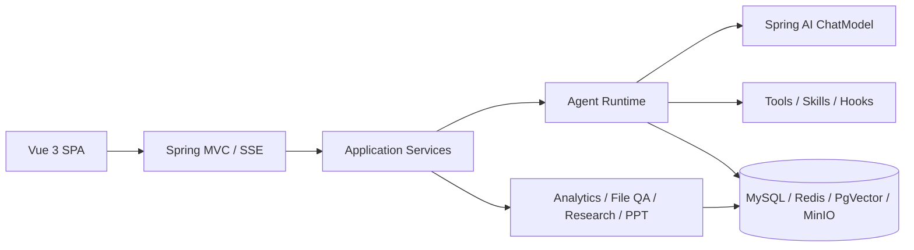

# AgentTrail

AgentTrail 是一个基于 Java 21、Spring Boot 4 和 Spring AI 2 构建的 Agent Runtime 与能力平台。项目重点不是包装单次模型调用，而是把工具执行、上下文、权限、恢复、审计和评测做成可验证的工程闭环。

## 已实现能力

| 能力 | 当前实现 |
|---|---|
| 多轮对话 | 流式 ReAct loop、SSE、会话持久化、上下文压缩、停止与恢复 |
| 工具系统 | 常驻工具、延迟发现、参数注入、幂等、审批、限速 |
| 数据分析 | Schema 探查、术语字典、SQL AST 安全校验、数据权限改写、脱敏、计算与图表 |
| 文件问答 | 文档解析、小文件直读、大文件 RAG、图片按需视觉问答 |
| 深度研究 | 需求澄清、计划、并行检索、批判、总结、任务状态与取消 |
| PPT 生成 | 会话式需求预检、持久化状态机、模板契约、图片生成、渲染校验、恢复和版本化修改 |
| 治理与评测 | 身份鉴权、HITL、预算、哈希链审计、指标追踪、Golden Case 与 LLM-as-Judge |

## 架构概览



详细设计见 [文档索引](docs/README.md) 和 [架构说明](docs/architecture.md)。

## 本地运行

环境要求：Java 21、Maven 3.9+、Python 3（PPT 渲染使用）以及按需启用的 MySQL、Redis、PgVector、MinIO。

```powershell
Copy-Item application-local.example.yml application-local.yml
mvn spring-boot:run
```

`application-local.yml` 只保存本机地址和密钥，已被 Git 忽略。配置项说明见 [docs/configuration.md](docs/configuration.md)。

## 验证

```powershell
mvn test
cd frontend
npm.cmd test
npm.cmd run build
npm.cmd audit
```

集成测试使用 Testcontainers 连接真实 MySQL/Redis，避免 H2 等替代实现掩盖 SQL、事务和分布式语义差异。

## 文档原则

公开文档只描述当前能力、架构决策和可复核证据。内部访谈材料、一次性审计、失败快照、研究草稿和施工票据保存在本机 `.local-docs/`，不进入公开仓库。
