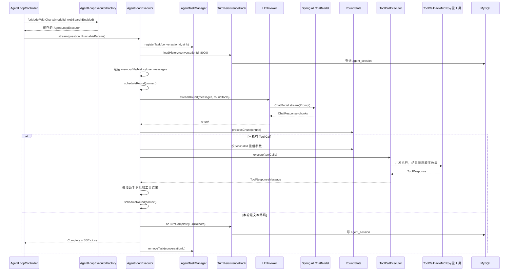
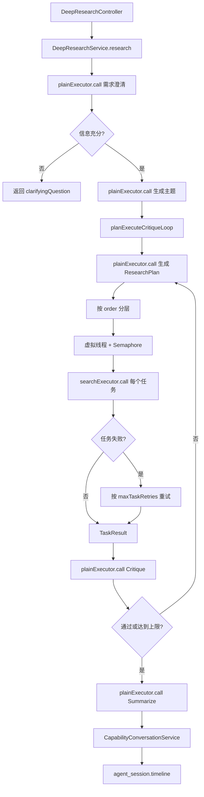
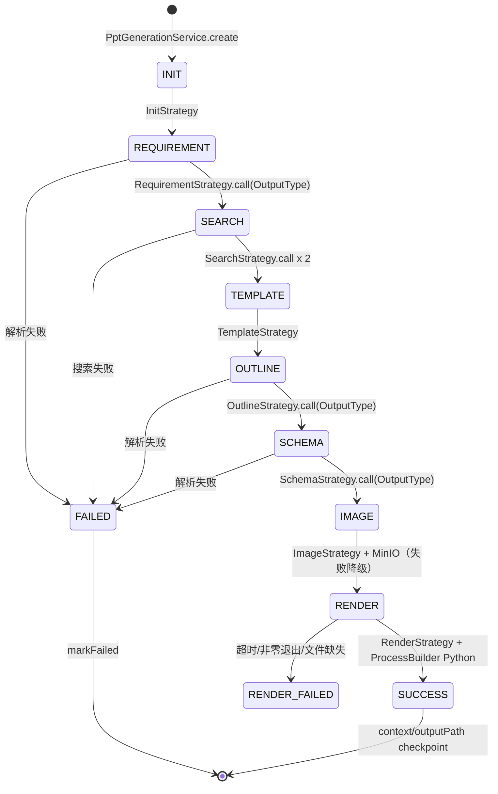
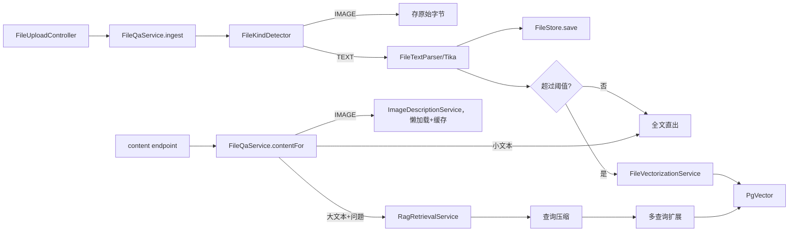
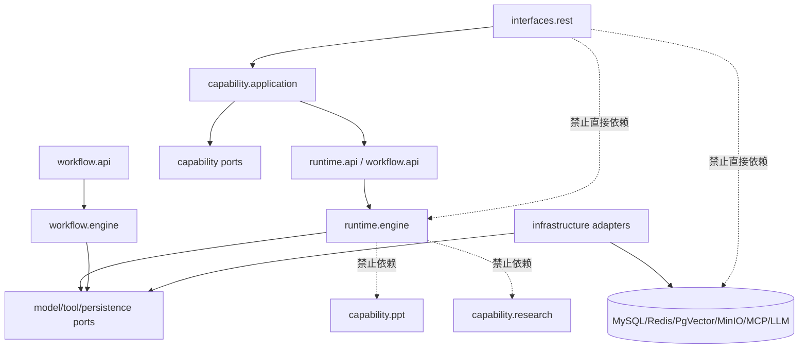

# AgentTrail 核心运行关系与可扩展架构重构方案

> 版本：2026-08-03  
> 目标：梳理当前核心 loop 的真实调用关系、业务引用方式、包结构与抽象问题，并给出可以逐步落地的重构方案。  
> 原则：先建立稳定的接口和测试护栏，再移动实现；不做一次性“大搬家”。

## 0. 先给结论

当前工程不是没有架构，而是处在“Runtime 已经长出来，Capability Pack 还没有从 Runtime 中分离”的过渡阶段。

目前最核心的结构性问题有三类：

1. **`AgentLoopExecutor` 既是 Runtime，又是会话组装器、记忆注入器、文件注入器、工具发现器、暂停恢复器、追踪器和持久化协调器。**它的接口越来越大，已经从深模块变成了高耦合的总门面。
2. **DeepResearch、PPT、文件问答等业务虽然已经有独立服务，但都放在 `com.agenttrail.loop.*` 下，且业务策略直接依赖 `AgentLoopExecutor` 和 Spring AI 类型。**这使“业务能力”和“底层循环”无法独立演进。
3. **DeepResearch/PPT 仍由同步 HTTP 请求直接驱动。**PPT 还会同步启动 Python 子进程，DeepResearch 会在请求线程内创建虚拟线程并阻塞等待。这个模型适合演示和低并发验证，不适合企业级长任务、取消、重试、资源配额和多实例部署。

目标不是把所有代码拆成更多小类，而是建立几个真正有深度的模块：

```text
Agent Runtime       = 一次 Agent 推理：模型 → 工具 → 模型 → 最终结果
Workflow            = 多步骤业务编排：状态、节点、分支、并行、检查点
Task/Worker         = 跨请求长任务：排队、租约、取消、重试、恢复、资源配额
Capability Pack     = 可插拔业务能力：Research、PPT、File QA、Data Analysis
Adapter             = Spring AI、MCP、Redis、MySQL、MinIO、Python 等外部实现
Web Interface       = 只做鉴权、参数校验、提交任务、订阅事件和下载产物
```

最终要做到：

```text
Controller 不认识 AgentLoopExecutor
Capability 不依赖 Web DTO
Workflow 不依赖 Spring AI ChatModel
Runtime 不知道 PPT、Research、RAG 的业务名词
Worker 不把长任务绑在 HTTP 请求生命周期上
```

---

## 1. 当前代码地图：真实状态而不是规划状态

### 1.1 顶层入口

当前有两条 HTTP Runtime 入口：

| 入口 | 当前实现 | 实际用途 | 判断 |
|---|---|---|---|
| `POST /agent/chat` | `legacy.V0.AgentScopeRuntime` | V0 旧演示路径 | 应保留一段时间，但必须标记 deprecated |
| `POST /agent/v1/chat` | `loop.core.AgentLoopExecutor` | V1 主线流式 Agent | 当前主入口 |
| `POST /agent/v1/deepresearch` | `loop.deepresearch.DeepResearchService` | 同步 DeepResearch | 应迁移为异步 Task |
| `POST /agent/v1/ppt/create` | `loop.ppt.PptGenerationService` | 同步 PPT 状态机 | 应迁移为异步 Worker |
| `POST /agent/v1/files` | `loop.file.FileQaService` | 上传、解析、向量化 | 应拆成 Ingest Task 与 Query Use Case |
| `GET /agent/v1/files/{id}/content` | `loop.file.FileQaService` | 文件内容/检索结果读取 | 应增加租户/会话权限校验 |

直接相关文件：

- [AgentLoopController.java](../src/main/java/com/agenttrail/web/AgentLoopController.java)
- [DeepResearchController.java](../src/main/java/com/agenttrail/web/DeepResearchController.java)
- [PptGenerationController.java](../src/main/java/com/agenttrail/web/PptGenerationController.java)
- [FileUploadController.java](../src/main/java/com/agenttrail/web/FileUploadController.java)
- [AgentController.java](../src/main/java/com/agenttrail/web/AgentController.java)

### 1.2 当前包结构

```text
com.agenttrail
├── legacy
│   └── V0.java
├── loop
│   ├── core             # ReAct 主循环与工具执行
│   ├── model            # 运行参数、事件、输出类型
│   ├── context          # token 估算与上下文压缩
│   ├── task             # 单飞、停止、Redis 锁、广播
│   ├── persistence      # 会话持久化
│   ├── pause            # HITL 暂停恢复
│   ├── trace            # 追踪审计
│   ├── memory           # 长期记忆
│   ├── stageoutput      # 分阶段输出
│   ├── tools            # 文件、Shell、Grep、搜索、幂等、图表
│   ├── skills           # Skills 管理与 SkillsTool
│   ├── file             # 文件上传、解析、文件问答
│   ├── rag              # 向量化、检索
│   ├── multimodal       # 图片描述
│   ├── deepresearch     # DeepResearch 业务工作流
│   └── ppt              # PPT 状态机、Python 渲染、图片存储
└── web
    ├── Controller       # HTTP 入口
    ├── Config           # Spring Bean 装配
    ├── Factory           # 按模型/工具组合缓存 Executor
    └── Conversation     # 能力结果写 agent_session
```

### 1.3 当前包结构的根本问题

`loop` 现在已经不是“循环内核”了，而是一个技术名词下混合了四种不同层次：

```text
loop/core          Runtime 内核
loop/tools         Runtime 扩展
loop/persistence   Runtime Adapter
loop/file/rag      业务 Capability
loop/deepresearch  业务 Workflow
loop/ppt           长任务业务 Workflow + 外部执行器
```

因此阅读代码时会出现三个认知错误：

- 看到 `loop.ppt`，误以为 PPT 是 Runtime 内的一种循环机制；
- 看到 `loop.file`，误以为文件问答是所有 Agent 都必须具备的基础能力；
- 看到 `loop.core.AgentLoopExecutor` 被业务大量直接引用，误以为业务和 Runtime 必须绑定在一起。

---

## 2. 当前核心 Loop 的真实调用关系

### 2.1 普通流式对话



核心代码位置：

| 阶段 | 当前方法 | 文件 |
|---|---|---|
| 运行注册 | `stream` | `loop/core/AgentLoopExecutor.java` |
| 历史/记忆/文件注入 | `buildMemorySection`、`buildFileSection` | 同上 |
| 单轮调度 | `scheduleRound` | 同上 |
| Chunk 解析 | `processChunk` | 同上 |
| 工具/终局分支 | `finishRound` | 同上 |
| 工具执行 | `ToolCallExecutor.execute` | `loop/core/ToolCallExecutor.java` |
| 模型调用 | `LlmInvoker.streamRound` | `loop/core/LlmInvoker.java` |
| 任务单飞/停止 | `AgentTaskManager` | `loop/task/AgentTaskManager.java` |
| 最终落库 | `completeRun` | `loop/core/AgentLoopExecutor.java` |

### 2.2 同步 `call()` 的真实语义

`AgentLoopExecutor.call()` 不是第二套循环，而是：

```text
stream(question, params)
  → blockLast()
  → 收集 Text 事件
  → 遇到 ToolStart 清空中间轮文本
  → Error/Paused 转换成 AgentCallException
  → OutputType 场景最后做 JsonRepair
```

这使得当前所有业务策略都能复用同一个 loop，但也带来一个重要限制：

- `call()` 是阻塞式 facade；
- 调用方拿不到结构化的 run 状态、当前轮次、已执行工具和取消句柄；
- 任何长流程只要直接调用 `call()`，就会把多步工作压到业务线程上；
- 业务无法区分“模型失败、工具失败、预算耗尽、人工暂停、租约丢失”等不同错误。

### 2.3 DeepResearch 的调用关系



当前的优点：

- 业务没有重复实现 ReAct；
- 计划、批判、总结等不需要工具的步骤使用 plain executor；
- 搜索任务使用带搜索工具的 executor；
- 有任务数上限、层内并发限制和失败重试；
- 内部调用不写入用户会话历史。

当前的结构性问题：

1. `DeepResearchService` 直接依赖 `AgentLoopExecutor`，因此业务接口绑定了 Runtime 实现，而不是一个“文本模型调用端口”。
2. 使用 `UUID` 生成内部 conversationId 是绕过单飞机制的手段，不是清晰的 `runId/taskId` 设计。
3. 任务执行、线程创建、重试、上下文压缩、结果汇总全部集中在一个 Service 中，未来增加依赖边、暂停、恢复、事件流时会继续膨胀。
4. Controller 同步等待整个研究完成；没有 `202 + taskId`、事件订阅、取消、租约和 Worker 隔离。
5. `CapabilityConversationService` 位于 `web`，说明业务历史写入仍被错误地认为是 Web 责任。

### 2.4 PPT 的调用关系



实际关系：

```text
PptGenerationController
  → PptGenerationService.create(conversationId, message)
  → PptIntentRecognizer
  → PptTaskStore.create/findLatest
  → PptGenerationService.run(taskId)
  → strategy.execute(context)
      → Requirement/Outline/Schema: AgentLoopExecutor.call
      → Search: AgentLoopExecutor.call + Tavily Tool
      → Image: TextToImageClient + MinioPptImageStore
      → Render: PptPythonRenderer + Python 子进程
  → PptTaskStore.advance/markFailed
  → CapabilityConversationService.recordSuccess/Failure
```

当前最重要的风险：

- `PptGenerationController.create()` 是同步 HTTP；请求线程、数据库连接和 Python 子进程生命周期绑定。
- `PptTaskStore` 的注释假设“不会并发推进”，但 Controller 没有按 taskId 的分布式租约/幂等键，重复提交或重复 resume 仍可能并发执行。
- 渲染使用本地文件系统和 `ProcessBuilder`，没有独立 render worker、并发上限、磁盘配额、租户隔离和产物清理策略。
- 下载接口只按 taskId 找产物，没有在 Controller 层看到会话/用户权限校验；当前请求模型固定使用 `anonymous`。
- MinIO 图片 bucket 被设置成公开读，企业场景必须改成签名 URL 或带租户授权的下载代理。

### 2.5 文件问答/RAG 的调用关系



当前文件问答是一个相对独立的能力，但命名仍挂在 `loop` 下；同时 `AgentLoopExecutor` 预留了 `FileStore` 注入能力，而生产 `AgentLoopExecutorFactory` 当前并没有把 `FileStore`、`MemoryStore`、`PauseConfig`、`TraceStore`、`StageOutputManager`、`ToolCatalog` 装配进去。这造成“代码看起来支持，运行时实际没有接上”的隐性偏差。

---

## 3. 具体问题清单与优先级

### P0：先修，否则继续加能力会放大问题

| 编号 | 问题 | 证据 | 影响 |
|---|---|---|---|
| P0-1 | 文档与代码状态漂移 | `architecture.md`/`AGENTS.md` 仍描述 `capability/` 为空，但实际已有 `loop.ppt`、`loop.deepresearch`、`loop.file`、`loop.rag` | 面试叙事、开发判断和实际代码不一致 |
| P0-2 | V0/V1 双入口同时暴露 | `/agent/chat` 仍装配 `V0.AgentScopeRuntime`，V1 另有 `/agent/v1/chat` | 调用关系、配置、监控和故障定位分裂 |
| P0-3 | 业务直接依赖 `AgentLoopExecutor` | PPT 策略、DeepResearch、WebSearch 测试直接 `new/forModel().call()` | Runtime 无法替换，业务无法独立测试 |
| P0-4 | `AgentLoopExecutor` 依赖过多 | 构造函数链包含任务、压缩、思考、持久化、工具搜索、暂停、阶段输出、追踪、记忆、文件等十多个可选依赖 | 空值语义、装配错误和回归风险持续增加 |
| P0-5 | Spring AI 类型泄漏到核心和业务 | `ChatModel`、`ToolCallback`、`Message`、`Flux` 出现在核心公开接口和业务构造函数 | 无法做框架迁移或多语言 sidecar |
| P0-6 | 长任务同步占用 Web 请求 | DeepResearch/PPT Controller 直接调用同步 Service | 超时、断连后任务继续运行、资源不可控 |
| P0-7 | 任务模型不统一 | Agent 使用 `conversationId` 单飞，PPT 使用 `taskId`，Research 没有持久 Task | 无法统一取消、恢复、状态和事件订阅 |
| P0-8 | 能力历史写入属于 Web | `CapabilityConversationService` 在 `web` 包 | 任何非 HTTP 入口都无法复用同一套会话事实源 |

### P1：不修会限制企业化扩展

| 编号 | 问题 | 影响 |
|---|---|---|
| P1-1 | `RunnableParams` 用 `Map<String,Object>` 承载系统参数 | 权限字段、租户字段和工具注入没有强类型约束 |
| P1-2 | 文件上传读取整份字节，缺少统一配额/大小/内容扫描 | 大文件和恶意压缩包可能打爆内存/磁盘 |
| P1-3 | PPT 产物落本地目录 | 多实例不可见，重启后下载失败，无法统一生命周期管理 |
| P1-4 | Python render 没有专用资源池 | 并发请求会无上限创建子进程，CPU、内存、磁盘和临时文件不可控 |
| P1-5 | 事件协议缺少 runId/sequence/replay 语义 | SSE 断线重连和跨实例订阅困难 |
| P1-6 | Redis 锁、取消和本地订阅耦合 | 锁租约、停止确认、客户端断连、进程重启语义不统一 |
| P1-7 | 业务错误、模型错误、工具错误、策略错误混在 Runtime 异常里 | 无法按错误类型重试、告警和计费 |
| P1-8 | 数据表按能力分别定义，但会话时间线和任务事件没有统一模型 | 审计、回放、跨能力关联和数据权限变复杂 |
| P1-9 | 生产装配仍有“可选机制写了但没接上”的风险 | 代码审查时容易把“有类”误判成“线上启用” |

### P2：在核心稳定后优化

- 将 `JsonRepair`、模型响应解析、Prompt 拼接从业务类继续下沉为结构化输出模块。
- 将 `ToolCallExecutor` 的 Reactor 实现替换为框架中立的工具执行端口，保留 Spring AI Adapter。
- 将 Skill、ToolSearch、MCP、A2A 统一注册到 `AgentCapabilityRegistry`，而不是分散在配置类中。
- 将 `PptGenerationContext`、DeepResearch `ResearchLoopOutcome` 等 JSON 快照增加 schemaVersion 和迁移器。
- 将 `V0.java` 从生产 Bean 路径中移除，作为独立 demo/test source set 或归档模块。

---

## 4. 目标架构：按职责分层、按能力分包

### 4.1 推荐的第一阶段包结构：先模块化单体，不立即拆 Maven

```text
com.agenttrail
├── platform
│   ├── identity          # TenantId/UserId/Principal/AuthorizationContext
│   ├── ids               # RunId/TaskId/ConversationId/ArtifactId
│   ├── event             # EventEnvelope/EventCursor/EventType
│   ├── error             # ErrorCode/RetryClass/DomainException
│   └── clock             # Clock、Deadline、测试时间
│
├── runtime
│   ├── api               # AgentRuntimePort、AgentRequest、AgentResult、AgentEvent
│   ├── engine             # AgentRunCoordinator、RoundDriver、RoundState
│   ├── model              # ModelGateway、ModelRequest、ModelChunk、Usage
│   ├── tool               # ToolDefinition、ToolGateway、ToolRegistry、ToolPolicy
│   ├── context            # ContextSnapshot、ContextBudget、CompactionPolicy
│   ├── lifecycle          # RunRegistry、Cancellation、Pause/Resume
│   ├── middleware         # RuntimeMiddleware、Hooks、Retry/Budget/Audit
│   └── profile            # AgentProfile、RuntimeProfileRegistry
│
├── workflow
│   ├── api               # WorkflowDefinition、WorkflowRun、NodeResult、Checkpoint
│   ├── engine             # Sequential/Parallel/Conditional/MapReduce 执行器
│   ├── task               # TaskCoordinator、TaskQueue、Lease、RetryPolicy
│   └── event              # WorkflowStarted/NodeCompleted/Paused/ArtifactCreated
│
├── capability
│   ├── chat               # 普通对话 Use Case、历史读取、SSE 适配前的应用服务
│   ├── research           # ResearchWorkflow、ResearchState、Evidence、Report
│   ├── ppt                # PptWorkflow、PptState、PptArtifact、RenderJob
│   ├── fileqa             # FileIngestWorkflow、FileQueryUseCase、Attachment
│   ├── analytics          # 未来 SQL/M-Schema/权限/图表
│   ├── skills             # SkillCatalog、SkillPack、SkillPermission
│   └── multiagent         # AgentDefinition、Router、Supervisor、SubAgent
│
├── conversation
│   ├── api               # ConversationPort、Turn、TimelineEntry
│   ├── application       # ConversationService、TimelineService
│   └── adapter            # JdbcConversationRepository、OutboxTimelineWriter
│
├── infrastructure
│   ├── llm.springai       # Spring AI ChatModel → ModelGateway
│   ├── tool.springai      # ToolCallback → ToolGateway
│   ├── tool.mcp           # MCP Client/Server
│   ├── protocol.a2a       # A2A Client/Server
│   ├── persistence.jdbc   # MySQL/PgVector Repository
│   ├── messaging.redis    # Redis lock、queue、pub/sub、event stream
│   ├── artifact.minio     # PPT、图片、CSV、报告产物
│   ├── process.python     # Python render worker adapter
│   └── observability      # Micrometer/OpenTelemetry/Trace adapter
│
└── interfaces
    └── rest
        ├── chat
        ├── research
        ├── ppt
        ├── fileqa
        └── admin
```

第一阶段只做包边界和接口，不拆成多个 Maven module。等 `runtime` 与 `capability` 的依赖测试稳定后，再拆为：

```text
agenttrail-platform
agenttrail-runtime-api
agenttrail-runtime-engine
agenttrail-workflow
agenttrail-capabilities
agenttrail-adapters
agenttrail-web
```

过早拆 Maven 会把“包边界还没想清楚”的问题变成依赖管理问题；先用 ArchUnit 锁定边界更稳。

### 4.2 目标依赖方向



依赖规则：

1. `runtime.engine` 不能 import `capability.*`。
2. `capability.*` 不能 import `interfaces.*`。
3. `interfaces.rest` 只能依赖 `application` 与 DTO mapper。
4. `infrastructure.*` 只能通过 port 接入，不能被业务直接 `new`。
5. Spring AI、Reactor、Jackson、JDBC、Redis 类型只允许出现在 adapter 或 application adapter 层。
6. `AgentRequest` 的身份、租户、预算、工具权限必须是强类型；禁止把权限主体塞进 `Map`。

---

## 5. 核心 Runtime 应该如何重新抽象

### 5.1 公共门面只保留一个深接口

目标是让业务只学习一个稳定的接口：

```java
public interface AgentRuntimePort {

    AgentRunHandle start(AgentRequest request);

    AgentResult call(AgentRequest request);

    AgentRunSnapshot snapshot(RunId runId);

    void cancel(RunId runId, CancellationReason reason);

    AgentRunHandle resume(RunId runId, ResumeCommand command);
}
```

这里的接口属于 `runtime.api`，不出现 `ChatModel`、`ToolCallback`、`Message`、`Flux`。

建议对象：

```text
AgentRequest
├── RunId（调用方可传幂等键，不传则生成）
├── ConversationId
├── Principal（tenantId/userId/roles）
├── UserInput
├── AgentProfileId
├── OutputContract
├── ToolScope
├── Budget（maxRounds/maxTokens/maxCost/deadline）
└── Metadata（只放非安全、非权限型扩展信息）
```

```text
AgentRunHandle
├── runId/taskId
├── events()：事件订阅端口
├── cancel()
├── status()
└── awaitResult()
```

### 5.2 把当前 `AgentLoopExecutor` 拆成 6 个内部模块

`AgentLoopExecutor` 可以先保留为兼容 facade，但实现内部应拆成：

| 新模块 | 只负责什么 | 当前来源 |
|---|---|---|
| `AgentRunCoordinator` | 创建/恢复 RunContext，驱动整体生命周期 | `stream`/`resume` |
| `RoundDriver` | 一轮模型请求、chunk 收集、终局判断 | `scheduleRound`/`processChunk` |
| `ToolRoundExecutor` | 工具解析、权限校验、并发执行、结果排序 | `ToolCallExecutor` |
| `ContextAssembler` | 历史、记忆、附件、系统 Prompt 组装 | `stream` 中的消息准备逻辑 |
| `RunCompletionCoordinator` | 落库、Stage、Trace、Memory、Complete 事件 | `completeRun` |
| `RunLifecycleManager` | 单飞、取消、暂停、租约、恢复 | `AgentTaskManager` + pause |

拆分原则：

- 外部只有 `AgentRuntimePort`；
- 这些内部模块只通过 `RunContext` 与事件接口协作；
- 不把 6 个模块都暴露成 Spring Bean；内部 seam 只为测试和替换服务；
- `RoundDriver` 不知道会话表，`RunCompletionCoordinator` 不知道如何解析 tool_call 分片。

### 5.3 用 Profile/Module 替代 telescoping constructor + null

当前 14 个构造函数重载和大量 `null` 是高风险设计。改为：

```text
AgentRuntimeProfile
├── modelGateway
├── toolRegistry
├── contextPolicy
├── middlewareChain
├── persistencePort
├── runLifecyclePort
├── outputPolicy
└── featureFlags
```

可选能力不再通过 `null` 表达，而通过显式 Module：

```text
RuntimeModule.EMPTY
RuntimeModule.contextCompaction(...)
RuntimeModule.memory(...)
RuntimeModule.pauseResume(...)
RuntimeModule.trace(...)
RuntimeModule.stageOutput(...)
RuntimeModule.toolSearch(...)
```

装配失败必须在启动时失败，而不是第一次请求才 NPE。生产 Bean 要打印最终 Profile 摘要，例如：

```text
profile=chat-default
model=deepseek-chat
tools=[web-search, chart]
pause=false
memory=false
trace=true
persistence=jdbc
```

### 5.4 工具层分成四个接口

当前 `ToolCallback` 同时承载定义、执行、错误和 Spring AI 适配。目标拆成：

```text
ToolDefinition       名称、描述、输入/输出 Schema、风险级别、成本级别
ToolResolver          根据 ToolScope/权限/FeatureFlag 决定本轮可见工具
ToolExecutor          执行已经通过解析和授权的 ToolInvocation
ToolResultPolicy      超时、重试、错误转 ToolResult、结果截断、敏感信息处理
```

这样 ToolSearch 只负责 Resolver，MCP 只负责 Adapter，Bash/PPT/SQL 工具只负责 Executor。

### 5.5 事件协议必须先于 Web SSE

当前 `AgentStreamEvent` 是运行事件，但没有统一的跨请求游标语义。目标事件信封：

```text
EventEnvelope
├── eventId
├── runId
├── taskId
├── conversationId
├── sequence
├── occurredAt
├── type
├── source（runtime/workflow/tool/worker）
├── visibility（user/internal/audit）
└── payload
```

至少支持：

- `RunStarted`
- `ModelDelta`
- `ToolStarted`
- `ToolCompleted`
- `NodeStarted`
- `NodeCompleted`
- `CheckpointSaved`
- `Paused`
- `ArtifactCreated`
- `RunCompleted`
- `RunFailed`
- `RunCancelled`

SSE 只是该事件流的一个订阅适配器。断线时使用 `Last-Event-ID` 或 `afterSequence` 重放，而不是重新启动 Agent。

---

## 6. Workflow 与 Task：Research/PPT 不能继续伪装成普通 Chat

### 6.1 Workflow 统一模型

```java
public interface WorkflowDefinition<S> {
    WorkflowId id();
    S initial(WorkflowRequest request);
    List<WorkflowNode<S>> nodes();
    WorkflowPolicy policy();
}
```

Node 需要明确：

```text
Node
├── id
├── input state selector
├── execute(context)
├── output state patch
├── retry policy
├── timeout/deadline
├── idempotency key strategy
├── compensation/rollback policy
└── next transition
```

DeepResearch 的目标图：

```text
Clarify
  → GenerateTopic
  → Plan
  → FanOut(SearchTask[])
  → MergeEvidence
  → Critique
  ├─ pass → Synthesize
  └─ fail → Plan（带 critique feedback）
  → ReportArtifact
```

PPT 的目标图：

```text
ParseRequirement
  → SearchMaterials
  → SelectTemplate
  → GenerateOutline
  → GenerateSchema
  → GenerateVisuals（可降级）
  → Render
  → ValidateArtifact
  → PublishArtifact
```

### 6.2 Task 统一模型

```text
TaskRecord
├── taskId
├── workflowId
├── tenantId/userId
├── conversationId
├── status（PENDING/RUNNING/PAUSED/SUCCEEDED/FAILED/CANCELLED）
├── currentNode
├── attempt
├── leaseOwner/leaseUntil
├── idempotencyKey
├── checkpointVersion
├── inputRef
├── outputRef
├── errorCode/errorMessage
└── createdAt/updatedAt
```

Task API：

```text
POST /agent/v1/runs                 → 202 {runId, taskId}
GET  /agent/v1/runs/{taskId}        → 状态快照
GET  /agent/v1/runs/{taskId}/events → SSE/分页事件
POST /agent/v1/runs/{taskId}/cancel
POST /agent/v1/runs/{taskId}/resume
```

同步 `call()` 只保留给短时、无外部副作用、可在预算内完成的内部节点调用。

### 6.3 PPT 的并发与资源安全改造

PPT 必须改成：

```text
HTTP Submitter → Task DB/Queue → PptWorker → Artifact Store → Event Stream
```

硬性规则：

1. Controller 不直接运行 Python。
2. 每个 PPT 任务先拿到数据库租约，再执行当前节点。
3. `RENDER` 使用独立 render worker 或独立线程池，设置全局并发上限。
4. 每个任务独立临时目录，任务结束按保留策略清理 schema/json/日志。
5. 模板、脚本、输出路径全部通过 allowlist 解析，禁止用户输入直接形成命令参数或路径。
6. 产物存 MinIO/S3，数据库只保存 `ArtifactId` 和元数据，不保存本地绝对路径作为长期事实。
7. 创建任务支持 `Idempotency-Key`，重复提交返回同一个 taskId。
8. 下载走授权后的签名 URL，不把 bucket 设置为全局公开读。
9. 失败节点只重试可重试错误；Python 非零退出、模板损坏、Schema 校验失败要区分为不可重试或有限重试。

---

## 7. 各业务能力的迁移映射

| 当前代码 | 目标位置 | 业务允许依赖 | 业务禁止依赖 |
|---|---|---|---|
| `loop.deepresearch.DeepResearchService` | `capability.research.application.ResearchWorkflow` | `AgentRuntimePort`、`WorkflowEngine`、`EvidenceRepository` | `AgentLoopExecutor`、Spring `ChatModel`、Web DTO |
| `loop.ppt.PptGenerationService` | `capability.ppt.application.PptWorkflow` | `TaskCoordinator`、`ArtifactStore`、`ModelPort`、`RenderPort` | `ProcessBuilder`、`PptTaskStore` JDBC 实现、Controller |
| `loop.ppt.strategy.*` | `capability.ppt.workflow.node.*` | PptState、NodeContext、ModelPort、RenderPort | `AgentLoopExecutor` |
| `loop.file.FileQaService` | `capability.fileqa.application.FileIngestUseCase` + `FileQueryUseCase` | `FileStorePort`、`EmbeddingPort`、`RetrievalPort` | Web MultipartFile、PgVector 实现 |
| `loop.rag.*` | `capability.fileqa.domain` + `infrastructure.vector` | RetrievalPort | `VectorStore` 直接泄漏到业务 |
| `loop.tools.websearch.*` | `capability.common.search` 或 `infrastructure.mcp.tavily` | ToolDefinition/ToolExecutor | Controller、DeepResearch 专属硬编码 |
| `loop.tools.chart.*` | `capability.analytics.chart` 或 MCP adapter | ToolPort、ArtifactStore | Runtime 对图表 URL 的特殊判断 |
| `loop.skills.*` | `capability.skills` + `runtime.tool` 注册端口 | SkillCatalog、PermissionPolicy | Runtime 直接扫描文件系统 |
| `web.CapabilityConversationService` | `conversation.application.TimelineService` | ConversationPort | Controller 直接写库 |
| `web.AgentLoopExecutorFactory` | `runtime.profile.RuntimeProfileRegistry` | ModelGateway、ToolRegistry | `web` 包、HTTP 请求 DTO |
| `legacy.V0` | `demo.v0` 或独立归档模块 | 无生产依赖 | Spring 主应用默认装配 |

### 7.1 普通对话允许的调用路径

```text
ChatController
  → ChatApplicationService
  → AgentRuntimePort
  → AgentRunCoordinator
  → ModelGateway / ToolGateway / RunRepository
```

### 7.2 Research/PPT 允许的调用路径

```text
ResearchController
  → ResearchApplicationService
  → TaskCoordinator.submit(ResearchWorkflow)
  → Worker
  → WorkflowEngine
  → AgentRuntimePort.call（只作为节点能力）
```

注意：Research/PPT 可以调用 Runtime，但 Runtime 不能反过来 import Research/PPT。

---

## 8. 逐阶段重构计划：小步提交，每步可运行

### Phase 0：建立事实基线和架构护栏

目标：先让“文档、包结构、测试状态”一致。

建议提交：

1. `docs: 更新当前入口、能力包和实际包结构`。
2. `docs: 增加四条核心调用链 Mermaid 图`。
3. `test: 增加当前 HTTP 契约快照`，固定 `/chat`、`/deepresearch`、`/ppt`、`/files` 的请求响应行为。
4. `build: 将 unit test 与 integration test 分离为 Surefire/Failsafe`，避免 `*IT` 被默认 `mvn test` 静默跳过。
5. `test: 增加 ArchUnit 依赖方向测试`。
6. `test: 增加重复 PPT 提交、重复 resume、断开 SSE 后任务状态的基线测试`。
7. `ops: 输出 Runtime Profile 启动摘要`，明确哪些可选机制实际启用。

验收：文档不再说 `capability/` 为空；每个线上 Bean 都能在启动日志中看到最终装配结果。

### Phase 1：冻结公共契约，不移动实现

1. 新增 `platform.ids`：`RunId`、`TaskId`、`ConversationId`、`ArtifactId`。
2. 新增 `platform.identity`：`Principal`、`TenantContext`、`AuthorizationContext`。
3. 新增 `platform.error`：`ErrorCode`、`RetryClass`、`FailureOrigin`。
4. 新增 `runtime.api.AgentRequest`，替代 `RunnableParams` 的公开使用。
5. 新增 `runtime.api.AgentEvent`，提供旧 `AgentStreamEvent` 到新事件的映射。
6. 新增 `runtime.api.AgentResult`、`AgentRunSnapshot`、`AgentRunHandle`。
7. 新增 `runtime.api.AgentRuntimePort`，先由适配器委托现有 `AgentLoopExecutor`。
8. 将 `RunnableParams` 标记 `@Deprecated`，禁止新增调用点。
9. 为新端口补 Fake Runtime，业务单测先不依赖真实模型。

验收：新业务只允许依赖 `AgentRuntimePort`；旧业务仍可运行。

### Phase 2：切断 Spring AI 从业务向外泄漏

1. 新增 `runtime.model.ModelGateway`、`ModelRequest`、`ModelChunk`、`ModelUsage`。
2. 将 `LlmInvoker` 改成只依赖 `ModelGateway`。
3. 新增 `infrastructure.llm.springai.SpringAiModelGateway`，把 `ChatModel` 映射到新端口。
4. 将 `ToolDefinition`、`ToolInvocation`、`ToolResult` 从 Spring AI 类型中抽出。
5. 新增 `infrastructure.tool.springai.SpringAiToolGateway`。
6. 将 `ToolCallAccumulator` 的输入输出改为框架中立的 `ToolCallDelta`。
7. 为模型适配器补分片、usage、timeout、错误映射测试。
8. 将 DeepResearch/PPT 策略构造函数从 `AgentLoopExecutor` 改成 `AgentRuntimePort`。
9. 将业务中的 `OutputType` 改成 `OutputContract`，JsonRepair 放入 structured-output adapter。

验收：`capability.*` 源码中 `rg "ChatModel|ToolCallback|Message|Flux"` 结果为零或只存在明确的 adapter 包。

### Phase 3：拆分 Runtime 内部模块，保留兼容 facade

1. 抽出 `ContextAssembler`，承接历史、记忆、文件和系统提示组装。
2. 抽出 `RoundDriver`，承接单轮模型请求、chunk 收集和终局判断。
3. 抽出 `ToolRoundExecutor`，承接工具调用解析、授权、并发、结果排序。
4. 抽出 `RunCompletionCoordinator`，承接落库、Stage、Trace、Memory、Complete 事件。
5. 抽出 `RunLifecycleManager`，承接单飞、取消、暂停、恢复和租约。
6. `AgentLoopExecutor` 只保留 facade：`start/call/resume/snapshot/cancel`。
7. 删除除兼容层外的 telescoping constructors。
8. 用 `RuntimeProfile` + `RuntimeModule` 替代 null 参数。
9. 增加装配时必检的 `RuntimeProfileValidator`。
10. 将 `AgentTaskManager` 的“本地任务 map”和“跨实例 lease”拆为两个 port。
11. 为 `RunContext` 增加不可变 snapshot 与 state version，避免异步回调随意修改共享 List。
12. 将事件发出、任务释放、持久化完成的顺序写成契约测试。

验收：Runtime facade 对外接口不超过 5 个核心动作；内部实现可单独替换和测试。

### Phase 4：统一 Run/Task/Checkpoint/Event

1. 新增 `RunRepository`，保存一次 Agent 执行的状态和版本。
2. 新增 `RunEventStore`，保存带 sequence 的事件。
3. 新增 `CheckpointStore`，保存 Runtime/Workflow 的可恢复快照。
4. 新增 `TaskCoordinator`，统一 Agent、Research、PPT 的状态模型。
5. 新增 `TaskQueue` port，先用内存实现，再接 Redis。
6. 新增 `LeaseManager`，把 RedisTaskLock 的租约/续期/释放做成独立模块。
7. 新增 `CancellationPort`，取消操作写入持久状态并广播，而不是只 dispose 本地订阅。
8. 新增 Outbox 表和 `OutboxPublisher`，保证“状态变更”和“事件发布”最终一致。
9. 将 `agent_session` 继续作为用户可读会话事实源，但不再承担 Workflow Task 状态。
10. 将 `timeline` 的能力结果改为统一 `TimelineEntry` schemaVersion。

验收：任何长任务都可通过 taskId 查询、取消、恢复和重放事件；单实例/多实例测试语义一致。

### Phase 5：迁移普通 Chat

1. 新建 `capability.chat.application.ChatApplicationService`。
2. 将 `AgentLoopController` 改为只调用 ChatApplicationService。
3. 将模型选择从 `AgentLoopExecutorFactory` 移到 `RuntimeProfileRegistry`。
4. 将 webSearch/chart 的工具选择变成 `ToolScope`，不再使用 Factory 中多个布尔分支。
5. 把 `ConversationHistoryService`、`CapabilityConversationService` 合并为 conversation application port。
6. 增加用户/租户身份映射，移除所有生产路径上的固定 `anonymous`。
7. 将 `/agent/v1/chat` 的 SSE 映射改为通用 EventEnvelope。
8. 保留 `/agent/chat`，但增加响应头/日志标记 `runtimeVersion=v0`。

验收：普通对话 Controller 不再 import `loop.core`；旧 V0 与新 Runtime 的行为有明确隔离。

### Phase 6：迁移 DeepResearch 为 Workflow + Task

1. 建立 `ResearchState`，替代散落的局部 List/String。
2. 建立 `ResearchNode`：Clarify、Topic、Plan、Search、Critique、Synthesize。
3. 把 `executeLayered` 迁为 Workflow Engine 的 fan-out/map-reduce 节点。
4. 把 `Semaphore` 改为按 tenant/capability 的 `ConcurrencyPolicy`。
5. 将每个搜索任务设置独立 idempotency key，避免重试重复计费。
6. 将研究证据和报告保存为 Artifact/Repository，而不是只放返回对象。
7. 新建 `ResearchTaskWorker`，HTTP 只负责提交任务。
8. 增加 `/research/{taskId}/events` SSE 和 `/research/{taskId}/cancel`。
9. 将 `CapabilityConversationService` 的写入挪到 Research application 完成事件处理器。
10. 增加节点级恢复测试：在 Search、Critique、Synthesize 前后杀进程并恢复。

验收：Research 请求立即返回 taskId；Worker 重启后可从最近 checkpoint 继续；用户会话不出现内部子调用。

### Phase 7：迁移 PPT 为异步 Artifact Workflow

1. 将 `PptState` 改为 Workflow Node 定义，不再由 Service 内部固定 `ORDER` 单独维护。
2. 将 `PptGenerationContext` 加 `schemaVersion` 和迁移器。
3. `PptTaskStore` 改为 `WorkflowTaskRepository` 的 PPT adapter。
4. 创建 PPT 使用 `Idempotency-Key`。
5. `PptSubmitService` 只创建任务并投递队列。
6. 新建 `PptWorker`，逐节点拿 lease 后执行。
7. 新建 `RenderPort`，先保留 `PptPythonRenderer` 作为 adapter。
8. 新建 render 专用线程池/队列，设置最大并发、队列长度和超时。
9. 临时文件迁移到任务隔离目录，完成/失败后按策略清理。
10. 产物迁移到 `ArtifactStore`（MinIO/S3），数据库只保存 artifact metadata。
11. 图片改为私有对象 + 短时签名 URL。
12. 增加 Schema 校验、PPTX 可打开校验、字体/资源大小和病毒扫描 hook。
13. `/ppt/{taskId}/download` 只返回授权后的下载地址。
14. 增加重复提交、重复恢复、Worker 崩溃、Python 超时和磁盘不足测试。

验收：PPT 不再占用 HTTP 请求线程；同一个幂等键最多创建一个任务；多实例下同一任务不会重复渲染。

### Phase 8：迁移 File QA/RAG

1. 拆 `FileQaService.ingest` 为 `FileIngestUseCase`。
2. 拆 `contentFor` 为 `FileContentQueryUseCase` 和 `FileRetrievalUseCase`。
3. 将 `MultipartFile`、PgVector `VectorStore`、Spring `Document` 限制在 adapter。
4. 文件元数据、原始文件、文本解析结果、向量索引状态分开建模。
5. 大文件向量化改为异步任务，上传接口先返回 `fileId + ingestTaskId`。
6. 增加文件大小、MIME、压缩炸弹、租户配额和病毒扫描策略。
7. 将“文件属于 conversation / turn”改为显式 Attachment 聚合。
8. 将 `FilePromptFormatter` 改为 Chat capability 的 Context Provider，不让 Runtime 直接依赖 FileStore。
9. 增加向量化失败重试、索引状态、删除/重建和租户过滤测试。

### Phase 9：多 Agent、Skills、MCP、A2A

1. 建立 `AgentDefinition`：id、description、profile、tools、input/output contract、policy。
2. 建立 `AgentRegistry` 和 `AgentRouter`，规则路由优先，模型路由兜底。
3. 建立 `SubAgentRunner`，限制嵌套深度、预算和权限。
4. 建立 `SupervisorWorkflow`，明确 fan-out、合并和 reviewer 节点。
5. Skills 变成可注册的 SkillPack，带版本、权限、资源和运行时依赖。
6. MCP 只作为 Tool Adapter，不把 MCP 类型泄漏到业务。
7. A2A 只暴露稳定的 Agent Card、Task、Event、Artifact 协议。
8. 增加跨 Agent 的 trace parent/child、预算、租户和取消传播。

### Phase 10：框架 PoC，而不是全量重写

用同一组 Golden Tasks 对比：

| PoC | 借鉴点 | 不直接替换的原因 |
|---|---|---|
| AgentScope Java 2.0 | Harness/Middleware、State Store、权限、SubAgent、A2A | 先验证与现有 `ModelGateway/ToolGateway` 的兼容性 |
| LangGraph | StateGraph、节点/边、checkpoint、interrupt | Python/TS 运行时，不适合直接放进 Java 进程 |
| AutoGen Core | AgentId、Message、Actor、Runtime | 可借鉴事件消息模型，不作为 Java 核心依赖 |
| CrewAI | Flow 与 Crew 的分层 | 借鉴业务流程包裹 Agent 团队，不引入 Python Runtime |
| Dify | API/Worker/Queue/插件/低代码控制面 | 作为外部平台或运营面，不嵌入业务数据库 |
| AutoGPT | Block、Artifact、Schedule、Run 控制 | 借鉴能力原子化和长任务对象 |
| LangChain | Tool Schema、Middleware、结构化输出 | Java 侧已有 Spring AI，避免双 SDK |

PoC 成功标准：

- 业务无需修改 `AgentRuntimePort`；
- 事件、取消、暂停、恢复语义可映射；
- 单测、集成测试、性能基线不退化；
- 迁移后能删除一批自研代码，而不是增加第二套 Runtime。

---

## 9. 测试与质量门禁

### 9.1 Runtime 测试

- `RoundDriverTest`：文本终局、单工具、多工具、工具调用分片、错误工具、空参数。
- `ContextAssemblerTest`：历史、记忆、附件、输出合同、租户上下文的注入顺序。
- `ToolPolicyTest`：工具可见性、权限、危险级别、参数注入和敏感字段。
- `RunLifecycleTest`：单飞、取消、暂停、恢复、租约过期、重复恢复。
- `EventContractTest`：sequence 单调递增、事件顺序、重放一致性。

### 9.2 Workflow/Task 测试

- 节点成功后 checkpoint 才推进。
- 节点失败按 RetryClass 处理。
- Worker 重启后从 checkpoint 恢复。
- 同一个 idempotency key 不重复执行副作用。
- 并行节点结果合并顺序稳定。
- 取消后不再启动下一节点。

### 9.3 生产集成测试

- MySQL：Run、Task、Checkpoint、Outbox、Conversation 时间线。
- Redis：租约、续期、抢占、广播取消、重复消息。
- PgVector：租户过滤、fileId 过滤、索引状态。
- MinIO：私有 bucket、签名 URL、过期、对象清理。
- Python Worker：进程超时、非零退出、stdout/stderr、半成品清理。
- SSE：断线、重连、afterSequence、重复事件去重。

### 9.4 架构测试

ArchUnit 规则至少包括：

```text
runtime.engine 不得依赖 capability.*
capability.* 不得依赖 interfaces.*
interfaces.* 不得依赖 infrastructure 实现类
capability.* 不得依赖 org.springframework.ai.*
所有 Repository 实现只能出现在 infrastructure.*
所有 Controller 只能调用 application service
```

---

## 10. 并发、资源和安全基线

### 10.1 每类资源单独限流

```text
LLM 并发：按 provider/model/tenant 限制
Tool 并发：按工具风险和外部服务限制
Research 并发：按 tenant + workflow 限制
PPT Render 并发：独立队列，通常远小于 LLM 并发
Embedding 并发：按向量模型 batch/连接池限制
Python 子进程：全局 semaphore + 单任务 timeout
```

### 10.2 不要把客户端断连等同于任务取消

客户端断连只意味着 SSE subscriber 消失。真正取消必须由：

```text
用户明确取消 → Task 状态写 CANCEL_REQUESTED → Worker/Runtime 检查取消令牌
              → 取消模型订阅/工具/子进程 → 写 CANCELLED → 发布事件
```

### 10.3 统一安全边界

- 所有请求必须有 `tenantId/userId`，不能继续用生产默认 `anonymous`。
- 工具权限在 Tool Gateway 做服务端校验，不能只依赖 Prompt。
- 系统参数注入使用强类型 `ExecutionPrincipal`，不使用自由 Map 覆盖。
- 文件、Python、Shell、MCP、下载 URL 都必须有 allowlist、超时和审计。
- 产物默认私有，使用签名 URL/授权代理。
- Prompt、工具返回值和错误日志要有 PII/Secret 脱敏策略。

---

## 11. 面试时可以这样讲这次重构

### 一句话

“我把系统从一个以 `AgentLoopExecutor` 为中心的技术包，重构成 Runtime、Workflow、Task、Capability Pack 和 Adapter 五层。普通对话走 Runtime，DeepResearch/PPT 走可恢复 Workflow，HTTP 只提交任务和订阅事件，Python/MCP/LLM 都通过端口隔离。”

### 追问“为什么不让 PPT 直接跑在 Web 请求里？”

“PPT 同时包含多次 LLM 调用、联网搜索、图片转存和 Python 子进程。同步 Web 只能解决 demo 的调用路径，不能解决排队、租约、取消、重试、断点恢复和多实例资源安全。所以我把它建模成 Task + Worker + Artifact，SSE 只订阅事件。”

### 追问“多 Agent 的代码在哪里？”

“多 Agent 不是把多个 `AgentLoopExecutor` 随便 new 出来，而是 `AgentDefinition + AgentRegistry + Router + Workflow`。Agent 负责单次推理，Supervisor/Research/PPT 是 Workflow，子 Agent 通过受预算和权限约束的 `SubAgentRunner` 调用。”

### 追问“为什么参考这些框架？”

“我分别吸收了它们解决的不同问题：图状态和 checkpoint、Middleware 和权限、Actor/Message 事件模型、Flow 与 Crew 的分层、API/Worker/Queue 的平台化、Block/Artifact 的能力原子化，而不是把几个框架混成一个基类。”

---

## 12. 推荐的第一批落地顺序

如果当前目标是面试可用、又不破坏已有功能，建议按这个顺序执行：

1. 先落本文档、ArchUnit 和运行时装配摘要。
2. 引入 `AgentRuntimePort`，让 DeepResearch/PPT 不再直接依赖 `AgentLoopExecutor`。
3. 抽 `ModelGateway` 和 `ToolGateway`，切断 Spring AI 类型泄漏。
4. 把 `CapabilityConversationService` 挪到 conversation application。
5. 先把 DeepResearch 改成 Task/Workflow，验证通用长任务模型。
6. 再把 PPT 改成异步 Worker/Artifact，作为资源安全和断点恢复的主展示案例。
7. 最后迁移文件问答和多 Agent，避免同时改动所有能力。

这条顺序能保留当前 V1 的可运行性，同时让每一步都产生清晰的面试材料：接口演进、调用链收敛、异步任务化、资源隔离、断点恢复和多 Agent 编排。

