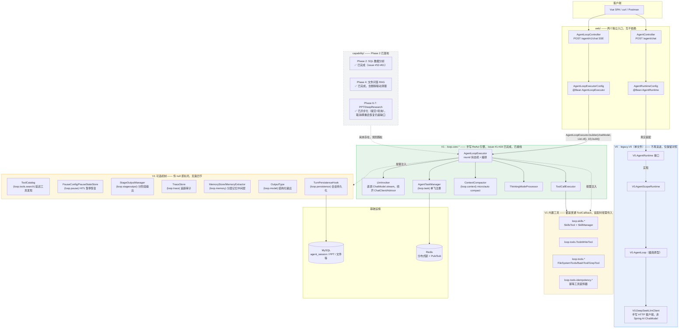
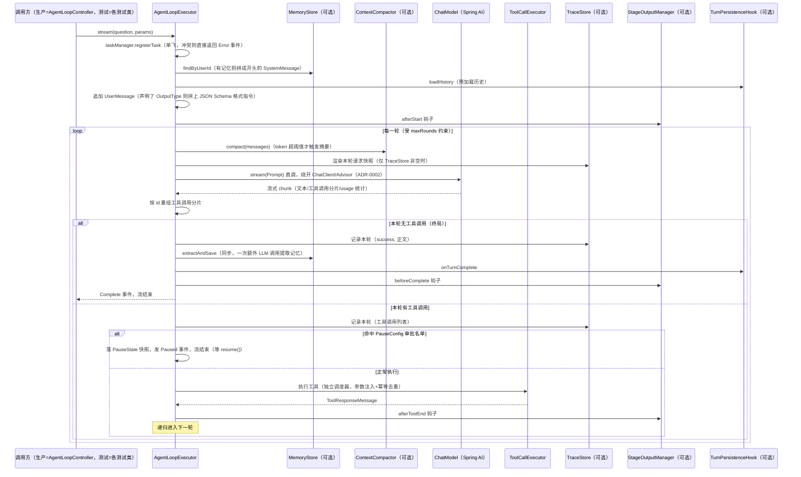

# AgentTrail 架构图与代码结构

> 术语沿用 `CONTEXT.md` 已定义的词汇表（Runtime / Capability Pack / Tool / Skill / Hook / LlmClient / Gateway），不引入新概念。
> 对应决策见 `adr/0001`（Runtime 定位）、`adr/0002`（手写 loop 为 V1 主线）；对应机制细节见 `roadmap.md`（Phase 0-11）与 `engineering-pitfalls-and-highlights.md`（踩坑点，部分机制在下文用 `#N` 标出）。issue 号（`#15`-`#19` 这类）指 GitHub issue，可用 `gh issue view <n> --json state,body` 查验收标准。
>
> **这一版已同步到 2026-08-06 的实际代码状态**：V1 的 SSE、会话持久化、历史查询与前端统一入口已经接线；`capability/`（analytics/auth/sys）已落地，DeepResearch/PPT 已异步化并支持取消；治理层（Hooks/审批/预算熔断/审计哈希链/可观测性/评测/安全纵深）已落地，见 `loop.hook`/`loop.security`/`evaluation`/`observability` 几个包，不再是规划中的 `governance/`；`distributed/`、`mcp/` 等仍是后续规划，见 `roadmap.md`。

---

## 〇、当前最重要的一件事：V0/V1 现在各有一个独立的 HTTP 入口，互不影响

这是理解这份文档时最容易搞反的一点，先单独说清楚：

- **`com.agenttrail.legacy.V0`（V0）**：项目最早期的两条探索性路径——手写的极简 `AgentLoop` 原型和基于 AgentScope Java 2.0 框架的 `AgentScopeRuntime`——已经收敛进这一个文件，不再演进，纯粹作为"决策是怎么一步步演进过来的"这段历史保留（不删除）。`AgentController`（`POST /agent/chat`）仍然装配它、仍然能跑，只是不再是开发重点。
- **`com.agenttrail.loop.core.AgentLoopExecutor`（V1）**：手写 ReAct 引擎。`AgentLoopController` 的 `POST /agent/v1/chat` 直接暴露 `stream()` 为 SSE；`AgentLoopExecutorConfig` 接入 `TurnPersistenceHook`，正常完成的轮次写入 `agent_session`。浏览器通过同一个 `conversationId` 完成多轮对话与历史恢复。
- 能接上的前提是解决了 `ChatModel` 从哪来的问题：`spring-ai-deepseek` 原来只在 `test` scope 声明，已经换成 `spring-ai-starter-model-deepseek`（Spring AI 官方 starter，正常 scope），由 `spring.ai.deepseek.*` 配置项（`application.properties`）自动装配出生产可用的 `DeepSeekChatModel` Bean，不用手写代码去 `new` 它。

两个入口的关系是"并存"，不是"新的替换旧的"：`/agent/chat` 继续走 V0，`/agent/v1/chat` 走 V1，各自独立装配，谁都不依赖谁。

---

## 一、整体分层架构（对齐当前代码）



**读图要点**：
- 实线箭头 = 当前真实存在的调用关系；虚线 = 规划中（`CapPacks`）。
- `AgentLoopExecutorConfig` 已接会话持久化；其它 `V1Opt/V1Tools` 仍按场景装配，虚线表达"可选依赖"而不是"未实现"。
- `V1Opt` 那一层全部是**同一种模式**："这个参数传 null，行为和没有这个机制时完全一致"——不是"未实现的占位符"，是刻意设计成可插拔。第四节详细讲这个模式怎么用。
- `CapPacks` 这块图和下面"虚线＝规划中"的说法已经过时，没有跟着后续更新重画：`capability/` 从 2026-08-05 起就不是空目录，2026-08-06 又把 `loop.deepresearch`/`loop.ppt`/`loop.file`/`loop.rag` 全部搬了进去（见第三节实际目录树、第七节 Capability Pack 行）——按那两处读，不要信这张图这一条。

---

## 二、V1 引擎一次完整请求的调用链路（`AgentLoopExecutor.stream()`）

这是引擎内部真实发生的事，来自 `AgentLoopExecutor.java` 当前代码，不是规划。`AgentLoopController` 直接订阅 `stream()` 并返回 SSE；持久化在 `Complete` 和流关闭之前完成。图里其余标为"可选"的参与者是否生效取决于生产装配：



**治理层（issue #63-#71）在这条链路上的接入点**（为保持图的可读性没有画进上面的时序图）：
- `stream()` 一开始、`registerTask` 成功之后：`PromptInjectionGuard`（疑似注入直接拒绝本轮）→ `PiiMasker`（打码后的文本才继续往下走，落库/messages 都看不到原文）→ `fireSessionStart`。
- 每轮 `finishRound` 里，`requiresApproval` 判到 `HIGH_RISK` 工具时先转 `PauseConfig` 走人工审批（在 `firePreToolUse` 之前拦下，根本不会执行）；剩下的调用先过 `firePreToolUse`（纯观察，不拦截），再由 `ToolRateLimiter` 做真正的放行/拒绝决策（超限的调用不送进 `ToolCallExecutor`，直接合成一条 `Error:` 开头的响应喂回模型），执行完再 `firePostToolUse`。
- `fireBudget`（每轮）配合 `SessionBudgetTracker.overBudget()`（每轮末尾检查）实现会话级熔断，和 `PreToolUseHook` 是两套独立机制——`Hook` 全系是观察型 void 接口（#63 的既定设计），限速/预算这类需要"拦截并改变行为"的机制刻意没有塞进 Hook 契约，而是各自成一个直接参与决策的组件，理由见 `docs/specs/backend-phase3-governance-ticket-09.md` 第 2 节。

**另一条入口**：`AgentLoopExecutor.call(question, params)`（issue #15）——不是另一套实现，是把 `stream()` 阻塞收集成一次性返回值，复用同一套单飞注册/上下文压缩/工具执行机制。声明了 `OutputType` 时，`call()` 会在返回前对文本做一次 `JsonRepair.fixJson` 兜底（`stream()` 不做，因为文本已经边生成边推给调用方了，没法事后再改）。

---

## 三、代码目录结构（如实反映当前 `src/main/java`）

```
com.agenttrail
├── AgentTrailApplication.java
│
├── legacy/
│   └── V0.java                                # V0 两条早期路径全部收敛在这一个文件里，不再演进
│                                               # （AgentLoop/LlmClient/DeepSeekLlmClient/AgentRuntime/AgentScopeRuntime
│                                               #  全部作为 public static 嵌套类型，对外仍以 V0.Xxx 引用）
│
├── loop/                                      # loop 根包下现在只有子包，没有散落的顶层文件
│   ├── core/                                  # ★ V1 主线：手写 ReAct 引擎本体
│   │   ├── AgentLoopExecutor.java            # 编排入口：stream()/call()/resume()，唯一的公开门面；
│   │   │                                      #   踩坑点 #93：call() 里为每一轮额外挂一个不依赖 Flux 内部信号的
│   │   │                                      #   绝对时钟 watchdog（默认 8 分钟），LlmInvoker 的 TTFT/idle 超时
│   │   │                                      #   会被不产出可见内容的 chunk 无限重置，这是它们之上的第三道防线
│   │   ├── AgentLoopExecutor.Builder         # 装配用 builder（见第四节），和既有构造函数并存
│   │   ├── RunContext.java / RoundState.java / RoundMode.java   # 单次请求 / 单轮的状态
│   │   ├── LlmInvoker.java                   # 流式模型调用唯一出口：直调 ChatModel.stream，两段式超时（TTFT+idle）——
│   │   │                                      #   踩坑点 #93：这两段超时按"距上一个信号多久"计时，会被不产出可见
│   │   │                                      #   内容的 chunk 无限重置，不是靠它自己就能兜住所有卡死场景
│   │   ├── SynchronousLlmCall.java           # 踩坑点 #92：同步模型调用唯一出口（分类/检索/摘要/提取/判分），
│   │   │                                      #   复用 LlmInvoker 同款 Reactor 超时，替换掉 6 处曾经裸调 chatModel.call() 的调用点
│   │   ├── ToolCallExecutor.java             # 工具执行（独立调度器隔离，MDC 跨线程传播）；踩坑点 #92 审计后
│   │   │                                      #   补了 .timeout(5min) + 超时降级为逐条 ToolResponse + 指标计数
│   │   ├── ToolCallAccumulator.java          # 流式 tool_call 分片按 id 重组
│   │   ├── ToolParamInjector.java            # toolParams 白名单注入
│   │   ├── ThinkingModeProcessor.java        # REASONING_CONTENT/THINK_TAG/DISABLED 三分支
│   │   ├── EventSinks.java / MdcPropagation.java
│   │   └── AgentCallException.java           # issue #15：call() 的失败通道
│   │
│   ├── model/                                 # 循环用到的值类型/事件协议
│   │   ├── AgentStreamEvent.java             # sealed interface，9 个事件变体
│   │   ├── RunnableParams.java               # 双通道运行参数（会话id/userId/toolParams/OutputType）
│   │   ├── ThinkingMode.java / TodoItem.java
│   │   └── OutputType.java                    # issue #18：结构化输出类型声明（内含格式指令缓存）
│   │
│   ├── context/                               # 上下文体积控制
│   │   ├── ContextPolicy.java / TokenEstimator.java
│   │   ├── ContextCompactor.java              # micro_compact（每轮）+ auto_compact（超阈值摘要）
│   │   └── MessageRendering.java              # 消息列表→可读文本，摘要提示词和 TraceAudit 共用
│   │
│   ├── stage/ThinkTagParser.java              # <think> 标签跨 chunk 解析（注意：和下面 stageoutput 是两回事）
│   │
│   ├── stageoutput/                           # issue #16：分阶段输出 SPI
│   │   ├── StageTiming.java                   # AFTER_START/AFTER_TOOL_END/BEFORE_COMPLETE
│   │   ├── StageContext.java / StageOutputProvider.java
│   │   └── StageOutputManager.java            # 按 timing 分组调用，单个 provider 异常不拖累其它
│   │
│   ├── trace/                                 # issue #17：TraceAudit
│   │   ├── TraceRecord.java                   # 一轮一条：输入/输出/think/token/耗时/成败
│   │   ├── TraceStore.java                    # 接口
│   │   ├── InMemoryTraceStore.java            # 内存实现
│   │   └── JdbcTraceStore.java                # JDBC 实现，一行一条记录，表见 db/schema.sql
│   │
│   ├── structured/JsonRepair.java             # issue #18：JSON 自动修复（markdown围栏/尾逗号/引号/转义）
│   │
│   ├── memory/                                # issue #19：分层记忆中间层（画像/偏好/指令/事实）
│   │   ├── MemoryType.java / MemoryItem.java
│   │   ├── MemoryStore.java / InMemoryMemoryStore.java
│   │   ├── JdbcMemoryStore.java                # JDBC 实现，一行一条记忆，表见 db/schema.sql
│   │   ├── MemoryPromptFormatter.java         # 按类型分组渲染成"# 长期记忆"提示词区块
│   │   └── MemoryExtractor.java               # 一轮结束后一次 LLM 调用提取，失败静默降级
│   │
│   ├── persistence/                           # issue #5：会话持久化
│   │   ├── TurnPersistenceHook.java           # core/ 依赖的接口，不关心具体实现
│   │   ├── TurnRecord.java / HistoryBudget.java
│   │   └── JdbcSessionStore.java              # JDBC 实现
│   │
│   ├── pause/                                 # issue #13：HITL 暂停恢复
│   │   ├── PauseState.java / SafePoint.java / PauseReason.java / PendingToolCall.java / ResumeInstruction.java
│   │   ├── PauseConfig.java                   # 审批名单 + PauseStateStore 的组合配置
│   │   ├── PauseStateStore.java               # 接口
│   │   ├── InMemoryPauseStateStore.java       # 内存实现
│   │   ├── JdbcPauseStateStore.java           # JDBC 实现，整份快照序列化成一段 JSON，表见 db/schema.sql
│   │   └── PauseStateJson.java                # PauseState ↔ JSON 的手工双向转换（含 Message 列表重建）
│   │
│   ├── task/                                  # issue #1/#9/#10/#11/#12：任务生命周期
│   │   ├── AgentTaskManager.java              # 单飞注册 + Disposable 每轮重注册 + 原子 stopTask
│   │   ├── InterruptBroadcaster.java          # 接口
│   │   └── RedisTaskLock.java / RedisInterruptBroadcaster.java   # 跨实例生产化实现
│   │
│   ├── tools/                                 # issue #9/#14：常驻工具 + 幂等
│   │   ├── FileSystemTools.java / PathSandbox.java / SandboxViolationException.java
│   │   ├── BashTool.java + ShellSessionManager.java
│   │   ├── GrepTool.java
│   │   ├── ToolArguments.java / JsonToolCallback.java / OutputTruncator.java / EncodingFallbackReader.java
│   │   ├── TodoWriteTool.java                 # issue #8
│   │   ├── search/                            # issue #6：ToolSearch 延迟工具发现
│   │   │   └── ToolCatalog.java / ToolSearchCallback.java / ToolSearchSession.java / ToolIndexEntry.java / ToolSearchConfig.java
│   │   └── idempotency/                       # issue #14：幂等工具模板
│   │       └── IdempotencyStore.java / InMemoryIdempotencyStore.java / IdempotentToolCallback.java / IdempotencyKeyStrategy(ies).java / IdempotencyRecord.java
│   │
│   ├── skills/                                # issue #7：Skills 渐进式披露
│   │   ├── SkillsTool.java                    # 单 mega-tool 设计
│   │   ├── SkillManager.java / SkillRepository.java / SkillReconciliation.java
│   │   └── Skill.java / SkillDocument.java / SkillMetadata.java / SkillNames.java / SkillsConfiguration.java
│   │
│   ├── hook/                                   # issue #63：Hooks SPI + 工具风险分级
│   │   ├── AgentHooks.java                    # 六个拦截点的有序 Hook 列表（EMPTY = 全不启用）
│   │   ├── SessionStartHook.java / PreToolUseHook.java / PostToolUseHook.java / BudgetHook.java / OnErrorHook.java / SessionEndHook.java
│   │   ├── HookContext.java / ToolInvocation.java
│   │   ├── ToolRiskLevel.java                 # READ_ONLY/HIGH_RISK 两档，故意不设第三档 WRITE
│   │   ├── ToolRiskRegistry.java              # 工具名 → 风险等级
│   │   └── SessionBudgetTracker.java          # issue #64：会话级 token 预算熔断，独立于 Hook（决策型组件，不是观察型）
│   │
│   └── security/                               # issue #71：安全纵深，均为可选机制（null = 不启用）
│       ├── PromptInjectionGuard.java          # 同步小模型分类调用，接入点在 stream() 构造 UserMessage 之前
│       ├── PiiMasker.java                     # 手机号/身份证号/银行卡号正则打码
│       └── ToolRateLimiter.java               # Redisson RRateLimiter，无 Redis 时永远放行
│
├── evaluation/                                 # issue #69：Golden Set 评测，从 src/test/java 提升为生产能力
│   ├── GoldenCase.java / GoldenTaskReport.java / GoldenAssertion.java / GoldenTaskRunner.java
│   ├── GoldenCaseCandidateExtractor.java      # 从 agent_trace 筛候选样本，强制人工确认，不自动信任生产流量
│   ├── LlmJudge.java                          # 结构化 LLM-as-Judge + 一致性方差校验
│   ├── GoldenCaseRecord.java / GoldenCaseView.java / GoldenCaseRequest.java  # 2026-08-06：评测页面反馈
│   │   （"只能跑、用例改不了、badcase 加不进去"）之后新增的可写用例——db/schema.sql 的 golden_case
│   │   表，YAML 内建用例仍只读；GoldenCaseView 把两边合并成一份列表，editable 标出哪些能改
│   ├── GoldenCaseRepository.java              # golden_case 表的 JdbcClient 读写，断言/工具调用整段存 JSON
│   ├── GoldenCaseService.java                 # 合并 YAML + DB、id 冲突校验；casesForExecution() 是
│   │   GoldenEvaluationService 实际跑的用例来源，和管理页面看到的列表共用同一份合并逻辑
│   └── GoldenEvaluationService.java           # 异步任务编排，供 GoldenEvaluationController 调用；
│       用例来源已从 GoldenTaskRunner.loadAll() 改成 GoldenCaseService.casesForExecution()
│
├── capability/                                 # 2026-08-05 更新：Phase 2 已落地，不再是空目录
│   ├── analytics/                              # SQL 数据分析能力包（issue #52-#61）：schema/sql/permission/glossary/tools 子包
│   ├── auth/                                   # 登录、Sa-Token 会话、密码校验
│   ├── sys/                                    # RBAC：sys_user/sys_role/sys_dept 及 controller/service/store 分层
│   ├── deepresearch/                           # 2026-08-06：从 loop.deepresearch 搬入——落地
│   │                                            #   architecture-refactor-blueprint-2026-08-03.md P0-1；
│   │                                            #   Plan-Execute-Critique 工作流，仍由 web.DeepResearchController 异步驱动
│   ├── ppt/                                    # 2026-08-06：从 loop.ppt 搬入（含 image/、strategy/ 子包）；
│   │                                            #   状态机 + JdbcPptTaskStore 落库 + Python 渲染
│   ├── file/                                   # 2026-08-06：从 loop.file 搬入；文件上传/解析/问答
│   │   └── multimodal/                         # 2026-08-06：从 loop.multimodal 搬入并挪到 file 下——
│   │                                            #   图片描述只服务于文件问答（FileQaService 是唯一外部调用方），
│   │                                            #   不该和 file 平级，搬迁时顺带修正了这层从属关系
│   └── rag/                                    # 2026-08-06：从 loop.rag 搬入；向量化、检索
│
├── observability/                              # issue #67：Micrometer + OTel 埋点
│   └── AgentObservabilityConfig.java          # 自定义 Sampler（ParentBased(TraceIdRatioBased)）、TTFT/duration 独立 Timer
│
└── web/
    ├── AgentController.java                    # V0 入口：POST /agent/chat
    ├── AgentRuntimeConfig.java                  # @Bean 装配 V0.AgentScopeRuntime
    ├── AgentLoopController.java                 # V1 入口：POST /agent/v1/chat（SSE）
    ├── AgentLoopExecutorConfig.java             # 装配模型、任务管理与 TurnPersistenceHook
    ├── ConversationHistoryService.java          # 会话列表/详情；首轮问题作稳定标题
    ├── CapabilityConversationService.java       # Research/PPT 复用 agent_session
    ├── DeepResearchController.java / PptGenerationController.java  # 均已异步化：提交立即返回 taskId，后台线程池执行，前端轮询 /{taskId} 查状态；均已支持取消（issue #65）
    ├── GoldenEvaluationController.java          # issue #69/#70：/agent/v1/evaluation/{run,{taskId},history}，供前端评测页面轮询
    ├── GoldenCaseController.java                 # 2026-08-06：/agent/v1/evaluation/cases 的增删改查，只对 DB 里的用例生效
    ├── GoldenCandidateController.java            # 2026-08-06：/agent/v1/evaluation/conversations(/{id}/candidates)，
    │                                              #   浏览跨用户的会话、拉取某会话的可提升候选；提升本身走 GoldenCaseController#create
    └── FileUploadController.java                # 文件上传/问答/删除，含向量库联动清理
```

**分包原则（不变）**：
- `loop/` 只装 Runtime 通用机制，不含任何业务知识——`capability/` 是它之上的业务层，不反向依赖。
- `loop.core` 之外的每个子包都是"一个可选机制 + 它的存取接口"，`AgentLoopExecutor` 只认接口，不关心是内存实现还是将来的 JDBC/Redis 实现。
- 当前仍是单 Maven 模块。

---

## 四、扩展模式：怎么加一个新的可选机制

这是这个引擎里**唯一**的可插拔套路，issue #6/#13/#16/#17/#18/#19 全部照这个模式做的，加新机制时照抄即可：

1. **接口 + 内存实现起步**：`XxxStore` 接口（通常就 `save`/`findByXxx` 两个方法），配一个 `InMemoryXxxStore`。不要一次性设计到"以后要支持 JDBC/Redis"的程度——接口本身不排斥换实现就够了（`TraceStore`/`MemoryStore`/`PauseStateStore` 都是这个粒度）。
2. **构造函数参数为 null = 完全不启用**：`AgentLoopExecutor` 拿到 null 就跳过这个机制相关的所有分支，不分配任何中间对象、不做任何多余渲染——不是"空实现兜底"，是真正的零开销路径（比如 `TraceStore` 为 null 时，连消息渲染成文本这一步都不做）。
3. **在生命周期的正确切入点调用，不要散落**：`stream()` 开头（一次性准备）、每轮的 `scheduleRound`/`finishRound`（逐轮）、`completeRun`（收尾）——这三个切入点覆盖了目前所有机制的需要。
4. **失败要降级，不能让整轮对话崩掉**：任何"锦上添花"性质的机制（记忆提取、分阶段输出 provider）失败时记日志+跳过，绝不向上抛异常——参照 `MemoryExtractor.extractAndSave`/`StageOutputManager.invoke`/`ContextCompactor.autoCompact` 里一致的 try-catch-降级写法。
5. **装配用 `AgentLoopExecutor.builder(chatModel, tools, maxRounds)`**：命名方法设置要开的机制，其余保持默认（等价于关闭）。旧的位置参数构造函数仍然保留（不破坏既有调用方），但新代码一律建议走 builder——机制一多，位置参数会有多个 null 占位，容易数错位置。

一个例子（同时开 TraceAudit 和分层记忆，其它都不开）：

```java
AgentLoopExecutor executor = AgentLoopExecutor.builder(chatModel, tools, maxRounds)
        .traceStore(new InMemoryTraceStore())
        .memoryStore(new InMemoryMemoryStore())
        .build();
```

---

## 五、设计亮点/权衡速查（详细版看 `engineering-pitfalls-and-highlights.md` + 各 issue 的 commit message）

| 机制 | issue | 一句话权衡 |
|---|---|---|
| 直调 `ChatModel.stream`，不经 ChatClient/Advisor | ADR-0002 | 换来"Spring AI 1.x/2.0 行为一致"，代价是框架层自动工具执行、Advisor 链这些能力要自己重写 |
| 流式 tool_call 分片按 id 重组 | #1 | 校验放到整轮结束后统一做，不在分片阶段过早报错 |
| 两层上下文压缩（micro/auto） | #4 | micro 每轮都跑但零结构变化；auto 触发阈值高但要搭一次额外 LLM 摘要调用，摘要失败会降级为"保留最近 N 条" |
| TraceAudit 的 requestJson 来源 | #17 | 参考框架靠 Advisor 拦截请求日志；这里绕开了 Advisor 链，改成直接渲染当时的 messages 列表——更贴近真实发送内容，但要在 finishRound 修改 messages 之前抢先渲染 |
| 结构化输出的格式指令注入位置 | #18 | 追加在 UserMessage 后面，不进系统提示词——`question` 本身、落库、压缩摘要都不会混入格式指令噪音 |
| 分层记忆注入位置 | #19 | 作为独立的、排在最前的 SystemMessage，和 #18 的"追加在问题后面"故意不同——这是背景信息，不是当前问题的一部分 |
| 记忆提取时机 | #19 | 放在 `completeRun` 里同步做（会增加一次 LLM 调用的延迟），理由是要在 emitComplete 前完成，避免进程退出后悄悄丢失——这是一个已知的、有意识做出的延迟/一致性取舍，还没有做成异步 |
| `RunnableParams` 双通道 | #59 | prompt 参数模型可见，`toolParams` 模型不可见且执行前强制注入覆盖——userId 必须走后一条通道，否则等于把越权空子交给可被诱导的模型 |
| 落库/记忆提取必须在 emitComplete 之前同步做完 | #63 | 挂在流关闭之后的回调里，进程退出时可能根本跑不到 |
| 所有能力共用会话事实源 | #83 | 普通对话与同步能力都按“一轮一行”写入 `agent_session`；结构化结果放在 `TimelineEntry[]` 的 `StageOutput` 中，不另造历史表 |
| 工具调用限速不塞进 `PreToolUseHook` | #71 | Hook 系全是观察型 void 接口，用异常做流程控制会拉伸这个契约；`ToolRateLimiter` 独立成一个直接返回布尔决策的组件，和 `SessionBudgetTracker` 是同一种取舍 |
| 审计哈希链用 `SELECT ... FOR UPDATE` 而不是应用层锁 | #66 | 同一 `conversationId` 的哈希链必须严格有序，多实例部署下应用层锁不跨进程；行锁把"取上一条哈希 + 写入新哈希"这个临界区下推到数据库自己保证 |
| Bash 工具的凭据隔离审查 | #71 | `ProcessBuilder` 默认继承整个 JVM 环境变量，`env`/`set` 能把数据库密码、模型 API Key（走 `${VAR}` 占位符注入的那些）原样打印出来——这是真实验证过的风险，不是假设性加固；修复是显式白名单化子进程环境，不是"假设模型不会想到调 `env`" |

### 统一会话存储契约

- `agent_session` 一行表示一轮交互；`conversation_id` 负责把普通问答、DeepResearch、PPT 聚合成同一会话。
- `question` 与 `answer` 保存人可读摘要；`timeline` 根节点固定为事件数组。同步能力的结构化响应写成 `{"type":"StageOutput","stage":"research|ppt","data":{"payload":...}}`，因此旧的时间线解析器仍可读取。
- 会话列表的标题取首轮问题，不会因为后续追问发生跳变；最近活动时间与排序取最后一轮。
- 前端 Pinia store 只消费会话列表/详情接口，再把 `StageOutput` 恢复成研究报告或 PPT 任务卡片。组件卸载、刷新页面都不会成为数据边界。
- `AgentLoopExecutorConfig` 显式提供 `ObjectMapper`：当前精简 MVC 依赖不保证自动装配该 Bean，而能力时间线需要稳定地序列化结构化载荷；不能把应用能否启动寄托在某个 starter 的传递行为上。
- PPT 产物路径只保留在服务端；`PptGenerationController` 将完成任务映射为 `/agent/v1/ppt/{taskId}/download`，并以 attachment 输出文件内容。这样前端不会暴露或误用运行机器上的文件系统路径，产物被清理后会明确返回 404。
- Runtime 保持流式 Tool Calling 闭环：`processChunk()` 按 `toolCallId` 累加 arguments 分片，`finishRound()` 在本轮完整响应后并行执行工具，并按原始 Tool Call 顺序回填 Tool Response；半截参数不会暴露给用户，也不会提前执行。由于当前 OpenAI 兼容客户端在合并省略 id 的后续分片时存在 `Optional.get()` 缺陷，工厂把带工具的 `qwen-plus` 请求路由到已验证兼容的原生 `deepseek-chat` 客户端；不挂工具的 Qwen 执行器仍使用用户选择的模型并保持 SSE 流式输出。

---

## 六、已知缺口（不阻塞现状，但用到对应机制时要记得处理）

- **DeepResearch/PPT 已经异步化，取消端点已补上（issue #65）**：`POST /agent/v1/{ppt,deepresearch}` 提交后立即返回 taskId，真正的执行丢到后台线程池，前端轮询 `GET .../{taskId}` 看进度（PPT 是 DB 落的逐状态 checkpoint，DeepResearch 只有 RUNNING/SUCCESS/FAILED 三态，无中间 checkpoint）。两个控制器都从 `Executor.execute()` 切成了 `ExecutorService.submit()` 拿 `Future`：PPT 走状态机级的 `CANCELLED` 状态（协作式，检查点之间才会真正停下来）；DeepResearch 用 `Future.cancel(true)`（尽力而为，中断点取决于当前在跑的子任务是否响应中断）。**跨刷新恢复仍然是缺口**——DeepResearch 的任务状态是纯内存 `ConcurrentHashMap`（见 `DeepResearchTaskRegistry`），应用重启会丢失所有进行中任务的记录；PPT 有 DB checkpoint，重启后还能凭 taskId 继续跑，但前端刷新页面本身不会自动重新接上一个还在跑的 taskId，这条留给以后再补。
- **换模型供应商**：只要额外的模型（OpenAI/智谱等）也有 Spring AI starter 且和 DeepSeek 的 starter 不同时存在于 classpath，`AgentLoopExecutorConfig` 不用改一行代码——它认的是通用 `ChatModel` 接口。同时装多个供应商的 starter 时会有多个 `ChatModel` Bean，需要按 Spring 标准做法用 `@Qualifier`/`@Primary` 挑一个默认的。
- `TraceStore`/`MemoryStore`/`PauseStateStore` 各有内存版和 JDBC 版两种实现（`JdbcTraceStore`/`JdbcMemoryStore`/`JdbcPauseStateStore`，表结构在 `db/schema.sql`）；`AgentLoopExecutorConfig` 目前装的是内存版，换成 JDBC 版只需要在装配时传对应的实例，不用改 `AgentLoopExecutor` 一行代码。
- `AgentTaskManager` 默认不会定时续期已持有的 Redis 锁——`RedisTaskLock.startAutoRenewal()` 已经实现了这个能力，但要显式调用才开启（同一套"null/未调用=关闭"惯例）。
- `MemoryExtractor.extractAndSave` 同步阻塞（见第五节），有明确的延迟代价，是否改异步是个待决策的取舍点，不是 bug。
- DeepSeek `reasoning_content` 的流式行为还没拿真实 key 实测过。

---

## 七、和 `CONTEXT.md` 术语的对应关系

| CONTEXT.md 术语 | 代码位置（当前实际） |
|---|---|
| Runtime | `loop.core` + `loop.context`/`stage`/`stageoutput`/`trace`/`structured`/`memory`/`persistence`/`pause`/`task`/`tools`/`skills`/`model`（V1，已接线，`/agent/v1/chat`）；`legacy.V0`（V0，`/agent/chat`，不再演进） |
| Capability Pack | `capability/*`：analytics/auth/sys（Phase 2，2026-08-05 落地）+ deepresearch/ppt/file(含 multimodal 子包)/rag（2026-08-06 从 `loop.*` 搬入）——`architecture-refactor-blueprint-2026-08-03.md` 的 P0-1 已全部落地，`loop/` 下不再有业务能力包，只剩纯 Runtime 机制 |
| Tool | `loop.tools.*`（FileSystem/Bash/Grep/TodoWrite 是 Runtime 内置 Tool），未来 Capability Pack 各自的 tools 子包 |
| Skill | `loop.skills.*` |
| Hook | ✅ 已实现（`loop.hook`，issue #63）：`SessionStart`/`PreToolUse`/`PostToolUse`/`Budget`/`OnError`/`SessionEnd` 六个拦截点，纯观察型 void 接口，不做流程控制——真正的决策型机制（HITL 审批、Budget 熔断、限速）是独立于 Hook 之外的专用组件（`PauseConfig`/`SessionBudgetTracker`/`ToolRateLimiter`），见下方"治理层"小节。`StageOutputProvider` 仍然是它自己的东西，语义没变（"产出附加内容"不是"治理拦截"） |
| LlmClient | V0：`legacy.V0.LlmClient` + `legacy.V0.DeepSeekLlmClient`；V1：直接用 Spring AI `ChatModel`，没有额外抽象层 |
| Gateway | 未来独立部署服务，不在本仓库范围内 |
