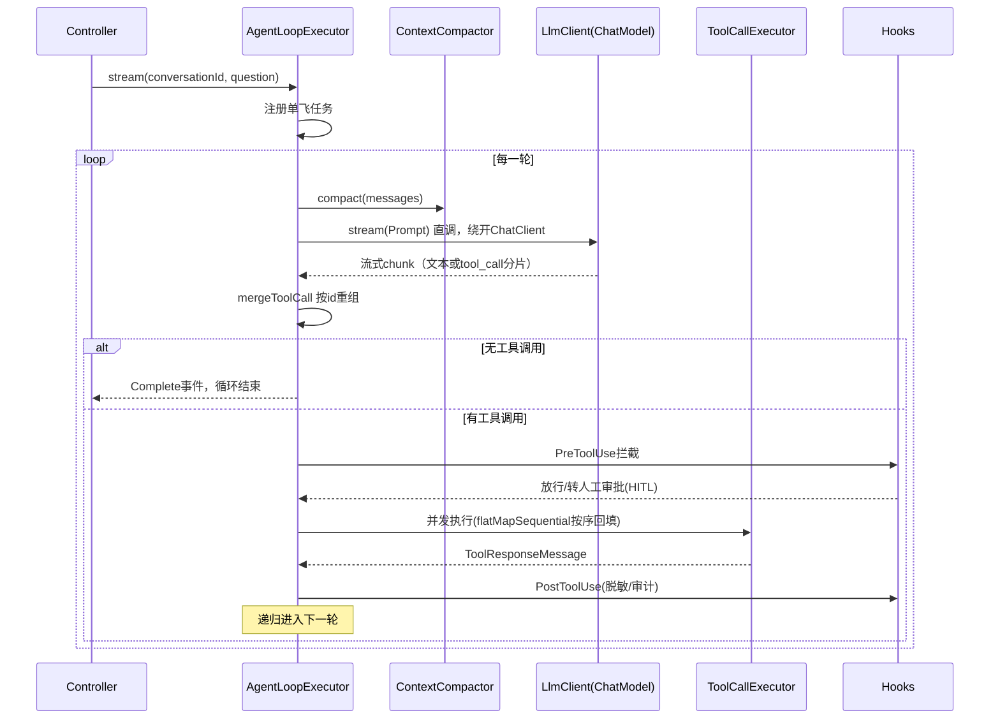

# AgentTrail 架构图与代码结构

> 术语沿用 `CONTEXT.md` 已定义的词汇表（Runtime / Capability Pack / Tool / Skill / Hook / LlmClient / Gateway），不引入新概念。
> 对应决策见 `adr/0001`（Runtime 定位）、`adr/0002`（手写 loop 为 V1 主线）；对应机制细节见 `roadmap.md`（Phase 0-11）与 `engineering-pitfalls-and-highlights.md`（72 条踩坑点，图里每个组件后面标的 `#N` 都能查到）。

---

## 一、整体分层架构

```mermaid
graph TB
    subgraph Client["客户端"]
        FE["前端 SPA<br/>SSE时间线/thinking折叠/Todo进度"]
        CURL["curl / Postman"]
    end

    subgraph Web["Web 层 (web/)"]
        AC["AgentController<br/>/agent/stream, /agent/stop"]
        SC["SessionController"]
        SKC["SkillController"]
    end

    subgraph Runtime["Runtime 层 (loop/) — Phase 0，手写主线"]
        LOOP["AgentLoopExecutor<br/>round状态机 #1 #2"]
        CTX["ContextCompactor<br/>micro/auto compact #6-8"]
        THINK["ThinkingModeProcessor #3-5"]
        TASK["AgentTaskManager<br/>单飞+中断 #9 #10"]
        TS["ToolSearch<br/>延迟工具发现 #13 #14"]
        SKILL["SkillsTool + SkillManager #15 #16 #47 #48"]
        TODO["TodoWriteTool #58"]
        FSTOOLS["FileSystem/Bash/Grep #17-20"]
        INT["PauseState/SafePoint<br/>HITL暂停恢复 #61"]
    end

    subgraph Gov["治理层 (governance/) — Phase 3"]
        HOOK["Hooks<br/>PreToolUse/PostToolUse/Budget"]
        AUDIT["审计日志（哈希链）"]
        OBS["可观测性<br/>TTFT #38 / trace传播 #39"]
        EVAL["评测体系<br/>Golden Set + LLM-as-Judge"]
    end

    subgraph CapPacks["Capability Packs (capability/) — 各自独立，新增不改 Runtime"]
        DATA["dataagent<br/>M-Schema/SQL安全/权限AST/脱敏<br/>#21-29 #35-37"]
        FILE["fileqa<br/>RAG检索管线 #49"]
        WEB["websearch + chart"]
        PPT["ppt<br/>状态机+模板填充 #44 #50-57"]
        DEEP["deepresearch<br/>plan-execute-critique #45 #46"]
        ORCH["orchestration<br/>Orchestrator+Reviewer+Graph #42 #43"]
    end

    subgraph Distributed["分布式基建 (distributed/) — Phase 1"]
        LOCK["Redis分布式锁+Lua原子性 #30 #31"]
        PUBSUB["Pub/Sub跨实例中断 #12"]
    end

    subgraph MCP["MCP (mcp/) — Phase 9"]
        MCPC["MCP Client消费方向"]
        MCPS["MCP Server暴露方向 #40 #41"]
    end

    subgraph Infra["基础设施"]
        LLM["LlmClient → DeepSeek/其他厂商<br/>（唯一模型接入边界）"]
        MYSQL[("MySQL sakila<br/>+会话表")]
        REDIS[("Redis")]
        PGV[("PgVector")]
    end

    FE --> AC
    CURL --> AC
    AC --> LOOP
    SC --> MYSQL
    SKC --> SKILL

    LOOP --> CTX
    LOOP --> THINK
    LOOP --> TASK
    LOOP --> TS
    LOOP --> SKILL
    LOOP --> TODO
    LOOP --> FSTOOLS
    LOOP --> INT
    LOOP <-->|"直调 stream(Prompt)<br/>绕开 ChatClient/Advisor"| LLM

    TASK --> LOCK
    TASK --> PUBSUB
    LOCK --> REDIS
    PUBSUB --> REDIS

    LOOP -.每次工具调用前后.-> HOOK
    HOOK --> AUDIT
    HOOK --> OBS
    LOOP -.按需发现/加载.-> CapPacks

    DATA --> MYSQL
    FILE --> PGV
    ORCH --> DATA
    ORCH --> PPT
    ORCH --> DEEP

    MCPS -.暴露.-> DATA
    MCPC -.消费外部.-> Infra

    style Runtime fill:#e8f0fe,stroke:#4285f4
    style CapPacks fill:#fef7e0,stroke:#f9a825
    style Gov fill:#fce8e6,stroke:#d93025
    style Distributed fill:#e6f4ea,stroke:#34a853
```



**读图要点**：Runtime 是手写主线，`AgentLoopExecutor` 每一轮都重新组装工具列表（ToolSearch 新发现的工具、当前启用的 Skills 都要在这一步汇入），这是"每轮重建"设计的落地位置。Capability Pack 层横向扩展（新增一个能力包不改 Runtime 代码，对应 `CONTEXT.md` 的定义），Governance 层不是一个独立调用链，而是挂在 Runtime 工具执行的前后（`Hooks` 拦截点），图里画成虚线表示"横切"而非"纵向调用"。

---

## 二、ReAct 一轮的时序（Runtime 内部，Phase 0.1 核心）



---

## 三、代码目录结构

```
com.agenttrail
├── AgentTrailApplication.java
│
├── loop/                                   # Runtime 核心 — Phase 0，手写 ReAct loop 主线
│   ├── AgentLoop.java                      # V0（保留，不删——ADR-0002 的对比参考）
│   ├── AgentLoopException.java             # V0
│   ├── ChatMessage.java / LlmResponse.java / Role.java / Tool*.java   # V0
│   ├── deepseek/DeepSeekLlmClient.java     # V0（LlmClient 唯一实现，V1 复用/替换待定）
│   │
│   ├── core/                               # V1 主线（手写 ReAct 引擎，设计已验证）
│   │   ├── AgentLoopExecutor.java          # #1 #2 #63
│   │   ├── RoundState.java / RoundMode.java
│   │   ├── LlmInvoker.java                 # 直调 ChatModel.stream，不经 ChatClient
│   │   ├── ToolCallExecutor.java
│   │   ├── ThinkingModeProcessor.java      # #3 #4 #5
│   │   └── AgentTaskManager.java           # 内存版 #9 #10，Redis版见 distributed/
│   │
│   ├── context/
│   │   ├── ContextPolicy.java
│   │   ├── ContextCompactor.java           # #6 #7 #8
│   │   └── TokenEstimator.java
│   │
│   ├── stage/
│   │   └── ThinkTagParser.java             # #3
│   │
│   ├── model/
│   │   ├── AgentStreamEvent.java           # 9个变体 sealed interface
│   │   ├── ThinkingMode.java
│   │   ├── RunnableParams.java             # #59 双通道参数
│   │   └── TodoItem.java
│   │
│   ├── toolsearch/                         # Phase 0.6
│   │   ├── DeferredToolRegistry.java       # #13 #14
│   │   └── ToolSearchTool.java             # HYBRID: 关键词优先+LLM兜底
│   │
│   ├── skills/                             # Phase 0.7
│   │   ├── SkillsTool.java                 # 单mega-tool设计 #15
│   │   ├── SkillManager.java               # 双存储+定时对账+热加载 #16 #47 #48
│   │   └── MarkdownParser.java             # frontmatter解析
│   │
│   ├── todo/
│   │   └── TodoWriteTool.java              # #58
│   │
│   ├── tools/                              # Phase 0.9 — 常驻工具三件套
│   │   ├── FileSystemTools.java            # virtualMode沙箱 #17-19
│   │   ├── BashTool.java + ShellSessionManager.java   # #20
│   │   └── GrepTool.java
│   │
│   ├── interrupt/                          # Phase 1+ HITL暂停恢复
│   │   ├── PauseState.java / SafePoint.java / PauseReason.java
│   │   └── PauseStateStore.java            # 内存版→JdbcPauseStateStore/RedisPauseStateStore
│   │
│   ├── subagent/                           # Phase 8 机制层（编排逻辑在 capability/orchestration）
│   │   └── SubAgentTool.java               # #60 ThreadLocal走私+禁止嵌套
│   │
│   └── persistence/                        # Phase 0.5
│       ├── TurnPersistenceHook.java         # 接口，core/ 依赖它但不关心实现
│       └── JdbcTurnPersistenceHook.java     # #49 conversation_id/session_id双key，#63持久化时序
│
├── distributed/                            # Phase 1 — 生产化/多实例
│   ├── RedisTaskLock.java                  # Redisson SETNX + Lua原子续期 #30 #31
│   ├── TaskStopPubSub.java                 # #12 双路径停止
│   └── RedisSessionStore.java
│
├── governance/                             # Phase 3 — 治理层
│   ├── hooks/
│   │   ├── AgentHook.java                  # 接口：SessionStart/PreToolUse/PostToolUse/Budget/OnError/SessionEnd
│   │   ├── ApprovalHook.java               # 高危操作转HITL
│   │   └── BudgetHook.java                 # token预算熔断
│   ├── audit/
│   │   └── AuditLogService.java            # 哈希链防篡改
│   ├── observability/
│   │   └── TracingConfig.java              # TTFT独立埋点 #38，Context传播 #39
│   └── eval/
│       └── GoldenSetEvaluator.java         # LLM-as-Judge
│
├── capability/                              # Capability Packs — 每个独立，新增不改 loop/
│   ├── dataagent/                          # Phase 2（SQL 数据分析能力包，主线优先级最高）
│   │   ├── schema/MSchemaIntrospector.java + MSchemaFormatter.java   # #21
│   │   ├── safety/SqlSafetyGuard.java + DangerousFunctionVisitor.java # #22
│   │   ├── permission/DataScopeResolver.java + DataScopeRewriter.java + PermissionRuleRegistry.java  # #26 #35-37
│   │   ├── masking/SensitiveFieldMasker.java   # #25
│   │   ├── glossary/GlossaryLookup.java        # #27 #28
│   │   └── tools/ListTablesTool.java + DescribeTablesTool.java + ValidateSqlTool.java + ExecuteSqlTool.java + CalculateTool.java  # #23 #24 #29
│   │
│   ├── fileqa/                             # Phase 4
│   │   ├── RagRetrievalPipeline.java        # 查询压缩+多查询扩展+PgVector
│   │   └── AnalyzeFileTool.java             # #49
│   │
│   ├── websearch/TavilyToolConfig.java      # Phase 5
│   ├── chart/ChartGenerationTool.java       # Phase 5
│   │
│   ├── ppt/                                # Phase 6
│   │   ├── PptStateMachine.java            # #44
│   │   ├── strategy/RequirementStrategy.java ... SchemaStrategy.java / RenderStrategy.java 等
│   │   └── render/PythonPptxRenderer.java   # ProcessBuilder桥接 #55
│   │
│   ├── deepresearch/                       # Phase 7
│   │   ├── PlanExecuteAgent.java            # order分层+Semaphore并发 #45
│   │   └── DeepResearchContextCompactor.java # 专用压缩 #46
│   │
│   └── orchestration/                      # Phase 8
│       ├── Orchestrator.java
│       ├── ReviewerAgent.java               # 结构化二元判定 #42
│       └── WorkflowGraphExecutor.java       # #43
│
├── mcp/                                     # Phase 9
│   ├── client/                              # 消费现成 MCP Server
│   └── server/                              # 暴露本项目能力 #40 #41
│
├── runtime/                                  # 既有：AgentRuntime 抽象 + AgentScope V2候补
│   ├── AgentRuntime.java
│   └── agentscope/AgentScopeRuntime.java    # ADR-0002：V2候补，不删
│
└── web/
    ├── AgentController.java                  # /agent/stream, /agent/stop
    ├── SessionController.java
    ├── SkillController.java                  # Phase 0.7 管理接口
    └── AgentRuntimeConfig.java
```

**分包原则**：
- `loop/` 只装 Runtime 通用机制，不含任何业务知识（不知道 SQL、不知道 PPT）——这是 `capability/` 能独立扩展而不改 Runtime 的前提。
- `capability/*` 之间互不依赖（`dataagent` 不会 import `ppt`），共享的只有 `loop/` 提供的 `ToolCallback`/`Skill` 注册接口。
- `governance/` 横切所有 Capability Pack，通过 Hook 接口挂载，不需要每个 Capability Pack 各自实现审计/脱敏。
- 当前仍是**单 Maven 模块**（未拆分）。如果后续 Capability Pack 数量继续增长（PPT/DeepResearch/多Agent都到位后），`capability/*` 拆成独立 Maven 模块是一个自然的下一步——但 V1 阶段没有必要，过早拆模块本身也是一种过度设计。

---

## 四、和 CONTEXT.md 术语的对应关系

| CONTEXT.md 术语 | 代码位置 |
|---|---|
| Runtime | `loop/`（core、context、toolsearch、skills、todo、tools、interrupt）+ `distributed/` + `governance/` |
| Capability Pack | `capability/*` 每个子包 |
| Tool | `capability/*/tools/`、`loop/tools/`（FileSystem/Bash/Grep 是 Runtime 内置 Tool） |
| Skill | `loop/skills/` |
| Hook | `governance/hooks/` |
| LlmClient | `loop/LlmClient.java`（接口）+ `loop/deepseek/DeepSeekLlmClient.java`（当前唯一实现） |
| Gateway | 未来独立部署服务，不在本仓库范围内，`LlmClient` 是唯一耦合点 |
