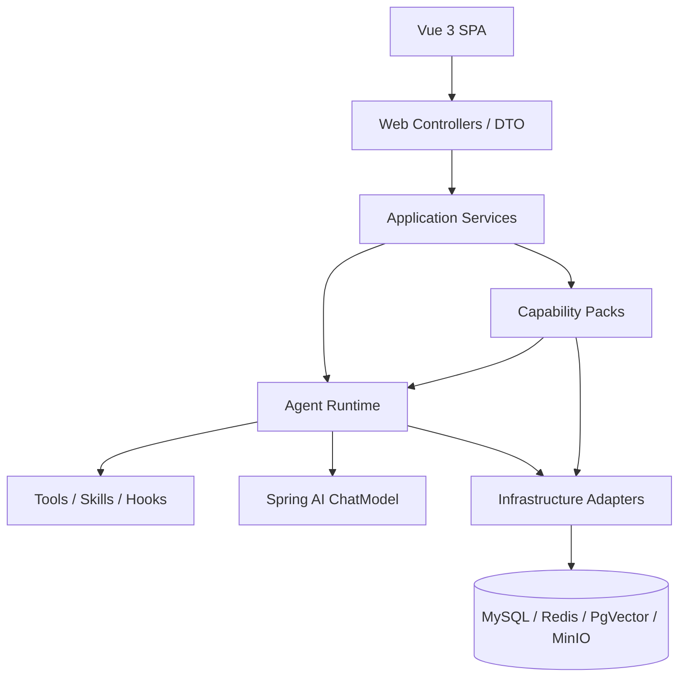

# AgentTrail 架构

> 状态：当前文档。最近核对：2026-08-27。

## 1. 分层

- `web`：HTTP、SSE、DTO 与用户边界。
- `capability`：analytics、file、rag、deepresearch、ppt 等业务能力。
- `loop`：ReAct loop、上下文、工具、Skill、Hook、暂停、记忆、审计和安全。
- `runtime`：稳定的运行时 API、任务与 checkpoint 契约。
- `infrastructure`：存储、分布式协调和运行时适配。
- `platform`：跨能力共享的模型配置和事件契约。

业务层不直接实现模型循环；通用治理不依赖模型提示词自觉。

## 2. 模型与 Runtime

V1 生产链路直接使用 Spring AI `ChatModel`。文本生成模型由 `AgentModelProperties` 的 `agenttrail.model.id` 统一配置，普通对话、数据分析、深度研究和 PPT 共用该标识。多模态、向量和文生图模型保留独立配置。

`AgentLoopExecutor` 负责：

1. 组装系统消息、历史、记忆和附件；
2. 消费模型流并重组工具调用分片；
3. 校验、审批和并发执行工具；
4. 将工具结果按原请求顺序送回下一轮；
5. 持久化正常完成、暂停、错误和 trace。

`call()` 是流式执行的同步门面，不维护第二套循环。

## 3. 主要请求链路

### 普通对话与数据分析

`POST /agent/v1/chat` 进入 `ChatApplicationService`，由模式决定 Runtime Profile。数据分析模式常驻 Schema、术语、SQL 校验、执行与计算工具；普通对话可按需启用联网搜索。

跨轮历史只回放用户问题与最终回答，不把旧轮次的工具 timeline 重新注入模型，避免跨模式出现悬空 `tool_call_id`。

### HITL

高风险工具命中审批规则时，执行器写入 `agent_pause_state` 并结束当前流。审批接口按会话归属读取快照、恢复原能力集，并用持久化状态保证重复恢复不会重复执行。

### 深度研究

`POST /agent/v1/deepresearch` 创建后台任务，服务执行澄清、规划、并行搜索、批判和总结。`research_task` 保存用户归属、会话和终态元数据；完成产物进入统一会话 timeline。

### PPT

`POST /agent/v1/ppt/converse` 先进行需求预检。未满足最低信息时只返回普通追问；确认后才创建任务。

PPT 将业务状态 `PptState` 与运行状态 `PptRunStatus` 分开：前者表示当前 checkpoint，后者表示排队、运行、成功、失败或取消。每个阶段写事件和快照，渲染产物通过 OOXML 重新打开、页数和文件大小校验后才能进入成功态。

## 4. 数据与状态

| 数据 | 主要存储 |
|---|---|
| 会话与 timeline | `agent_session` |
| HITL 快照 | `agent_pause_state` |
| Trace 与 prompt stamp | `agent_trace` |
| 记忆 | `agent_memory` |
| 文件及轮次绑定 | `agent_file` |
| PPT 任务、阶段事件、幂等 | `ppt_generation_task`、`ppt_generation_stage_event`、`ppt_generation_idempotency` |
| 深度研究任务元数据 | `research_task` |
| 用户、角色、部门、权限 | `sys_*` 表 |
| Golden Case | `golden_case` 及评测记录 |

MySQL 保存业务事实；Redis 用于跨实例锁、广播、限速和预算；PgVector 保存大文件向量；MinIO 保存图表和媒体产物。

## 5. 前端

Vue SPA 以一个会话页面承载四种互斥模式：普通对话、数据分析、深度研究和 PPT。普通对话走 SSE；研究与 PPT 提交后由后台任务推进，前端通过轮询和事件接口恢复进度。任务卡片只展示权威状态，用户补充和修改仍从统一输入框发送。

## 6. 安全边界

- 身份来自登录态，不接受客户端或模型伪造的 `userId`。
- 文件、会话、研究和 PPT 查询均校验用户归属。
- SQL 权限通过 AST 改写，敏感字段按来源列脱敏。
- 工具执行前经过风险、审批、限速和 Prompt Injection 检查。
- 本地密钥只放 `application-local.yml`；公开配置只提供空值和安全默认值。

## 7. 当前限制

当前未宣称完成的部分包括：DeepResearch 阶段级持久化续跑、Flyway 单一迁移事实源、Kubernetes 交付、正式容量基线和通用多 Agent/A2A 路由。后续顺序见 [路线图](roadmap.md)。
