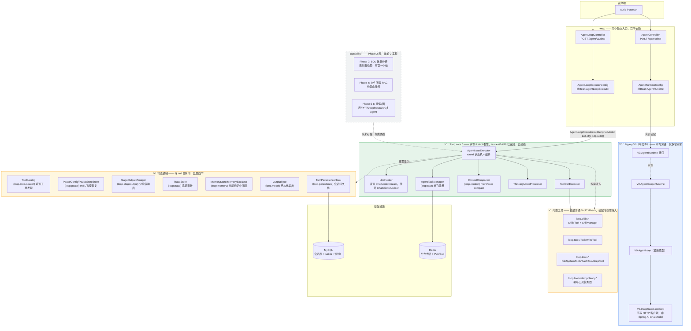
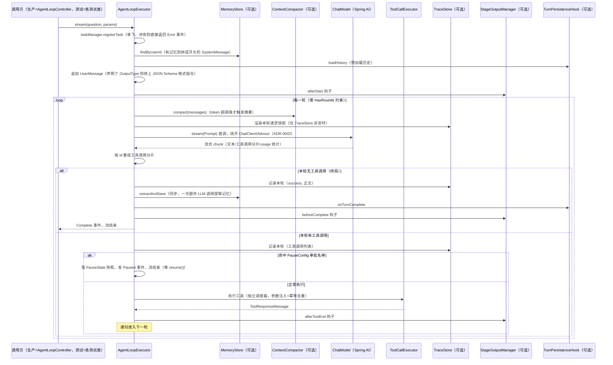

# AgentTrail 架构图与代码结构

> 术语沿用 `CONTEXT.md` 已定义的词汇表（Runtime / Capability Pack / Tool / Skill / Hook / LlmClient / Gateway），不引入新概念。
> 对应决策见 `adr/0001`（Runtime 定位）、`adr/0002`（手写 loop 为 V1 主线）；对应机制细节见 `roadmap.md`（Phase 0-11）与 `engineering-pitfalls-and-highlights.md`（踩坑点，部分机制在下文用 `#N` 标出）。issue 号（`#15`-`#19` 这类）指 GitHub issue，可用 `gh issue view <n> --json state,body` 查验收标准。
>
> **这一版对齐的是 2026-07-31（V0 收敛 + V1 接线之后）的实际代码状态**（issue #1-#19 已关闭），不是规划态——`capability/`、`governance/`、`distributed/`、`mcp/` 这些包目前都还不存在，规划内容见 `roadmap.md` Phase 2 起。

---

## 〇、当前最重要的一件事：V0/V1 现在各有一个独立的 HTTP 入口，互不影响

这是理解这份文档时最容易搞反的一点，先单独说清楚：

- **`com.agenttrail.legacy.V0`（V0）**：项目最早期的两条探索性路径——手写的极简 `AgentLoop` 原型和基于 AgentScope Java 2.0 框架的 `AgentScopeRuntime`——已经收敛进这一个文件，不再演进，纯粹作为"决策是怎么一步步演进过来的"这段历史保留（不删除）。`AgentController`（`POST /agent/chat`）仍然装配它、仍然能跑，只是不再是开发重点。
- **`com.agenttrail.loop.core.AgentLoopExecutor`（V1）**：手写 ReAct 引擎，issue #1-#19 全部完成，`mvn test` 372/372 绿。现在已经有独立的 HTTP 入口：`AgentLoopExecutorConfig` 装配一个只带裸引擎（无工具/暂停恢复/追踪审计/分层记忆）的 `AgentLoopExecutor` Bean，`AgentLoopController`（`POST /agent/v1/chat`）通过同步的 `call()` 暴露出去——先用同步接口把装配跑通，流式 SSE 是这之上很小的一步（换返回类型即可，见该类 javadoc）。
- 能接上的前提是解决了 `ChatModel` 从哪来的问题：`spring-ai-deepseek` 原来只在 `test` scope 声明，已经换成 `spring-ai-starter-model-deepseek`（Spring AI 官方 starter，正常 scope），由 `spring.ai.deepseek.*` 配置项（`application.properties`）自动装配出生产可用的 `DeepSeekChatModel` Bean，不用手写代码去 `new` 它。

两个入口的关系是"并存"，不是"新的替换旧的"：`/agent/chat` 继续走 V0，`/agent/v1/chat` 走 V1，各自独立装配，谁都不依赖谁。

---

## 一、整体分层架构（对齐当前代码）



**读图要点**：
- 实线箭头 = 当前真实存在的调用关系；虚线 = 规划中（`CapPacks`）。
- `AgentLoopExecutorConfig` 目前只把裸引擎接上——`ALE -.按需注入.-> V1Opt/V1Tools` 那两条虚线是"机制存在、可以传，但当前生产装配没传"，不是"还没实现"。
- `V1Opt` 那一层全部是**同一种模式**："这个参数传 null，行为和没有这个机制时完全一致"——不是"未实现的占位符"，是刻意设计成可插拔。第四节详细讲这个模式怎么用。
- `CapPacks` 目前是纯规划，代码里连包目录都没建。

---

## 二、V1 引擎一次完整请求的调用链路（`AgentLoopExecutor.stream()`）

这是引擎内部真实发生的事，来自 `AgentLoopExecutor.java` 当前代码，不是规划——但要注意：这是 `stream()` 的完整能力面，`AgentLoopController` 当前走的是同步的 `call()`（内部就是阻塞收集 `stream()`），且生产装配没开任何可选机制，所以下图里标"可选"的那几个参与者在当前生产环境里实际上都不生效，只有测试代码会真的配上它们：



**另一条入口**：`AgentLoopExecutor.call(question, params)`（issue #15）——不是另一套实现，是把 `stream()` 阻塞收集成一次性返回值，复用同一套单飞注册/上下文压缩/工具执行机制。声明了 `OutputType` 时，`call()` 会在返回前对文本做一次 `JsonRepair.fixJson` 兜底（`stream()` 不做，因为文本已经边生成边推给调用方了，没法事后再改）。

---

## 三、代码目录结构（如实反映当前 `src/main/java`）

```
com.agenttrail
├── AgentTrailApplication.java
│
├── legacy/
│   └── V0.java                                # V0 两条早期路径全部收敛在这一个文件里，不再演进
│                                               # （AgentLoop/LlmClient/DeepSeekLlmClient/AgentRuntime/AgentScopeRuntime
│                                               #  全部作为 public static 嵌套类型，对外仍以 V0.Xxx 引用）
│
├── loop/                                      # loop 根包下现在只有子包，没有散落的顶层文件
│   ├── core/                                  # ★ V1 主线：手写 ReAct 引擎本体
│   │   ├── AgentLoopExecutor.java            # 编排入口：stream()/call()/resume()，唯一的公开门面
│   │   ├── AgentLoopExecutor.Builder         # 装配用 builder（见第四节），和既有构造函数并存
│   │   ├── RunContext.java / RoundState.java / RoundMode.java   # 单次请求 / 单轮的状态
│   │   ├── LlmInvoker.java                   # 唯一模型调用出口：直调 ChatModel.stream
│   │   ├── ToolCallExecutor.java             # 工具执行（独立调度器隔离，MDC 跨线程传播）
│   │   ├── ToolCallAccumulator.java          # 流式 tool_call 分片按 id 重组
│   │   ├── ToolParamInjector.java            # toolParams 白名单注入
│   │   ├── ThinkingModeProcessor.java        # REASONING_CONTENT/THINK_TAG/DISABLED 三分支
│   │   ├── EventSinks.java / MdcPropagation.java
│   │   └── AgentCallException.java           # issue #15：call() 的失败通道
│   │
│   ├── model/                                 # 循环用到的值类型/事件协议
│   │   ├── AgentStreamEvent.java             # sealed interface，9 个事件变体
│   │   ├── RunnableParams.java               # 双通道运行参数（会话id/userId/toolParams/OutputType）
│   │   ├── ThinkingMode.java / TodoItem.java
│   │   └── OutputType.java                    # issue #18：结构化输出类型声明（内含格式指令缓存）
│   │
│   ├── context/                               # 上下文体积控制
│   │   ├── ContextPolicy.java / TokenEstimator.java
│   │   ├── ContextCompactor.java              # micro_compact（每轮）+ auto_compact（超阈值摘要）
│   │   └── MessageRendering.java              # 消息列表→可读文本，摘要提示词和 TraceAudit 共用
│   │
│   ├── stage/ThinkTagParser.java              # <think> 标签跨 chunk 解析（注意：和下面 stageoutput 是两回事）
│   │
│   ├── stageoutput/                           # issue #16：分阶段输出 SPI
│   │   ├── StageTiming.java                   # AFTER_START/AFTER_TOOL_END/BEFORE_COMPLETE
│   │   ├── StageContext.java / StageOutputProvider.java
│   │   └── StageOutputManager.java            # 按 timing 分组调用，单个 provider 异常不拖累其它
│   │
│   ├── trace/                                 # issue #17：TraceAudit
│   │   ├── TraceRecord.java                   # 一轮一条：输入/输出/think/token/耗时/成败
│   │   ├── TraceStore.java                    # 接口
│   │   └── InMemoryTraceStore.java            # 内存实现（JDBC/Redis 留作后续）
│   │
│   ├── structured/JsonRepair.java             # issue #18：JSON 自动修复（markdown围栏/尾逗号/引号/转义）
│   │
│   ├── memory/                                # issue #19：分层记忆中间层（画像/偏好/指令/事实）
│   │   ├── MemoryType.java / MemoryItem.java
│   │   ├── MemoryStore.java / InMemoryMemoryStore.java
│   │   ├── MemoryPromptFormatter.java         # 按类型分组渲染成"# 长期记忆"提示词区块
│   │   └── MemoryExtractor.java               # 一轮结束后一次 LLM 调用提取，失败静默降级
│   │
│   ├── persistence/                           # issue #5：会话持久化
│   │   ├── TurnPersistenceHook.java           # core/ 依赖的接口，不关心具体实现
│   │   ├── TurnRecord.java / HistoryBudget.java
│   │   └── JdbcSessionStore.java              # JDBC 实现
│   │
│   ├── pause/                                 # issue #13：HITL 暂停恢复
│   │   ├── PauseState.java / SafePoint.java / PauseReason.java / PendingToolCall.java / ResumeInstruction.java
│   │   ├── PauseConfig.java                   # 审批名单 + PauseStateStore 的组合配置
│   │   ├── PauseStateStore.java               # 接口
│   │   └── InMemoryPauseStateStore.java       # 内存实现（JDBC/Redis 留作后续）
│   │
│   ├── task/                                  # issue #1/#9/#10/#11/#12：任务生命周期
│   │   ├── AgentTaskManager.java              # 单飞注册 + Disposable 每轮重注册 + 原子 stopTask
│   │   ├── InterruptBroadcaster.java          # 接口
│   │   └── RedisTaskLock.java / RedisInterruptBroadcaster.java   # 跨实例生产化实现
│   │
│   ├── tools/                                 # issue #9/#14：常驻工具 + 幂等
│   │   ├── FileSystemTools.java / PathSandbox.java / SandboxViolationException.java
│   │   ├── BashTool.java + ShellSessionManager.java
│   │   ├── GrepTool.java
│   │   ├── ToolArguments.java / JsonToolCallback.java / OutputTruncator.java / EncodingFallbackReader.java
│   │   ├── TodoWriteTool.java                 # issue #8
│   │   ├── search/                            # issue #6：ToolSearch 延迟工具发现
│   │   │   └── ToolCatalog.java / ToolSearchCallback.java / ToolSearchSession.java / ToolIndexEntry.java / ToolSearchConfig.java
│   │   └── idempotency/                       # issue #14：幂等工具模板
│   │       └── IdempotencyStore.java / InMemoryIdempotencyStore.java / IdempotentToolCallback.java / IdempotencyKeyStrategy(ies).java / IdempotencyRecord.java
│   │
│   └── skills/                                # issue #7：Skills 渐进式披露
│       ├── SkillsTool.java                    # 单 mega-tool 设计
│       ├── SkillManager.java / SkillRepository.java / SkillReconciliation.java
│       └── Skill.java / SkillDocument.java / SkillMetadata.java / SkillNames.java / SkillsConfiguration.java
│
├── capability/                                 # Phase 2 起——当前不存在，规划见 roadmap.md
│
└── web/
    ├── AgentController.java                    # V0 入口：POST /agent/chat
    ├── AgentRuntimeConfig.java                  # @Bean 装配 V0.AgentScopeRuntime
    ├── AgentLoopController.java                 # V1 入口：POST /agent/v1/chat（同步 call()）
    ├── AgentLoopExecutorConfig.java              # @Bean 装配 AgentLoopExecutor（裸引擎，无可选机制）
    └── AgentChatRequest.java / AgentChatResponse.java   # 两个入口共用同一套请求/响应 DTO
```

**分包原则（不变）**：
- `loop/` 只装 Runtime 通用机制，不含任何业务知识——`capability/` 落地后不需要改动 `loop/`。
- `loop.core` 之外的每个子包都是"一个可选机制 + 它的存取接口"，`AgentLoopExecutor` 只认接口，不关心是内存实现还是将来的 JDBC/Redis 实现。
- 当前仍是单 Maven 模块。

---

## 四、扩展模式：怎么加一个新的可选机制

这是这个引擎里**唯一**的可插拔套路，issue #6/#13/#16/#17/#18/#19 全部照这个模式做的，加新机制时照抄即可：

1. **接口 + 内存实现起步**：`XxxStore` 接口（通常就 `save`/`findByXxx` 两个方法），配一个 `InMemoryXxxStore`。不要一次性设计到"以后要支持 JDBC/Redis"的程度——接口本身不排斥换实现就够了（`TraceStore`/`MemoryStore`/`PauseStateStore` 都是这个粒度）。
2. **构造函数参数为 null = 完全不启用**：`AgentLoopExecutor` 拿到 null 就跳过这个机制相关的所有分支，不分配任何中间对象、不做任何多余渲染——不是"空实现兜底"，是真正的零开销路径（比如 `TraceStore` 为 null 时，连消息渲染成文本这一步都不做）。
3. **在生命周期的正确切入点调用，不要散落**：`stream()` 开头（一次性准备）、每轮的 `scheduleRound`/`finishRound`（逐轮）、`completeRun`（收尾）——这三个切入点覆盖了目前所有机制的需要。
4. **失败要降级，不能让整轮对话崩掉**：任何"锦上添花"性质的机制（记忆提取、分阶段输出 provider）失败时记日志+跳过，绝不向上抛异常——参照 `MemoryExtractor.extractAndSave`/`StageOutputManager.invoke`/`ContextCompactor.autoCompact` 里一致的 try-catch-降级写法。
5. **装配用 `AgentLoopExecutor.builder(chatModel, tools, maxRounds)`**：命名方法设置要开的机制，其余保持默认（等价于关闭）。旧的位置参数构造函数仍然保留（不破坏既有调用方），但新代码一律建议走 builder——机制一多，位置参数会有多个 null 占位，容易数错位置。

一个例子（同时开 TraceAudit 和分层记忆，其它都不开）：

```java
AgentLoopExecutor executor = AgentLoopExecutor.builder(chatModel, tools, maxRounds)
        .traceStore(new InMemoryTraceStore())
        .memoryStore(new InMemoryMemoryStore())
        .build();
```

---

## 五、设计亮点/权衡速查（详细版看 `engineering-pitfalls-and-highlights.md` + 各 issue 的 commit message）

| 机制 | issue | 一句话权衡 |
|---|---|---|
| 直调 `ChatModel.stream`，不经 ChatClient/Advisor | ADR-0002 | 换来"Spring AI 1.x/2.0 行为一致"，代价是框架层自动工具执行、Advisor 链这些能力要自己重写 |
| 流式 tool_call 分片按 id 重组 | #1 | 校验放到整轮结束后统一做，不在分片阶段过早报错 |
| 两层上下文压缩（micro/auto） | #4 | micro 每轮都跑但零结构变化；auto 触发阈值高但要搭一次额外 LLM 摘要调用，摘要失败会降级为"保留最近 N 条" |
| TraceAudit 的 requestJson 来源 | #17 | 参考框架靠 Advisor 拦截请求日志；这里绕开了 Advisor 链，改成直接渲染当时的 messages 列表——更贴近真实发送内容，但要在 finishRound 修改 messages 之前抢先渲染 |
| 结构化输出的格式指令注入位置 | #18 | 追加在 UserMessage 后面，不进系统提示词——`question` 本身、落库、压缩摘要都不会混入格式指令噪音 |
| 分层记忆注入位置 | #19 | 作为独立的、排在最前的 SystemMessage，和 #18 的"追加在问题后面"故意不同——这是背景信息，不是当前问题的一部分 |
| 记忆提取时机 | #19 | 放在 `completeRun` 里同步做（会增加一次 LLM 调用的延迟），理由是要在 emitComplete 前完成，避免进程退出后悄悄丢失——这是一个已知的、有意识做出的延迟/一致性取舍，还没有做成异步 |
| `RunnableParams` 双通道 | #59 | prompt 参数模型可见，`toolParams` 模型不可见且执行前强制注入覆盖——userId 必须走后一条通道，否则等于把越权空子交给可被诱导的模型 |
| 落库/记忆提取必须在 emitComplete 之前同步做完 | #63 | 挂在流关闭之后的回调里，进程退出时可能根本跑不到 |

---

## 六、已知缺口（不阻塞现状，但用到对应机制时要记得处理）

- **V1 只接了裸引擎**：`AgentLoopExecutorConfig` 没开工具/暂停恢复/追踪审计/分层记忆任何一个可选机制，也没有会话持久化（每次请求都是全新 conversationId，没有多轮记忆）；`AgentLoopController` 用的是同步 `call()`，不是 SSE 流式——这两点都是"先跑通装配"的最小切片，不是最终形态，第四节的扩展模式随时可以往上叠。
- **换模型供应商**：只要额外的模型（OpenAI/智谱等）也有 Spring AI starter 且和 DeepSeek 的 starter 不同时存在于 classpath，`AgentLoopExecutorConfig` 不用改一行代码——它认的是通用 `ChatModel` 接口。同时装多个供应商的 starter 时会有多个 `ChatModel` Bean，需要按 Spring 标准做法用 `@Qualifier`/`@Primary` 挑一个默认的。
- `TraceStore`/`MemoryStore`/`PauseStateStore` 都只有内存实现，进程重启会丢数据；接口设计上都不排斥换 JDBC/Redis。
- `AgentTaskManager` 不会定时续期已持有的 Redis 锁。
- `MemoryExtractor.extractAndSave` 同步阻塞（见第五节），有明确的延迟代价，是否改异步是个待决策的取舍点，不是 bug。
- DeepSeek `reasoning_content` 的流式行为还没拿真实 key 实测过。

---

## 七、和 `CONTEXT.md` 术语的对应关系

| CONTEXT.md 术语 | 代码位置（当前实际） |
|---|---|
| Runtime | `loop.core` + `loop.context`/`stage`/`stageoutput`/`trace`/`structured`/`memory`/`persistence`/`pause`/`task`/`tools`/`skills`/`model`（V1，已接线，`/agent/v1/chat`）；`legacy.V0`（V0，`/agent/chat`，不再演进） |
| Capability Pack | 规划中，`capability/*`，当前不存在 |
| Tool | `loop.tools.*`（FileSystem/Bash/Grep/TodoWrite 是 Runtime 内置 Tool），未来 Capability Pack 各自的 tools 子包 |
| Skill | `loop.skills.*` |
| Hook | 规划中（`governance/`），当前 V1 里最接近的是 `StageOutputProvider`（生命周期钩子，但语义是"产出附加内容"不是"治理拦截"） |
| LlmClient | V0：`legacy.V0.LlmClient` + `legacy.V0.DeepSeekLlmClient`；V1：直接用 Spring AI `ChatModel`，没有额外抽象层 |
| Gateway | 未来独立部署服务，不在本仓库范围内 |
