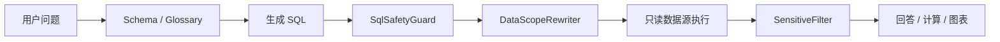

# 数据分析与权限

## 执行链路

## 安全边界

- `SqlSafetyGuard` 只允许只读 SQL，并限制危险结构。
- `DataScopeResolver` 根据当前用户的角色和部门计算范围。
- `DataScopeRewriter` 在 SQL AST 上注入范围，不做字符串拼接。
- `SensitiveFilter` 根据真实来源列打码，避免别名绕过。
- 执行使用独立只读数据源和结果行数上限。
- 图表只能消费带工具来源的数据。

## 工具分工

| 工具 | 作用 |
|---|---|
| `list_tables` | 返回可分析表和关系概览 |
| `describe_tables` | 按需披露字段、注释和样例 |
| `lookup_glossary` | 获取业务口径和时间锚点 |
| `validate_sql` | 在执行前解释安全校验结果 |
| `execute_sql` | 权限改写、预检、只读执行、脱敏 |
| `calculate` | 执行确定性公式，避免模型心算 |

## 评测

Golden Case 覆盖基础问答、越权对比、脱敏、危险 SQL、业务口径、空结果、增长率和图表。涉及安全、范围或脱敏代码时，使用 `mvn verify -Pgolden` 作为额外门禁。
