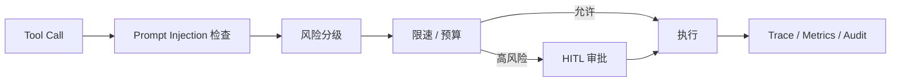

# 安全、可观测性与评测

## 身份与权限

- Sa-Token 提供登录态；生产接口从登录态解析用户身份。
- 用户、角色、部门和权限点存储在 `sys_*` 表。
- 会话、文件、PPT 和研究任务均校验用户归属。
- 数据分析额外执行部门范围计算、SQL AST 注入和字段脱敏。

## 工具治理

- Prompt Injection 检查在工具执行边界运行。
- 高风险调用进入持久化审批，而不是阻塞线程等待。
- Redis 支撑跨实例限速与会话预算；未启用时按配置明确降级。
- PII 打码和日志过滤减少敏感值进入模型、日志和 trace 的机会。
- `JdbcTraceStore` 使用哈希链提供篡改检测。

## 可观测性

- Spring Boot Actuator 暴露 health、info 和 Prometheus。
- liveness 只判断进程存活；readiness 检查关键外部依赖。
- Micrometer 与 OTel 记录模型、工具、TTFT、轮次和任务阶段。
- PPT 使用低基数字段记录状态和耗时，避免把 taskId 等高基数值做 metric tag。

## 评测

Golden Case 既支持内建 fixture，也支持数据库维护的用例。异步评测记录结果、指标和失败原因；候选提取用于把真实会话 bad case 回流为可审查用例。LLM-as-Judge 只作为一个维度，确定性安全断言仍由代码和测试负责。
