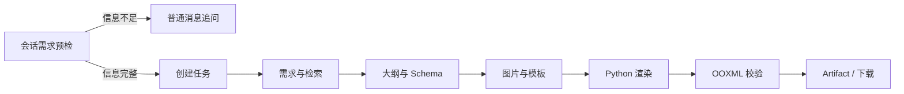

# PPT 与深度研究工作流

## 为什么使用独立任务

普通聊天的 SSE 生命周期通常只有一次请求；研究和 PPT 可能持续数十秒、需要刷新恢复、取消和产物下载，因此使用“提交任务—后台推进—查询状态”的模型。

## PPT

设计要点：

- 主题、页数、受众和风格未确认时不创建任务。
- `PptState` 表示业务 checkpoint，`PptRunStatus` 表示运行生命周期。
- 阶段事件、任务快照和幂等键持久化。
- 模板以 shape name、字段类型和容量构成契约。
- Python 负责富模板渲染，Java 负责状态、校验、恢复和产物访问。
- 基于成功任务的修改创建新版本，不覆盖原产物。

## DeepResearch

DeepResearch 执行澄清、主题生成、计划、并行搜索、批判和总结。任务支持查询、事件订阅和取消，完成结果写入统一会话 timeline。

当前 `research_task` 保存归属和运行终态，使刷新或重启后不会把任务误报为不存在；它尚未保存每个研究阶段的完整 checkpoint，因此不宣称支持从中间步骤无损续跑。

## 前端恢复

任务卡片从后端权威状态重建。PPT 与研究在后台运行时不会长期占用聊天输入框；切换会话或刷新页面后，前端通过历史和运行中任务接口恢复卡片。
