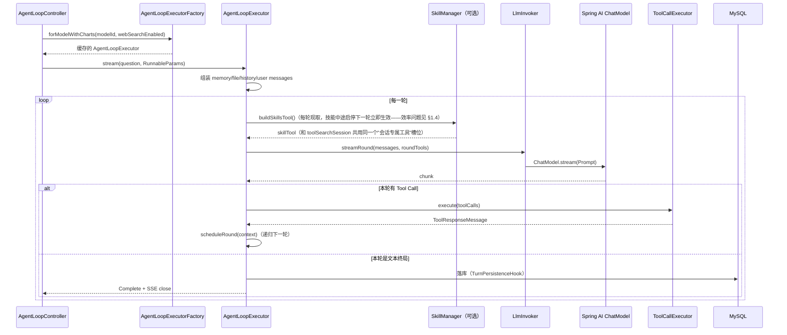
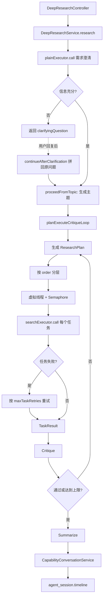
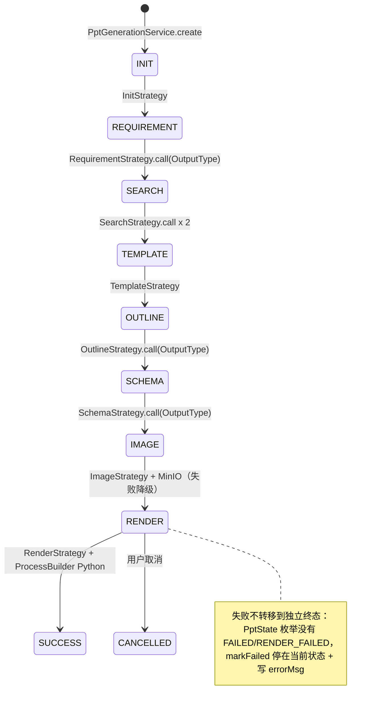
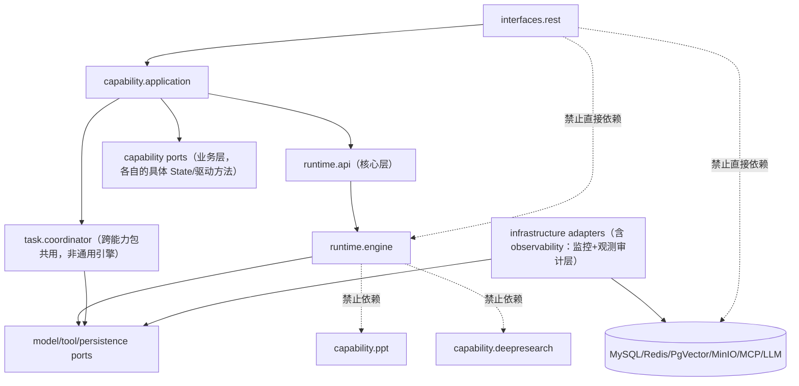

# AgentTrail 重构技术文档

> 最后更新：2026-08-11
> 这是唯一一份重构技术文档，取代并合并了此前的 `architecture-refactor-blueprint-2026-08-03.md` 与
> `refactor-audit-2026-08-11.md`——两份文档已删除，内容全部并入本文档。
> **按系统层级组织**：核心层（Agent Runtime 引擎）→ 业务层（Capability Packs）→ 监控层（Metrics &
> Health）→ 观测审计层（Trace、Security & Compliance）。同一层的现状问题、调用关系图、目标设计放在
> 一起读，不再是"代码地图一节、调用关系一节、问题清单一节、目标架构又一节"这种按分析维度切、
> 实际内容全耦合在一起的组织方式。
> 更新本文档时直接改正文，不要叠加"复核更新"分层块——单文档、原地更新。

---

## 0. 先给结论

当前工程不是没有架构，而是处在"Runtime 已经长出来，Capability Pack 正在从 Runtime 剥离"的过渡阶段——`capability/`（analytics/auth/sys/deepresearch/ppt/file/rag）已经落地，`loop/` 下已经只剩纯 Runtime 机制。

| 优先级 | 所属层 | 问题 | 一句话 | 章节 |
|---|---|---|---|---|
| 🔴 P0 | 观测审计层 | Golden Case / 审计接口无角色校验 | 任何登录用户可跨用户浏览会话、改评测用例、查审计哈希链 | §4.1 |
| 🔴 P0 | 业务层 | PPT 下载接口未登录请求绕过归属校验 + MinIO bucket 公开读 | 任何人拿到/猜到 taskId 就能下载别人的 PPT 产物，不需要登录 | §2.3 |
| 🔴 P0 | 核心层 | `AgentLoopExecutorFactory` 比 `AgentLoopExecutor` 本体更严重的 telescoping constructor | 24 字段、12 构造函数，原蓝图只诊断了执行器一个类 | §1.3 |
| 🔴 P0 | 核心层 | V0/V1 双入口同时暴露 | `legacy/V0.java` 的阻塞调用至今零超时，是"给每个调用加超时"这个 fix 唯一没盖到的路径 | §1.3 |
| 🟠 P0 | 核心层 | 主 HikariCP 连接池从未显式调参 | 全部 JDBC 存储共用默认 10 连接，次要连接池反而调过参 | §1.5 |
| 🟠 P0 | 核心层 | 两个后台线程池硬编码 4 线程 + 无界队列 | `PptGenerationConfig`/`DeepResearchConfig`，突发负载下是 OOM 风险点 | §1.5 |
| 🟠 P0 | 观测审计层 | 集成测试里能跑进 CI 的部分也没跑 | ~28 个 `*IT.java` 里 Testcontainers 自包含的那部分本可零成本接入 CI | §4.4 |
| 🟡 P1 | 核心层 | `Hook`/`StageOutputProvider` 两套 SPI 零实现 | 生产里完全没人用，抽象没有回本；**2026-08-11 已定案：留、不删**（`PreToolUse` 已有限速/审批场景，ASJ `SkillHook`/SAA `SkillsAgentHook` 证明"技能注入做成 Hook"是生产验证过的真实需求，具体理由见 [ticket-14.md](specs/refactor-remediation/refactor-remediation-ticket-14.md) §3.1）——这一行的"没有回本"是问题现状描述，不是删除建议 | §1.6 |
| 🟡 P1 | 核心层 | 新增 Tool 没有注册机制 | `GrepTool`/`BashTool`/`FileSystemTools` 甚至没接入生产 | §1.6 |
| 🟡 P1 | 业务层 | 5 处重复的"结构化 LLM 调用+JsonRepair+解析"逻辑 | 该抽个 `StructuredLlmCall`，仿照已有的 `SynchronousLlmCall` | §2.4 |
| 🟡 P1 | 业务层 | DeepResearch/PPT 任务模型深浅不一 | PPT 有 DB checkpoint，DeepResearch 纯内存 Map，重启即丢且从不清理终态任务 | §2.3 |
| 🟡 P1 | 业务层 | DeepResearch 进度对前端完全黑盒 | 前端已经画好"规划→检索→验证→综合"流程图等着数据，后端 `DeepResearchTaskResponse` 却只有 status 一个字段，四个环节永远不会高亮 | §2.7 |
| 🟢 P2 | 核心层 | `AgentLoopExecutor` 每轮看门狗定时器不主动释放 | 多轮对话下是真实的内存/定时器堆积 | §1.4 |

---

## 1. 核心层：Agent Runtime 引擎

管的是"一次 Agent 推理"本身——模型调用、工具执行、上下文组装、生命周期管理，不带任何业务知识。代码对应 `loop/*`（`core`/`model`/`context`/`task`/`tools`/`skills`/`hook`/`security` 等子包）+ `web/service/AgentLoopExecutorFactory`。

### 1.1 顶层入口与包结构

| 入口 | 当前实现 | 判断 |
|---|---|---|
| `POST /agent/chat` | [legacy/V0.java](../src/main/java/com/agenttrail/legacy/V0.java)（`AgentScopeRuntime`） | V0 旧演示路径，不再演进但仍装配、仍能跑，保留作历史对照 |
| `POST /agent/v1/chat` | [loop/core/AgentLoopExecutor.java](../src/main/java/com/agenttrail/loop/core/AgentLoopExecutor.java) | V1 主线流式 Agent，当前主入口 |

```text
loop/                          # 只剩纯 Runtime 机制，不再有业务能力包（capability/ 已在 2026-08-06 剥离完成）
├── core/                      # AgentLoopExecutor、LlmInvoker、ToolCallExecutor、SynchronousLlmCall
├── model/ context/ stage/ stageoutput/ trace/ structured/ memory/ persistence/ pause/ task/ tools/
├── skills/                    # SkillManager/SkillRepository + SkillController
│                               # ⚠️ SkillController 是个例外：它是个 HTTP 入口，却放在这里而不是
│                               #   web/controller/——违反了团队刚统一好的分包规范，是 08-08 新增时
│                               #   引入的问题，见 §1.3
├── hook/                      # Hook SPI（6 拦截点，生产零实现，见 §1.6）
└── security/                  # PromptInjectionGuard/PiiMasker/ToolRateLimiter（这三个机制的现状
                                #   属于观测审计层，见 §4.3，这里只是代码位置）
```

### 1.2 调用关系：普通流式对话



**同步 `call()` 的真实语义**：不是第二套循环，而是 `stream(question, params) → blockLast() → 收集 Text 事件 → Error/Paused 转换成 AgentCallException → OutputType 场景最后做 JsonRepair`。这让所有业务策略能复用同一个 loop，但 `call()` 是阻塞式 facade，调用方拿不到结构化的 run 状态、当前轮次、已执行工具和取消句柄。

### 1.3 结构问题（P0）

| 问题 | 证据 | 影响 |
|---|---|---|
| V0/V1 双入口同时暴露 | `/agent/chat` 仍装配 `V0.AgentScopeRuntime`；`legacy/V0.java` 的 `agent.call(...).block()` 至今零超时——是"给每个模型/工具调用加超时"这个 fix（[SynchronousLlmCall.java](../src/main/java/com/agenttrail/loop/core/SynchronousLlmCall.java) 覆盖了 6 处同步调用点）唯一没盖到的第四条路径 | 更深层的修法不是再补一个调用点的超时，而是在 `ChatModel` 底层 HTTP client 上配置 read timeout——目前 `application*.yml` 里 `spring.ai.*timeout` 是空的，任何未来新增调用点默认都不设防 |
| 业务直接依赖 `AgentLoopExecutor` | PPT 策略、DeepResearch、WebSearch 测试直接 `new`/`forModel().call()` | Runtime 无法替换，业务无法独立测试（这条的业务侧后果见 §2.3） |
| `AgentLoopExecutor` 依赖过多、telescoping constructor | 1206 行，全项目最大类，25 个字段，16 个依次转发的构造函数（已有 `Builder` 覆盖同样能力，构造函数链是纯历史包袱） | 空值语义、装配错误和回归风险持续增加 |
| **`AgentLoopExecutorFactory` 比执行器本体更严重**（本次审计新发现） | 497 行，**24 个字段，12 个 telescoping 构造函数**——比 `AgentLoopExecutor` 还多几个；还揉进了 4 个独立的 `ConcurrentHashMap` executor 缓存（plain/webSearch/analytics/chart）和一处硬编码模型兼容性绕过逻辑（`resolveToolCallingModel()` 把带工具的 `qwen-plus` 请求悄悄路由到 `deepseek-chat`，`deepseek-chat` 未注册时直接抛 `IllegalStateException`） | 同上，且范围比原诊断更大 |
| Spring AI 类型泄漏到核心和业务 | `ChatModel`、`ToolCallback`、`Message`、`Flux` 出现在核心公开接口和业务构造函数 | 无法做框架迁移或多语言 sidecar |
| `skillTool`/`toolSearchSession` 共用同一个会话级工具槽位（2026-08-08 新增） | `AgentLoopExecutor.finishRound` 靠代码注释"生产环境下两者互斥"保证不撞车，不是类型系统保证 | 以后两者要共存会静默出错 |
| `SkillController` 违反刚定的包规范 | 放在 `loop/skills/` 而不是 `web/controller/` | 和团队自己刚统一好的分包原则矛盾 |

### 1.4 效率与资源泄漏

- **看门狗定时器不主动释放**：[AgentLoopExecutor.java:707-717](../src/main/java/com/agenttrail/loop/core/AgentLoopExecutor.java) 每轮 `Mono.delay(roundTimeout).subscribe(...)` 正常结束时从不 dispose，持有整个 `RunContext`（含消息列表）直到 8 分钟超时自然触发。`ToolCallExecutor` 已经用 `.timeout(...)` 串联管道做到同样效果且不泄漏，`AgentLoopExecutor` 应该抄同样写法。
- **Skill 列表每轮重新查库+读盘**：`SkillManager.buildSkillsTool()` 每一**轮**（不是每次对话开始）都做 JDBC 查询 + 逐个技能读盘解析 + 重建工具描述字符串。语义上只需要按对话粒度缓存+失效钩子。

### 1.5 高并发支持

| 问题 | 证据 | 影响 |
|---|---|---|
| 两个后台线程池硬编码 4 线程 | `PptGenerationConfig.java:67`、`DeepResearchConfig.java:70` 都是 `Executors.newFixedThreadPool(4, ...)` 字面量，不是 `@Value`——对比同一个类里其它参数都做成了可配置项 | 背后是无界 `LinkedBlockingQueue`，突发负载下任务在堆内存无限排队，是真实 OOM 风险点 |
| **主 HikariCP 连接池从未显式调参** | 没有任何 `spring.datasource.hikari.*` 配置，`PrimaryDataSourceConfig.java:34-38` 直接吃 Spring 默认（10 连接）——这个池同时被 session/trace/memory/pause/ppt/golden/sys/auth **所有** JDBC 存储共用 | 对比 pgvector 池（显式设了 4）、analytics 只读池（显式设了 10，注释里还写了"要对着 MySQL max_connections 折算"）——两个次要池反而调过参，扛最多流量的主池没人管过 |
| 没有任何全局并发上限/背压 | `AgentTaskManager` 只做到"同一 conversationId 单飞"，`application.yml` 没设 `server.tomcat.max-threads`/`accept-count` | 请求会一路涌到 DB 连接池或 LLM API 限流才被卡住 |
| `ToolRateLimiter` 默认禁用 | 依赖 Redis，`application.yml:114` 默认 `agenttrail.redis.enabled: false`，代码注释自己写"永远放行" | 唯一存在的限流机制开箱即禁用（这个机制本身属于观测审计层的安全纵深，见 §4.3，这里只讲它对并发的影响） |
| `MschemaIntrospector.collectExamples()` 每次调用新建线程池 | 影响小：唯一调用方有 Redis 锁+定时触发保护 | 若以后挪到请求路径上是真 bug |

**正面对照**：`ToolCallExecutor.java:71-73` 用一个**静态共享、有界**的 `Schedulers.newBoundedElastic(...)` 处理所有实例的工具执行——做对的例子，说明团队不是不知道怎么做，只是没把同样的严谨度铺开到所有线程池。

### 1.6 插件化与抽象重量

**新增内置 Tool 没有注册机制**：`GrepTool`/`BashTool`/`FileSystemTools`/`TodoWriteTool` **现在压根没接入生产**（`web/` 下零引用），只有 `FileContentTool` 被装配。加一个新工具要动：新工具类 + `AgentLoopExecutorConfig` 加 `@Bean` + `AgentLoopExecutorFactory` 的多个工厂方法（`forModel`/`forAnalytics`/`forModelWithCharts`/`forInternalOrchestration`）——真实缺口。

**通用抽象是否过重**：

| 抽象 | 生产里实际有多少实现/使用 | 判断 |
|---|---|---|
| `Hook` SPI（6 个拦截点接口） | **0 个实现**；`AgentLoopExecutorFactory` 直接硬编码 `AgentHooks.EMPTY`，连构造函数参数都不是 | 现状没有回本，但**已定案保留不删**——`PreToolUse` 有现成的限速/审批场景，ASJ/SAA 都把类似的技能注入做成 Hook，证明这类拦截点是真实需求，不是过度设计（见 Ticket 14 §3.1） |
| `StageOutputProvider`/`StageOutputManager` SPI | **0 个实现**，生产工厂从未调用 `.stageOutputManager(...)` | 现状没有回本，**已定案随 `Hook` 一并保留**，但没有同等分量的真实场景，留到 Phase 6/7 设计 `EventEnvelope` 时再确定要不要复用（见 Ticket 14 §3.2） |
| `AgentLoopExecutor.Builder`（21 个可选项） | 生产实际接了 15/18——比预期用得多；只有 `toolCatalog`（仅 `forAnalytics` 用）和 `stageOutputManager`（从不使用）是死可选项 | 基本回本 |
| `RunnableParams` 双通道 | 8 处调用 7 处 `toolParams` 传空；唯一负载是安全关键路径（`userId`/`conversation_id` 鉴权注入） | 为那一处安全路径付出代价，可以接受 |
| `IdempotencyStore`/`InterruptBroadcaster` | 各只有一个实现，没有真实第二实现在路上 | 对比 `TraceStore`/`MemoryStore`/`PauseStateStore` 等真正有两版实现且都在用的接口，这两个更像"为了对称而加" |

### 1.7 单一职责违反

| 类 | 行数 | 混杂的职责 |
|---|---|---|
| [AgentLoopExecutor.java](../src/main/java/com/agenttrail/loop/core/AgentLoopExecutor.java) | 1206 行，25 个字段 | 单飞注册、记忆注入、文件注入、看门狗定时器、Micrometer 指标、工具延迟发现、暂停/恢复/HITL、追踪记录、预算熔断、限速执行、六个 Hook 生命周期触发 |
| [AgentLoopExecutorFactory.java](../src/main/java/com/agenttrail/web/service/AgentLoopExecutorFactory.java) | 497 行，24 个字段 | 模型注册表 + 4 个独立 executor 缓存 + 硬编码模型兼容性绕过逻辑 |

**最该拆的是 `AgentLoopExecutor`**，按"改动理由是否相同"拆成 4 块：

1. **RoundDriver**（模型流式协议变了才动）
2. **RunLifecycleManager**（治理策略变了才动）
3. **RunObservability**（追踪记录 + Micrometer 计时器——本次审计新发现，之前的模块划分没单独点出来，指标库升级和暂停恢复 bugfix 现在会改同一个 1206 行的文件）
4. **ContextAssembler**（Prompt 组装规则变了才动）

### 1.8 目标架构与落地阶段

公共门面只保留一个深接口：

```java
public interface AgentRuntimePort {
    AgentRunHandle start(AgentRequest request);
    AgentResult call(AgentRequest request);
    AgentRunSnapshot snapshot(RunId runId);
    void cancel(RunId runId, CancellationReason reason);
    AgentRunHandle resume(RunId runId, ResumeCommand command);
}
```

`AgentLoopExecutor` 先保留为兼容 facade，内部拆成 6 个模块（对应 §1.7 的 4 块拆分，这里是完整目标态）：

| 新模块 | 只负责什么 | 当前来源 |
|---|---|---|
| `AgentRunCoordinator` | 创建/恢复 RunContext，驱动整体生命周期 | `stream`/`resume` |
| `RoundDriver` | 一轮模型请求、chunk 收集、终局判断 | `scheduleRound`/`processChunk` |
| `ToolRoundExecutor` | 工具解析、权限校验、并发执行、结果排序 | `ToolCallExecutor` |
| `ContextAssembler` | 历史、记忆、附件、系统 Prompt 组装 | `stream` 中的消息准备逻辑 |
| `RunCompletionCoordinator` | 落库、Stage、Trace、Memory、Complete 事件 | `completeRun` |
| `RunLifecycleManager` | 单飞、取消、暂停、租约、恢复 | `AgentTaskManager` + pause |

用 `RuntimeProfile`/`RuntimeModule` 替代 telescoping constructor + null：可选能力不再通过 null 表达，而是 `RuntimeModule.contextCompaction(...)`/`memory(...)`/`pauseResume(...)`/`trace(...)`/`stageOutput(...)`/`toolSearch(...)` 这样的显式模块；装配失败必须在启动时失败，生产 Bean 打印最终 Profile 摘要（`profile=chat-default model=deepseek-chat tools=[web-search,chart] pause=false memory=false trace=true persistence=jdbc`）。

工具层拆成四个接口：`ToolDefinition`（名称/描述/Schema/风险级别）、`ToolResolver`（本轮可见工具，替代当前无注册机制的问题）、`ToolExecutor`（执行）、`ToolResultPolicy`（超时/重试/截断/脱敏）。

事件协议：统一 `EventEnvelope`（eventId/runId/taskId/conversationId/sequence/occurredAt/type/source/visibility/payload），支持 `RunStarted`/`ModelDelta`/`ToolStarted`/`ToolCompleted`/`CheckpointSaved`/`Paused`/`RunCompleted`/`RunFailed`/`RunCancelled`，断线用 `Last-Event-ID`/`afterSequence` 重放。

**对应落地阶段**（完整 Phase 列表见 §6）：Phase 0（架构护栏）→ Phase 1（冻结 `AgentRuntimePort` 契约）→ Phase 2（切断 Spring AI 泄漏）→ Phase 3（拆分 6 模块、删 telescoping constructor、给 `Hook`/`StageOutputProvider`——已定案保留——接上第一个真实实现）→ Phase 4（统一 Run/Task/Checkpoint/Event 基础设施，供业务层使用）。

---

## 2. 业务层：Capability Packs

管的是具体业务能力——DeepResearch、PPT、文件问答/RAG、数据分析、Golden Case 评测。代码对应 `capability/*` + `evaluation/*` + 部分 `web/controller`、`web/service`。**这一层只应该依赖 `AgentRuntimePort` 这个稳定接口，不应该直接依赖 `AgentLoopExecutor`**——这是当前和目标状态之间最大的落差。

### 2.1 包结构与入口

```text
capability/                    # 2026-08-06 起从 loop/ 搬入完成
├── analytics/ auth/ sys/      # Phase 2：数据分析、登录、RBAC
├── deepresearch/ ppt/         # 各自的状态机/工作流
├── file/（含 multimodal 子包）/ rag/

evaluation/                    # Golden Set 评测：GoldenCase*/LlmJudge/GoldenTaskRunner
                                # 2026-08-06 起从 src/test 提升为生产能力
```

| 入口 | 当前实现 | 状态 |
|---|---|---|
| `POST /agent/v1/deepresearch` | [capability/deepresearch/DeepResearchService.java](../src/main/java/com/agenttrail/capability/deepresearch/DeepResearchService.java) | 已异步化：提交即返回 `taskId`，后台线程池执行，轮询状态，支持取消（issue #65）。2026-08-08 起支持"追问后续接"：`DeepResearchRequest` 新增 `previousQuestion`/`previousClarifyingQuestion` 字段，`continueAfterClarification(...)` 把用户回复拼回原问题重新进入流程 |
| `POST /agent/v1/ppt/create` | [capability/ppt/PptGenerationService.java](../src/main/java/com/agenttrail/capability/ppt/PptGenerationService.java) | 已异步化，DB 落逐状态 checkpoint，支持取消——比 DeepResearch 更完整 |
| `POST /agent/v1/files` | [capability/file/FileQaService.java](../src/main/java/com/agenttrail/capability/file/FileQaService.java) | 上传、解析、向量化 |

### 2.2 调用关系

**DeepResearch**：



**PPT 状态机**：



`PptState` 实际只有 `INIT/REQUIREMENT/SEARCH/TEMPLATE/OUTLINE/SCHEMA/IMAGE/RENDER/SUCCESS/CANCELLED` 九个值——此前文档画错了不存在的 `FAILED`/`RENDER_FAILED` 状态。

### 2.3 结构问题

- **业务直接依赖 `AgentLoopExecutor`**：`DeepResearchService`、PPT 策略类都直接 `new`/`call()` 执行器，业务接口绑定了 Runtime 实现，不是一个"文本模型调用端口"（核心层侧的问题描述见 §1.3）。
- **DeepResearch 用 `UUID` 生成内部 conversationId** 绕过单飞机制，不是清晰的 `runId/taskId` 设计。
- **任务模型深浅不一**：`DeepResearchTaskRegistry` 是纯内存 `ConcurrentHashMap`，重启丢失所有进行中任务的记录，且从不清理终态任务（不重启也会无限增长）；PPT 有 DB 落的逐状态 checkpoint，重启后还能凭 taskId 继续跑。两条业务线的"任务"语义深浅完全不对等。
- **PPT 并发与资源风险**：`PptTaskStore` 假设"不会并发推进"但没有分布式租约/幂等键；渲染用本地文件系统和 `ProcessBuilder`，没有独立 render worker、并发上限、磁盘配额；下载接口没有会话/用户权限校验，当前请求模型固定使用 `anonymous`；MinIO 图片 bucket 是公开读。
- **`CapabilityConversationService`/`ConversationHistoryService` 位于 `web.service`**：能力历史写入被当成 Web 层的责任，直接手写 SQL 并映射进 `web.dto` 响应对象，任何非 HTTP 入口都无法复用同一套会话事实源。
- **🔴 PPT 下载接口未登录请求会绕过归属校验**（写票核实时新发现，比原来"下载接口没有会话/用户权限校验"的描述更具体）：`PptGenerationController` 的下载端点只在 `currentUserId()` 非空时才做归属过滤，未登录请求会落到未过滤的查询路径，能拿到任意 `taskId` 的产物。加上 `MinioPptImageStore.ensureBucketReady()` 已确认显式把 bucket 策略设成 `Principal: ["*"]` 公开读——两者叠加意味着任何人只要拿到或猜到 `taskId` 就能下载别人的 PPT 产物，不需要登录。修复方案见 [specs/refactor-remediation/refactor-remediation-ticket-18.md](specs/refactor-remediation/refactor-remediation-ticket-18.md) §6/§7。

### 2.4 复用与重复代码

**五处重复的"结构化 LLM 调用"模式**：[RequirementStrategy.java:38-48](../src/main/java/com/agenttrail/capability/ppt/strategy/RequirementStrategy.java)、[SchemaStrategy.java:44-55](../src/main/java/com/agenttrail/capability/ppt/strategy/SchemaStrategy.java)、[OutlineStrategy.java:46-57](../src/main/java/com/agenttrail/capability/ppt/strategy/OutlineStrategy.java)、`DeepResearchService.java` 的 `critique`/`generatePlan` 各自独立实现同一套步骤：构造 `RunnableParams` → `executor.call(...)` → `JsonRepair.fixJson` → 反序列化 → catch 包装异常。核心层已经为"同步 LLM 调用"抽象过一次（`SynchronousLlmCall`，六处正确复用），但没有等价的"结构化调用+JsonRepair+解析"版本，fallback 行为已经开始漂移。**建议**：加一个 `StructuredLlmCall.call(executor, prompt, params, Class<T>)`，五处调用点各自从十来行缩到 3 行。

**`GoldenCaseService.create()`/`update()` 重复记录构造**：[GoldenCaseService.java:43-79](../src/main/java/com/agenttrail/evaluation/GoldenCaseService.java) 两个方法完整重复校验+构造逻辑，抽一个 `buildRecord(...)` 私有方法即可，低风险。

### 2.5 单一职责违反

| 类 | 行数 | 混杂的职责 |
|---|---|---|
| [GoldenTaskRunner.java](../src/main/java/com/agenttrail/analytics/golden/GoldenTaskRunner.java) | 162 行 | YAML 加载+缓存、并发执行框架、打分/断言合并三件不相关的事 |
| [PptGenerationService.java](../src/main/java/com/agenttrail/capability/ppt/PptGenerationService.java) | 222 行 | 相对干净，唯一小问题是 `prepareModify`/`prepareResume` 直接内联操作 JSON 快照，没有委托给状态对象 |

### 2.6 插件化与扩展性

用"今天要加 X，需要动几个文件、有没有注册机制"逐场景验证：

| 场景 | 现状 | 需要改几个文件 | 判断 |
|---|---|---|---|
| 加一个新的 PPT 步骤 | 真实的注册表：`Map<PptState,PptGenerationStrategy>` 按 `handledState()` 建表，启动时缺状态就 fail-fast（但不是 `@Component` 自动扫描，是手动 `@Bean`） | 新枚举值 + 新 Strategy + 加一个 `@Bean`——3 个文件 | 恰当的简单 |
| 加一个全新业务能力 | 没有能力层的统一扩展点 | 要仿 PPT 整套新建包、Config、Controller、DTO，前端路由 | 目标架构 Phase 9（`AgentDefinition`/`AgentRegistry`）就是为解决这个缺口设计的 |
| 换模型/供应商 | 只在"新增一个 ChatModel Bean"这个子场景成立零代码；实际有硬编码的 `"qwen-plus"`/`"deepseek-chat"` 字符串特判（见 §1.3） | 文档声称"零代码"，实际有一半是理想状态 |
| 前端 admin 加新页面 | 无注册机制，`AdminLayout.vue` 硬编码 `<RouterLink>`，`router.ts` 硬编码路由数组 | 至少 3 个文件，`GoldenCasesView.vue`/`GoldenCandidatesView.vue` 重复实现几乎相同的 error/loading ref + 页面外壳，没有共享 composable |

（Skills 系统的插件化评估属于核心层机制，见 §1.6——`SkillReconciliation` 定时扫描技能目录、自动注册/清理孤儿，加新技能 0 个 Java 文件，是目前做得最好的扩展点。）

### 2.7 前端实时可见性：DeepResearch 是唯一的黑盒

审计工具调用（含 MCP）、DeepResearch、PPT、Golden 评测四条异步/流式链路，逐一核实后端是否真的把执行进度发出来、前端是否真的渲染了，结论是**前三条做对了，DeepResearch 是唯一名不副实的地方**：

| 环节 | 后端是否往外发进度 | 前端是否渲染 | 用户实际体验 |
|---|---|---|---|
| 普通对话工具调用（含 MCP） | ✅ `AgentStreamEvent` 里的 `ToolStart`/`ToolEnd`（[loop/model/AgentStreamEvent.java](../src/main/java/com/agenttrail/loop/model/AgentStreamEvent.java)）——`ToolCallExecutor.executeOne` 在工具执行**前**就发 `ToolStart`（带真实工具名和参数），超时路径也会补发 `ToolEnd`，不会挂起。MCP 工具（如 `ChartToolProvider` 用 `SyncMcpToolCallbackProvider`）被转成普通 `ToolCallback`，走的是完全一样的事件路径，没有降级 | ✅ [chat.ts](../frontend/src/stores/chat.ts) 的 `applyStreamEvent` 收到 `ToolStart` 立即推一个 chip，`ToolEnd` 原地更新——[ChatView.vue](../frontend/src/views/ChatView.vue) 实时渲染成 `CollapsibleChip` | 能看到"正在调用 XX 工具"及参数/结果 |
| Skills 调用 | ⚠️ 机制上有事件（走同一个 `ToolStart`/`ToolEnd`），但工具名固定显示成 `"Skill"`（[SkillsTool.java:46](../src/main/java/com/agenttrail/loop/skills/SkillsTool.java)），不区分具体调用的是哪个技能 | 只有解析 `arguments` 里的 `command` 字段才能看出调的哪个技能，UI 目前没做这层 | 能看到"在调技能"但看不出调的哪个 |
| PPT | ✅ 状态机每步落 DB checkpoint，`PptGenerationController.toResponse` 直接把真实 `PptState`（9 个值）返回给轮询接口 | ✅ [PptTaskCard.vue:14-16](../frontend/src/components/PptTaskCard.vue) 把 9 个状态映射成中文，每 1.5s 轮询实时更新 | 能看到"正在生成大纲""正在渲染"等真实进度 |
| Golden 评测 | ✅ `GoldenEvaluationService.EvaluationTask` 用 `AtomicInteger completedCases` 实时计数 | ✅ [EvaluationView.vue:124](../frontend/src/admin/views/EvaluationView.vue) 渲染成 `X/Y cases` 进度条 | 能看到真实完成数 |
| **DeepResearch** | ❌ **完全黑盒**：`DeepResearchTaskResponse` 只有 `{taskId,status,report,errorMsg}` 四个字段——`DeepResearchController` 类注释自己写着"跑完了没有"；内部 `planExecuteCritiqueLoop`/`critique`/`summarize`（`DeepResearchService.java` 180-437 行）全部只写 `log.info(...)`，和 `taskRegistry`/进度字段零耦合（grep 确认为空） | 前端画了个"规划→检索→验证→综合"流程图（[ResearchReportCard.vue:49](../frontend/src/components/ResearchReportCard.vue)），但没有任何字段可绑定，四个环节永远不会高亮，是纯装饰；唯一真实的反馈是一个从 0 开始累加的计时器 | 提交后只能看计时器干等，可能是几分钟，期间服务端明明在打"第 2 轮执行计划""4 个任务并发执行"这些日志，但一个字都传不到前端 |

这是**明确的设计取舍**（class 注释自己承认），不是疏漏——但确实是当前唯一"前端 UI 已经画好等着数据、后端却从没提供过"的地方：`ResearchReportCard.vue` 的四步流程图是个信号，说明前端开发者当初是按会有进度字段来设计的。

**建议**（低成本，不需要等 Phase 6 的改造）：在 `DeepResearchTaskRegistry` 的任务条目上加一个 `volatile currentStep` 字段（`CLARIFYING/PLANNING/SEARCHING/CRITIQUING/SUMMARIZING`），`DeepResearchService` 现有的 `log.info` 调用点顺手多写一行更新该字段，`DeepResearchTaskResponse` 加一个 `currentStep` 字段透出，前端把已经画好的四步图从装饰改成真绑定。这是一个独立于 Phase 6 的小改动，不需要等大重构，可以现在做；真正的进度事件流（按 checkpoint/阶段粒度）留给 Phase 6 的 `EventEnvelope` 做。

### 2.8 目标设计与落地阶段

**2026-08-11 已定案：不引入通用 `WorkflowDefinition<S>`/`WorkflowNode`/`WorkflowEngine` 抽象**（本节
原来的设计已废弃）。理由：① 横向读过的参考实现（DeepResearch 的 Plan-Execute-Critique 循环）本身
就是写死在具体类里的 `for` 循环，没有通用工作流引擎；② PPT 现有的 `PptState` 枚举 +
`Map<PptState, PptGenerationStrategy>` + `PptGenerationService` 显式驱动已经验证过"具体状态枚举 +
显式代码"这条路径能跑；③ DeepResearch、PPT 是目前仅有的两个"多步骤可恢复"场景，还没到需要抽象出
第三种形状的地步（三次法则）。目标设计改为：**每个能力包自己定义状态枚举 + 具体驱动方法，共用
Phase 4 的 Task/Checkpoint/Event 基础设施（`TaskCoordinator`/`CheckpointStore`/`RunEventStore`），
不共用任何"Workflow"接口层**。

DeepResearch 目标阶段（`DeepResearchStage` 枚举，具体驱动方法见 [refactor-remediation-ticket-17.md](specs/refactor-remediation/refactor-remediation-ticket-17.md) §2）：`Clarify → GenerateTopic → Plan → FanOut(SearchTask[]) → MergeEvidence → Critique（pass→Synthesize / fail→Plan 带反馈）→ ReportArtifact`——这条链路本身不变，变的只是"用生成通用接口实现"改成"用具体枚举+驱动方法实现"。

PPT 目标阶段：沿用现有 `PptState` 枚举 + `Map<PptState, PptGenerationStrategy>` 模式，本节不重新设计。

Task 统一模型（解决 §2.3 的"任务模型深浅不一"）：`taskId/capabilityId/tenantId/userId/conversationId/status/currentStage/attempt/leaseOwner/leaseUntil/idempotencyKey/checkpointVersion/inputRef/outputRef/errorCode/createdAt/updatedAt`（`capabilityId`/`currentStage` 都是普通字符串标签，不对应任何通用接口类型）；Task API：`POST /agent/v1/runs → 202 {runId,taskId}`、`GET .../{taskId}`、`GET .../{taskId}/events`、`POST .../{taskId}/cancel`、`POST .../{taskId}/resume`。

**PPT 并发与资源安全改造（硬性规则）**：Controller 不直接运行 Python；每个任务先拿数据库租约再执行当前阶段；`RENDER` 用独立 render worker 或独立线程池，设全局并发上限；每个任务独立临时目录，结束按保留策略清理；模板/脚本/输出路径全部走 allowlist；产物存 MinIO/S3，数据库只存 ArtifactId；创建任务支持 `Idempotency-Key`；下载走签名 URL；失败节点按 RetryClass 区分可重试/不可重试。

**迁移映射**：

| 当前代码 | 目标位置 | 业务允许依赖 | 业务禁止依赖 |
|---|---|---|---|
| `capability.deepresearch.DeepResearchService` | `capability.deepresearch.application.DeepResearchWorkflow`（具体类，不实现通用接口） | `AgentRuntimePort`、`TaskCoordinator`、`EvidenceRepository` | `AgentLoopExecutor`、Spring `ChatModel`、Web DTO |
| `capability.ppt.PptGenerationService` | `capability.ppt.application.PptWorkflow`（具体类，沿用现有 `PptState` 模式） | `TaskCoordinator`、`ArtifactStore`、`ModelPort`、`RenderPort` | `ProcessBuilder`、`PptTaskStore` JDBC 实现、Controller |
| `capability.file.FileQaService` | `capability.fileqa.application.FileIngestUseCase` + `FileQueryUseCase` | `FileStorePort`、`EmbeddingPort`、`RetrievalPort` | Web MultipartFile、PgVector 实现 |
| `web.service.CapabilityConversationService` | `conversation.application.TimelineService` | ConversationPort | Controller 直接写库 |

**对应落地阶段**（完整 Phase 列表见 §6）：Phase 5（迁移普通 Chat）→ Phase 6（DeepResearch 改成 Task 化的具体驱动）→ Phase 7（PPT 改成异步 Worker/Artifact）→ Phase 8（文件问答/RAG）→ Phase 9（多 Agent/Skills/MCP/A2A）。

---

## 3. 监控层：Metrics & Health

管的是"系统是否健康、指标是否达标"——不涉及具体某一次请求的因果链（那是第 4 层观测审计层的事），是聚合视角的运行状态。

### 3.1 现状：比预想的完善

`docker-compose.yml` + `deploy/prometheus.yml` + `deploy/prometheus/alerts.yml`（3 条真实 SLO 告警规则：TTFT P95>2s、耗时 P95>5s、工具成功率<99%）+ Grafana 看板 JSON 都已存在并接线到 `management.endpoints.web.exposure.include: health,info,prometheus`。这块比预想的成熟，值得在面试/文档里正面提。

### 3.2 缺口

- **没有任何自定义 `HealthIndicator`**（`grep -rln HealthIndicator` 零命中）——`/actuator/health` 只反映 Spring Boot 自动探测的 DataSource/磁盘检查，对 Redis/PgVector/MinIO/DashScope 的可达性完全没有探针。
- **无 CORS 配置**（`grep -rn "Cors\b" src/main/java` 零命中）。

### 3.3 建议

补齐 Redis/PgVector/MinIO/DashScope 的自定义 `HealthIndicator`，让 `/actuator/health` 能真正反映依赖是否可用，而不只是数据库连不连得上。

---

## 4. 观测审计层：Trace、Security & Compliance

管的是"某一次请求发生了什么、谁能看什么、能不能追溯"——单次请求粒度的因果链、权限边界、合规基线。代码对应 `loop/trace`、`loop/security`、`loop/hook`、`web/controller/TraceAuditController`、`GoldenCaseController`/`GoldenCandidateController`，以及测试基础设施（`*IT.java`）。

### 4.1 🔴 权限校验缺失（最高优先级）

`GoldenCaseController.java`、`GoldenCandidateController.java`、`TraceAuditController.java` 均无 `@SaCheckRole`/`@SaCheckPermission`，而 `sys.controller.*` 下的管理接口都有对应的角色校验（已交叉确认 `web/controller` 下无一处这类注解）。当前鉴权是"全局默认拒绝未登录"，但登录之后没有二次角色/权限校验——任何已登录的普通用户可以：浏览其他用户的会话列表和详情（`GoldenCandidateController`）、增删改评测用例（`GoldenCaseController`）、调用审计哈希链校验接口（`TraceAuditController`，本该是内部运维用途）。

**建议**：这几个接口至少加管理员角色校验，等价于 `sys.controller.*` 已有的做法。这是本文档优先级最高的一项，改动范围小（加注解），应该独立于其它重构工作立即处理。

### 4.2 追踪审计机制现状

`TraceStore`（内存版+JDBC 版）记录每一轮的输入/输出/think/token/耗时/成败；审计哈希链用 `SELECT ... FOR UPDATE` 而不是应用层锁——同一 `conversationId` 的哈希链必须严格有序，多实例部署下应用层锁不跨进程，行锁把"取上一条哈希+写入新哈希"这个临界区下推到数据库自己保证。这部分设计是扎实的，缺口只在 §4.1 的权限校验没跟上——机制做对了，但谁能调用它没有管住。

### 4.3 安全纵深现状

`PromptInjectionGuard`（同步小模型分类调用，`stream()` 构造 UserMessage 之前拦截）、`PiiMasker`（手机号/身份证号/银行卡号正则打码）、`ToolRateLimiter`（Redisson `RRateLimiter`）均为可选机制（null = 不启用）。其中 `ToolRateLimiter` 默认禁用（依赖 Redis，`application.yml:114` 默认 `agenttrail.redis.enabled: false`，代码注释自己写"永远放行"）——这是唯一存在的限流机制，开箱即禁用，对入站 HTTP 或出站 LLM QPS 没有等价保护（并发影响见 §1.5）。

### 4.4 集成测试闭环审计

`pom.xml` 里 `maven-surefire-plugin` 默认排除 `**/*IT.java`（注释解释"本项目没接 Failsafe"），只有 `-P integration`（跑全部 `*IT.java`）或 `-P golden`（跑 `GoldenTaskIT`/`GoldenTaskLiveIT`）才会执行；`.github/workflows/ci.yml` 跑的是不带任何 profile 的 `./mvnw -B -ntp verify`，且该文件自己有注释说明这是**有意为之**的权衡：

```yaml
# 带 MySQL、Postgres、MinIO、MCP 和外部模型的集成测试只在本地基础设施环境运行，
# GitHub Actions 仅执行不依赖这些本地服务的默认测试集。
```

抽查的 `GoldenCaseRepositoryIT`、`AgentLoopExecutorFullStackIT`、`DeepResearchServiceIT`、`ImageStrategyIT`、`SearchStrategyIT` 测试本身质量过关——真写真读回验证（`ImageStrategyIT` 用 MinIO SDK 独立重新拉取校验），不 mock 被测系统本身。**问题不在测试写得好不好**，在这个"一刀切"的权衡可以做得更细：

| IT 分类 | 代表文件 | 能否进 CI | 现状 |
|---|---|---|---|
| Testcontainers 自包含（GitHub Actions 自带 Docker，不需要外部密钥或本地长驻服务） | [RedisTaskLockIT.java](../src/test/java/com/agenttrail/loop/task/RedisTaskLockIT.java)、[AgentTaskManagerCrossInstanceIT.java](../src/test/java/com/agenttrail/loop/task/AgentTaskManagerCrossInstanceIT.java)、[ToolRateLimiterIT.java](../src/test/java/com/agenttrail/loop/security/ToolRateLimiterIT.java)、`SharedMySql` 相关的 IT | **可以** | 目前和其它 IT 混在一起被整体排除，一次都没在 CI 跑过 |
| 依赖真实外部密钥/本地长驻服务 | [ChartAgentLoopIT.java](../src/test/java/com/agenttrail/web/config/ChartAgentLoopIT.java)（需本地 `mcp-echarts`）、`WebSearchAgentLoopIT`（需 Tavily/DashScope key）、[ImageStrategyIT.java](../src/test/java/com/agenttrail/capability/ppt/strategy/ImageStrategyIT.java)（需本地 MinIO）、`RagPipelineIT`（需真实 PgVector+embedding） | **确实不适合进无密钥的公共 CI** | 排除合理，但没有 `@EnabledIf`/跳过门槛——本地开发者不小心跑 `-P integration` 又没起对应服务时是**直接失败**，不是优雅跳过 |

**建议**：① 新增一个不需要密钥的 `-P integration-ci` profile（或精确 `<include>` 到 Testcontainers 类），接入 `ci.yml`，成本低、马上有真实回归保护；② 给需要外部密钥的 IT 补 `@EnabledIfEnvironmentVariable` 之类的门槛，本地误跑时优雅跳过。

### 4.5 合规与上线差距

- **`docker-compose.yml` 的 `langfuse` 服务硬编码了密钥字面量**——本地用没问题，但没有机制阻止这份 compose 文件被原样搬去真实部署环境。
- **数据库迁移是单个扁平 `db/schema.sql`**，靠 `spring.sql.init.mode: always` 每次启动重跑幂等 DDL，没有 Flyway/Liquibase，没有版本化，环境间 schema 漂移无法检测。
- **多租户**：`grep -rn tenantId src/main/java` 零命中——目前是完全未动工的状态，`RunnableParams` 用 `Map<String,Object>` 承载系统参数，权限字段、租户字段和工具注入没有强类型约束。

### 4.6 目标：统一安全边界

所有请求必须有 `tenantId/userId`，不能继续用生产默认 `anonymous`；工具权限在 Tool Gateway 做服务端校验，不能只依赖 Prompt；系统参数注入使用强类型 `ExecutionPrincipal`，不使用自由 Map；文件/Python/Shell/MCP/下载 URL 都必须有 allowlist、超时和审计；产物默认私有，使用签名 URL；Prompt、工具返回值和错误日志要有 PII/Secret 脱敏策略；管理类接口必须有角色校验（§4.1，这条是目前唯一违反的）。

**对应落地任务**：这一层的问题大多是独立的配置/注解改动（§4.1 权限校验、§4.4 CI profile），不依赖 Phase 0-10 的架构大改，应该最先做，见 §9。

---

## 5. 目标架构总览：四层如何组合成一个系统

第一阶段只做包边界和接口，不拆成多个 Maven module：

```text
com.agenttrail
├── platform          # 【跨层基础设施】TenantId/RunId/EventEnvelope/ErrorCode/Clock
│
├── runtime            # 【核心层目标态，对应 §1.8】
│   ├── api / engine / model / tool / context / lifecycle / middleware / profile
│
├── task               # 【核心层↔业务层共用的任务/检查点/事件基础设施——不是通用工作流引擎，
│   │                    #   见 §2.8：DeepResearch/PPT 各自的状态机是具体类，只共用这层基础设施】
│   ├── coordinator（TaskCoordinator）/ checkpoint（CheckpointStore）/ event（RunEventStore）/ lease
│
├── capability          # 【业务层目标态，对应 §2.8】
│   ├── chat / deepresearch / ppt / fileqa / analytics / skills / multiagent
│
├── conversation        # 【业务层：会话事实源，解决 CapabilityConversationService 归属问题】
│   ├── api / application / adapter
│
├── infrastructure       # 【核心层+业务层共用的外部系统适配器】
│   ├── llm.springai / tool.springai / tool.mcp / protocol.a2a
│   ├── persistence.jdbc / messaging.redis / artifact.minio / process.python
│   └── observability     # 【监控层+观测审计层的落地位置】
│
└── interfaces
    └── rest（chat/deepresearch/ppt/fileqa/admin）
```

等 `runtime` 与 `capability` 的依赖测试稳定后，再拆为独立 Maven module——过早拆 Maven 会把"包边界还没想清楚"的问题变成依赖管理问题，先用 ArchUnit 锁定边界更稳。

**目标依赖方向**：



规则：`runtime.engine` 不能 import `capability.*`；`capability.*` 不能 import `interfaces.*`；`interfaces.rest` 只能依赖 `application` 与 DTO mapper；`infrastructure.*` 只能通过 port 接入；Spring AI/Reactor/Jackson/JDBC/Redis 类型只允许出现在 adapter 层；`AgentRequest` 的身份、租户、预算、工具权限必须是强类型，禁止塞进 `Map`；`capability.*` 之间不共用状态/驱动逻辑，只共用 `task.*` 这层基础设施。

---

## 6. 逐阶段重构计划

### Phase 0：建立事实基线和架构护栏（跨四层）

1. **权限校验补齐**（§4.1，观测审计层）——安全问题，优先级最高，加注解即可。
2. **CI 接入 Testcontainers 类 IT**（§4.4，观测审计层）——新增不需要密钥的 profile，成本低，立刻有回归保护。
3. `test`：增加当前 HTTP 契约快照，固定 `/chat`、`/deepresearch`、`/ppt`、`/files` 的请求响应行为。
4. `test`：增加 ArchUnit 依赖方向测试。
5. `ops`：输出 Runtime Profile 启动摘要，明确哪些可选机制实际启用。

### Phase 1-4：核心层（对应 §1.8）

Phase 1 冻结 `AgentRuntimePort` 契约，不移动实现；Phase 2 切断 Spring AI 从业务向外泄漏；Phase 3 拆分 Runtime 内部 6 模块、删除 telescoping constructor（`AgentLoopExecutor` 和 `AgentLoopExecutorFactory` 一起处理，见 §1.3）、给已定案保留的 `Hook`/`StageOutputProvider` 两套 SPI 接上第一个真实实现（不再是"要不要保留"的开放问题）；Phase 4 统一 Run/Task/Checkpoint/Event 基础设施。验收标准见各阶段小节末尾（原文见 §1.8）。

### Phase 5-9：业务层（对应 §2.8）

Phase 5 迁移普通 Chat；Phase 6 把 DeepResearch 接入 Task 基础设施（解决 §2.3 的任务模型深浅不一，顺带把 §2.7 提到的进度字段升级成正式的 `EventEnvelope` 事件流；不引入通用 Workflow 引擎，具体状态机保留在 `DeepResearchService` 自己的驱动方法里，见 §2.8）；Phase 7 把 PPT 改成异步 Worker/Artifact（落地 §2.8 的并发资源安全规则）；Phase 8 迁移文件问答/RAG；Phase 9 多 Agent/Skills/MCP/A2A。

### Phase 10：框架 PoC，而不是全量重写

用同一组 Golden Tasks 对比 AgentScope Java 2.0（Harness/Middleware/State Store/SubAgent/A2A）、LangGraph（StateGraph/checkpoint/interrupt）、AutoGen Core（AgentId/Message/Actor）、CrewAI（Flow/Crew 分层）、Dify（API/Worker/Queue/插件）、AutoGPT（Block/Artifact/Schedule）、LangChain（Tool Schema/Middleware）——各自借鉴一个问题的解法，不整体替换。PoC 成功标准：业务无需修改 `AgentRuntimePort`；事件/取消/暂停/恢复语义可映射；性能基线不退化；迁移后能删除一批自研代码，而不是增加第二套 Runtime。

---

## 7. 测试与质量门禁

**核心层测试**：`RoundDriverTest`（文本终局/单工具/多工具/工具调用分片/错误工具）、`ContextAssemblerTest`（历史/记忆/附件/输出合同注入顺序）、`ToolPolicyTest`（可见性/权限/危险级别）、`RunLifecycleTest`（单飞/取消/暂停/恢复/租约过期）、`EventContractTest`（sequence 单调递增、重放一致性）。

**业务层测试**：节点成功后 checkpoint 才推进；节点失败按 RetryClass 处理；Worker 重启后从 checkpoint 恢复；同一个 idempotency key 不重复执行副作用；并行节点结果合并顺序稳定；取消后不再启动下一节点。

**观测审计层测试**：MySQL（Run/Task/Checkpoint/Outbox/时间线）、Redis（租约/续期/抢占/广播取消）、PgVector（租户过滤/索引状态）、MinIO（私有 bucket/签名 URL/清理）、Python Worker（超时/非零退出/半成品清理）、SSE（断线/重连/afterSequence/去重）。

**架构测试**（ArchUnit，跨四层强制执行 §5 的依赖方向规则）：`runtime.engine` 不得依赖 `capability.*`；`capability.*` 不得依赖 `interfaces.*`；`interfaces.*` 不得依赖 infrastructure 实现类；`capability.*` 不得依赖 `org.springframework.ai.*`；所有 Repository 实现只能出现在 `infrastructure.*`；所有 Controller 只能调用 application service。

---

## 8. 面试时可以这样讲这次重构

**一句话**："我把系统从一个以 `AgentLoopExecutor` 为中心的技术包，重构成核心层（Runtime）、业务层（Workflow/Capability）、监控层、观测审计层四层。普通对话走 Runtime，DeepResearch/PPT 走可恢复 Workflow，HTTP 只提交任务和订阅事件，Python/MCP/LLM 都通过端口隔离；监控和审计不是事后补的，是从一开始就在四层里各自有独立位置的一等公民。"

**追问"为什么不让 PPT 直接跑在 Web 请求里？"**："PPT 同时包含多次 LLM 调用、联网搜索、图片转存和 Python 子进程。同步 Web 只能解决 demo 的调用路径，不能解决排队、租约、取消、重试、断点恢复和多实例资源安全。所以我把它建模成 Task + Worker + Artifact，SSE 只订阅事件。"

**追问"监控层和观测审计层有什么区别？"**："监控层回答'系统整体健不健康'——Prometheus/Grafana/SLO 告警，是聚合视角；观测审计层回答'这一次请求发生了什么、谁能看、能不能追溯'——TraceStore、审计哈希链、权限校验，是单次请求粒度的因果链和合规边界。这次审计发现的最高优先级问题（Golden Case 接口无角色校验）就出在观测审计层，说明这层不能只做机制，还要管住谁能调用这些机制。"

**追问"为什么参考这些框架？"**："我分别吸收了它们解决的不同问题：图状态和 checkpoint、Middleware 和权限、Actor/Message 事件模型、Flow 与 Crew 的分层、API/Worker/Queue 的平台化、Block/Artifact 的能力原子化，而不是把几个框架混成一个基类。"

---

## 9. 推荐的落地顺序

**独立于大改动、成本低、马上能做的**（不需要等 Runtime 拆分完成，按层标注）：

1. 【观测审计层】权限校验（§4.1）——安全问题，改注解，优先级最高。
2. 【观测审计层】CI 接入 Testcontainers 类 IT（§4.4）——新增 profile，立刻有回归保护。
3. 【核心层】主 HikariCP 连接池显式调参、两个后台线程池的队列/大小改成可配置+有界（§1.5）——纯配置改动。
4. 【核心层】`AgentLoopExecutor` 看门狗定时器改用 `.timeout(...)` 串联管道（§1.4）——`ToolCallExecutor` 已有先例，照抄即可。
5. 【业务层】`GoldenCaseService` 去重、`ToolCallExecutor` 构造函数瘦身（§2.4）——低风险机械改动。
6. 【监控层】补齐 Redis/PgVector/MinIO/DashScope 的 `HealthIndicator`（§3.3）。
7. 【业务层】DeepResearch 补 `currentStep` 字段打通已经画好的前端进度图（§2.7）——加一个字段、几个 `log.info` 调用点顺手多写一行，不需要等 Phase 6。

**需要按 Phase 0-10 分阶段做的**（涉及核心执行路径和多个测试文件的调用点，不建议脱离计划单独改）：

1. 先落本文档、ArchUnit 和运行时装配摘要（Phase 0）。
2. 【核心层】引入 `AgentRuntimePort`，让 DeepResearch/PPT 不再直接依赖 `AgentLoopExecutor`（Phase 1）。
3. 【核心层】抽 `ModelGateway` 和 `ToolGateway`，切断 Spring AI 类型泄漏（Phase 2）。
4. 【核心层】拆分 `AgentLoopExecutor`/`AgentLoopExecutorFactory` 的 telescoping constructor，给已定案保留的 `Hook`/`StageOutputProvider` 两套 SPI 接上第一个真实实现（Phase 3）。
5. 【业务层】把 `CapabilityConversationService` 挪到 conversation application（Phase 2 尾声）。
6. 【业务层】先把 DeepResearch 接入 Task/Checkpoint/Event 基础设施，验证长任务模型（Phase 6）。
7. 【业务层】再把 PPT 改成异步 Worker/Artifact，作为资源安全和断点恢复的主展示案例（Phase 7）。
8. 【业务层】最后迁移文件问答和多 Agent（Phase 8-9）。

这条顺序能保留当前 V1 的可运行性，同时让每一步都产生清晰的面试材料：接口演进、调用链收敛、异步任务化、资源隔离、断点恢复和多 Agent 编排。
