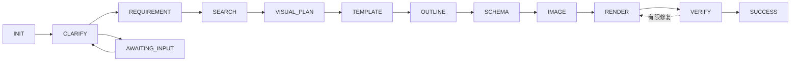

# PPT 生成能力重构需求文档

> 状态：Implemented
>
> 日期：2026-08-19
> 范围：PPT 生成后端、前端、任务持久化、模板与渲染、失败恢复及端到端体验

本文档是 PPT 重构规格的总入口。详细需求已按实现边界拆分到 `ppt-generation-refactor/`，需求编号 R1–R57 与验收编号 E1–E15 保持稳定。

## 1. 背景

当前项目已经具备意图识别、需求澄清、信息检索、模板加载、大纲生成、页面内容生成、封面配图、Python 渲染、数据库 checkpoint、异步执行、状态轮询及失败后从当前阶段重试。

现有路线“状态机 + Strategy + 模板填充 + Python 渲染”可以继续沿用，但仍有以下产品化缺口：

- 后端任务状态与前端卡片尚未形成单一权威来源；
- 页面刷新、重新登录、切换会话、服务重启后的任务找回与续跑不完整；
- 取消入口与运行中调用的取消传播未闭环；
- 失败缺少稳定错误码、重试分类和用户提示；
- 最终 PPT 依赖生成实例的本机磁盘；
- 模板、页面 Schema、逐页素材和复杂渲染能力有限；
- checkpoint 只有最新完整快照，缺少版本、乐观锁和阶段事件；
- CREATE、MODIFY、RESUME 的修改基线、历史展示与恢复体验不完整。

本次重构不重写状态机，而是在保留正确骨架的前提下，让任务、数据、模板、渲染和前端交互真正闭环。

## 2. 目标与成功标准

### 2.1 核心目标

1. 保留状态粒度 checkpoint，并增加版本兼容、并发保护和审计能力。
2. 后端任务表成为唯一权威，前端与会话历史仅保存稳定任务引用。
3. 打通创建、澄清、运行、失败、重试、取消、刷新找回、重启恢复、下载与修改。
4. 将模板、图片和最终 PPT 纳入稳定对象存储。
5. 建设可注册、可校验、可选择、可版本化的模板体系。
6. 扩展页面 Schema，支持多页面类型、文本、图片、背景和图表。
7. 加强 Python 渲染、模板契约验证和渲染后质量检查。
8. 建立结构化失败、重试、降级和 warning 模型。

### 2.2 用户侧成功标准

- 发起生成后立即得到任务卡片并看到真实进度；
- 需求不足时助手在会话中追问，用户继续通过统一会话输入框补充；
- 关闭页面后重新进入仍能找回同一任务；
- 失败后可理解失败阶段并按能力继续；
- 可主动取消并看到最终取消结果；
- 服务重启后任务可自动恢复或明确提示继续；
- 可从任意应用实例下载产物；
- 可基于已有 PPT 做局部修改并保留历史版本；
- 最终文件可编辑、视觉一致且经过验证。

## 3. 非目标

- 不把 PPT 状态机抽象为所有 Agent 共用的通用工作流框架；
- 不改用 HTML、整页文生图或动态代码生成路线；
- 不建设在线 PPT 编辑器或多人实时协作；
- 不保存或展示模型完整思考链；
- 不一次性建设无限模板市场；
- 不把分钟级任务改回单次长连接请求。

## 4. 目标状态机

执行阶段与运行生命周期分离：`pipelineState` 表示下一步要执行的业务阶段，`runStatus` 表示 `QUEUED`、`RUNNING`、`WAITING_INPUT`、`RETRY_WAIT`、`FAILED`、`CANCEL_REQUESTED`、`CANCELLED` 或 `SUCCEEDED`。

## 5. 拆分文档与需求映射

| 文档 | 需求范围 | 主题 |
| --- | --- | --- |
| [01-state-and-checkpoint.md](ppt-generation-refactor/01-state-and-checkpoint.md) | R1–R5 | 状态语义、快照、版本、乐观锁、阶段事件 |
| [02-execution-recovery-and-failure.md](ppt-generation-refactor/02-execution-recovery-and-failure.md) | R6–R13 | 调度、幂等、重启恢复、重试、取消、失败与降级 |
| [03-template-schema-and-assets.md](ppt-generation-refactor/03-template-schema-and-assets.md) | R14–R21 | 模板注册、视觉规划、动态 Schema、逐页素材 |
| [04-rendering-and-artifacts.md](ppt-generation-refactor/04-rendering-and-artifacts.md) | R22–R25 | Python 渲染、VERIFY、对象存储 |
| [05-operations-api-and-security.md](ppt-generation-refactor/05-operations-api-and-security.md) | R26–R31 | CREATE/MODIFY/RESUME、统一 API、鉴权 |
| [06-frontend-and-conversation.md](ppt-generation-refactor/06-frontend-and-conversation.md) | R32–R41 | 任务卡片、轮询、取消、历史恢复与异常窗口 |
| [07-observability-testing-and-delivery.md](ppt-generation-refactor/07-observability-testing-and-delivery.md) | R42–R43、E1–E15 | 可观测性、验收、测试、迁移、增量提交 |
| [08-conversation-requirement-progress-and-mvc.md](ppt-generation-refactor/08-conversation-requirement-progress-and-mvc.md) | R44–R57 | 单一会话输入、主题门禁、统一消息、事件进度与 MVC 收敛 |

推荐按表格顺序阅读；前后端联调至少同时阅读 05、06、07，不能只实现其中一侧。

## 6. 跨文档不变量

1. 任务表是状态唯一权威；会话历史、前端卡片和缓存不得覆盖它。
2. `FAILED` 只描述运行生命周期，不能覆盖真正失败的 `pipelineState`。
3. Strategy 的副作用全部成功后，才能原子提交新快照、下一状态、revision 和阶段事件。
4. 前端断开不等于取消；取消只能由绑定 taskId 的显式操作触发。
5. 数据库只保存稳定对象引用，不保存大文件、临时签名 URL 或运行时服务对象。
6. CREATE、MODIFY、RESUME、澄清、取消、下载都必须校验任务归属并保持幂等。
7. SUCCESS 前必须完成产物上传和 VERIFY；下载失败不能反向修改生成任务状态。
8. 前端只消费统一任务视图及 capability flags，不自行复制一套业务状态机。

## 7. 关键决策

1. 保留 PPT 专用状态机，不建设通用工作流框架。
2. 保留完整 JSON 快照，增加版本、revision 和阶段事件，不改为每阶段一张表。
3. `pipelineState` 与 `runStatus` 分离，失败不覆盖 checkpoint。
4. 前端使用异步提交 + 状态轮询；未来可增加 SSE 通知，但查询接口仍是权威。
5. 会话历史只保存 task 引用，不保存任务状态副本。
6. 需求澄清使用 `WAITING_INPUT`，不作为失败。
7. 最终成功不依赖 LLM 总结；总结失败只产生 warning。
8. 模板、图片和最终 PPT 使用对象存储，数据库保存稳定引用。
9. 修改操作创建新任务和新产物版本，不覆盖历史。
10. 页面断开不取消任务；取消必须是显式用户动作。

## 8. 完成定义

只有同时满足以下条件，PPT 重构才算闭环完成：

- E1–E15 均具备自动化或可重复验收脚本；
- 前端和后端使用同一份统一任务视图；
- 页面刷新、重新登录、会话切换和服务重启后状态不丢失、不倒退；
- 失败、重试、取消和降级均有结构化状态与用户反馈；
- 最终 PPT 不依赖生成实例本机磁盘；
- 模板契约在进入生成流程前可验证；
- SUCCESS 前经过产物验证；
- 同一任务在多实例环境下不会被重复推进；
- 历史修改版本可追溯、可下载；
- 日志、阶段事件和指标可以定位任一失败阶段。
