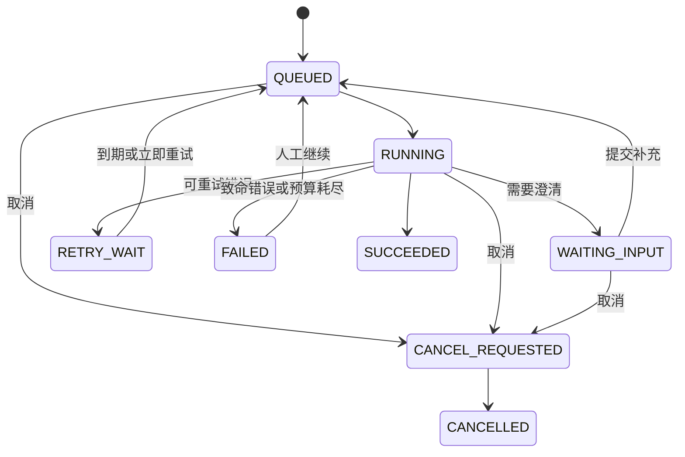

# 执行、恢复、失败与取消

> 上级文档：[PPT 生成能力重构需求文档](../ppt-generation-refactor-requirements.md)
> 需求范围：R6–R13

## 1. R6：单任务单执行者

- 同一 taskId 同一时间只能有一个有效 worker；
- 多实例使用分布式租约或等效协调机制；
- 长阶段执行期间持续续租；
- 丢失租约的 worker 不得继续提交 checkpoint；
- 重复点击继续只产生幂等调度，不得重复执行阶段；
- 租约拥有者仍需通过 expected state + revision 条件提交。

## 2. R7：创建与调度幂等

- 前端每次创建生成稳定 `idempotencyKey`；
- 后端按用户和幂等键持久化去重；
- 幂等键不能只存在单机内存；
- 网络重试返回原 taskId；
- 新建、恢复和修改使用不同幂等作用域；
- 入队动作必须与任务状态变更协调，避免“状态已变但消息未入队”或重复入队无法收敛。

## 3. R8：服务重启恢复

应用启动后扫描非终态任务，并按以下规则处理：

| 条件 | 行为 |
| --- | --- |
| WAITING_INPUT | 保持等待，不自动执行 |
| CANCEL_REQUESTED | 推进安全取消 |
| QUEUED/RUNNING 且租约已过期 | 重新入队 |
| RETRY_WAIT 且到达 nextRetryAt | 自动入队 |
| FAILED | 不自动重试，等待用户决定 |
| SUCCEEDED/CANCELLED | 忽略 |

启动恢复必须有批量上限与抖动，避免进程启动时形成恢复洪峰。恢复扫描本身应可重复执行。

## 4. R9：失败重试

- 错误分类为 RETRIABLE、FATAL、DEGRADED、CANCELLED；
- 可重试错误采用有限次数、指数退避和最大等待时间；
- 每个阶段拥有独立重试预算；
- 模型结构解析失败、网络超时、限流、渲染超时等使用稳定错误码；
- 模板契约错误、上下文版本不兼容默认是 FATAL；
- 自动重试耗尽后进入 FAILED，保留 failedStage 和最后一次安全错误；
- 重试从当前 `pipelineState` 开始，不重复执行已完成阶段。

## 5. R10：真正可用的取消

- 前端在可取消阶段显示取消按钮；
- 取消请求立即把 runStatus 写成 CANCEL_REQUESTED；
- LLM、HTTP 图片请求、检索调用、渲染 Future 和 Python 子进程尽可能响应取消；
- Python 进程显式 destroy，并清理子进程树；
- 无法立即中断的调用完成后也不得提交下一 checkpoint；
- 取消完成后写 CANCELLED 事件并停止轮询；
- 已成功和已取消任务重复取消保持幂等；
- 页面关闭、路由变化、网络中断不触发取消。

取消检查点至少位于：阶段开始前、外部调用返回后、checkpoint 提交前。对支持取消令牌的调用应主动传播，而不是只在阶段边界轮询数据库。

## 6. R11：结构化失败对象

任务响应中的错误至少包含：

| 字段 | 用途 |
| --- | --- |
| code | 稳定错误码 |
| failedStage | 出错阶段 |
| retryable | 是否可人工重试 |
| retryClass | 重试分类 |
| attempt | 当前尝试次数 |
| userMessage | 脱敏的用户说明 |
| occurredAt | 发生时间 |

技术堆栈、供应商响应、本机路径和凭证只能进入服务端日志或安全审计，不得直接返回前端。

## 7. R12：降级可见

图片生成失败后可生成无图版本，图表服务不可用时可降级为表格或文字，但必须写 warning。此时保持 `runStatus=SUCCEEDED`，并通过非空 warnings 表达“成功但有警告”，不额外引入与生命周期表冲突的状态，也不得把降级静默伪装成完整成功。

warning 至少包含 code、stage、userMessage、affectedPageIds。warning 不改变已经成功的阶段，但前端必须以区别于失败的视觉层级展示。

## 8. R13：失败说明不强依赖 LLM

用户提示优先由错误码模板稳定生成。可选使用 LLM 润色，但润色失败不能覆盖原错误，也不能阻塞失败状态落库。

不得保存或展示完整思考链。允许保存结构化阶段摘要与工具执行元数据。

## 9. 执行闭环

## 10. 验收要点

- 重复创建、继续、取消不会产生重复任务或重复阶段提交；
- 服务在 OUTLINE、IMAGE、RENDER 中断后都可恢复；
- 自动重试只消耗当前阶段预算并保留 attempt；
- 检索、图片和 Python 渲染期间取消最终都不能提交 SUCCESS；
- 降级成功有 warning，真实失败有结构化 error；
- 用户提示生成失败不会破坏已经持久化的任务状态。
