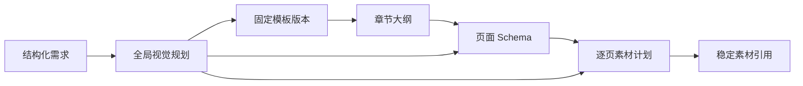

# 模板、视觉规划、Schema 与素材

> 上级文档：[PPT 生成能力重构需求文档](../ppt-generation-refactor-requirements.md)
> 需求范围：R14–R21

## 1. R14：模板注册表

模板至少包含：

- templateId；
- version；
- name、description；
- styleTags；
- supportedPageTypes；
- templateSchema；
- artifactId；
- checksum；
- status；
- createdAt。

同一 templateId 的新版本不能改变历史任务使用的模板文件。任务必须固定引用一个明确版本，不能在恢复时漂移到“当前最新版”。

## 2. R15：模板上线与启动校验

模板进入可选列表前必须校验：

- 文件可以正常打开；
- 模板版本和 checksum 匹配；
- 每种页面类型对应有效模板页；
- 必需 shapeName 唯一存在；
- shape 类型与 Schema 字段类型匹配；
- 图片、背景、组合元素和关系引用可复制；
- fontLimit 和布局容量合法。

模板不合格时标记为不可选并记录结构化原因。运行任务不得临时猜测缺失 shape 的映射。

## 3. R16：全局视觉规划

VISUAL_PLAN 至少包含：

- 风格关键词；
- 主色、辅助色、背景色；
- 标题和正文字体体系；
- 图片风格；
- 页面密度；
- 图表风格；
- 页面尺寸与语言。

模板选择、Schema 生成和素材生成必须读取同一份视觉规划，避免各阶段独立猜测风格。视觉规划是可持久化业务数据，纳入 checkpoint 与版本迁移。

## 4. R17：动态页面 Schema

Schema 至少支持以下页面类型：

- COVER；
- CATALOG；
- SECTION；
- CONTENT；
- IMAGE_TEXT；
- COMPARE；
- TIMELINE；
- CHART；
- SUMMARY；
- END。

每一页包含稳定 pageId、pageType、templatePageRef、字段数据和可选 speakerNotes。字段类型至少支持 text、image、background、chart、table。

Schema 是业务语义层；Python 渲染 payload 是机械填充层。二者通过模板契约转换，不能让模型直接生成依赖具体 Python 内部结构的任意 payload。

## 5. R18：Schema 约束

- Schema 同时通过结构验证和业务验证；
- 页面数量符合用户需求，或给出明确调整理由；
- 字段名属于选定模板版本；
- 必填字段不得为空；
- 字数限制在生成时软约束、渲染时硬兜底；
- 超长文本优先压缩或降低信息密度，硬截断仅作最后防线；
- 页面类型与模板页兼容；
- Schema 修改保留未修改页面的稳定 pageId；
- 图表、表格和图片字段的输入结构必须可校验；
- 页面引用与素材引用不得指向其他用户或未完成对象。

## 6. R19：逐页素材计划

IMAGE 阶段扫描 Schema，按字段创建素材任务。每个任务至少包含：

- pageId；
- fieldName；
- type；
- prompt；
- visualStyle；
- status；
- artifactId；
- attempt。

素材任务的结果写回稳定 artifact 引用。封面图与内容页图片使用同一套任务模型，不再以单独字段形成例外路径。

## 7. R20：素材来源与 provenance

支持并记录以下来源：

- 文生图；
- 联网图片检索；
- 图表生成；
- 程序化装饰图；
- 模板原始素材。

外部素材必须校验 MIME、大小、尺寸和可访问性。网络检索素材还应记录来源链接和授权信息。来源元数据不得依赖短时签名 URL。

## 8. R21：素材幂等与清理

素材 object key 由任务、页面、字段和内容摘要稳定派生。重复执行不得无界产生垃圾对象。

替换素材时保留版本关系，并定义：

- 临时对象何时删除；
- 失败任务素材保留多久；
- 历史成功版本引用的素材不得被新版本清理；
- 同摘要素材是否允许任务内复用；
- 对象写入成功但 checkpoint 未提交时如何回收或认领。

## 9. 阶段数据流

## 10. 验收要点

- 历史任务恢复后仍使用原 templateId/version；
- 不合格模板在任务开始前被禁用；
- 页面类型、字段名和 shape 契约不匹配时提前失败；
- 逐页图片风格继承全局视觉规划；
- 重跑 IMAGE 不产生无界重复对象；
- MODIFY 后未变页面保留 pageId 和素材引用。
