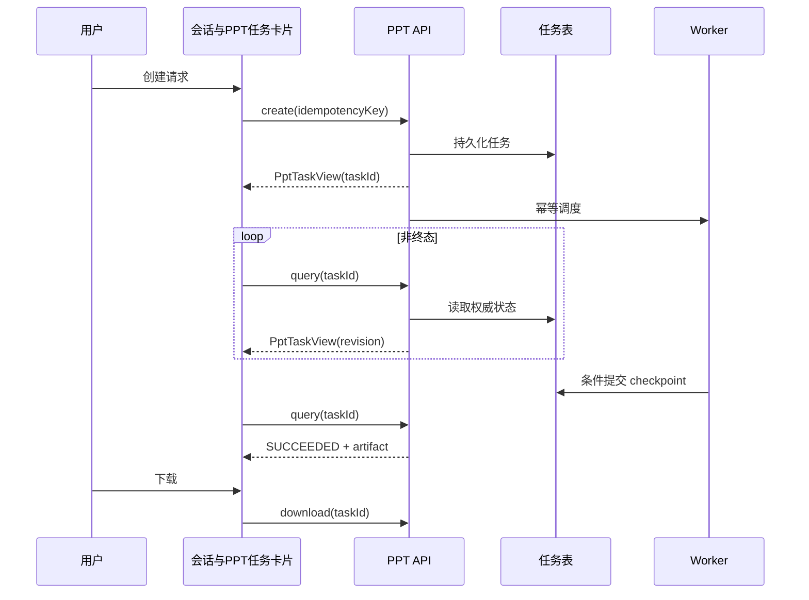

# 前端任务卡片与会话闭环

> 上级文档：[PPT 生成能力重构需求文档](../ppt-generation-refactor-requirements.md)
> 需求范围：R32–R41

## 1. 前端状态来源

后端任务表是唯一权威。前端组件状态、会话消息 payload、本地缓存和轮询结果只用于展示，不得覆盖任务服务返回的新 revision。

前端统一以 `PptTaskView` 驱动直播状态与历史回放，使用后端 capability flags 决定按钮，不维护另一套状态转换规则。

## 2. R32：统一任务卡片

同一张卡片覆盖：

- 创建中与排队；
- 运行及阶段进度；
- 等待补充；
- 可重试失败；
- 不可重试失败；
- 取消中；
- 已取消；
- 带 warning 成功；
- 成功下载；
- 修改版本。

直播消息和历史消息不得使用两种不兼容的 PPT 卡片协议。组件输入以 taskId 为稳定主键，任务视图可以被轮询结果原位更新。

## 3. R33：状态展示矩阵

| runStatus | 展示 | 可用操作 |
| --- | --- | --- |
| QUEUED | 排队说明 | 取消 |
| RUNNING | 当前阶段、进度、耗时 | 取消 |
| WAITING_INPUT | 助手追问，回答使用页面底部会话输入框 | 发送补充或取消 |
| RETRY_WAIT | 错误说明、下次重试时间 | 立即重试、取消 |
| FAILED | 失败阶段、用户说明 | 重试或新建，取决于 canResume |
| CANCEL_REQUESTED | 正在停止 | 无重复操作 |
| CANCELLED | 已取消 | 新建 |
| SUCCEEDED | 下载、warning、版本信息 | 下载、修改、新建 |

按钮还必须遵循 `canCancel`、`canResume`、`canAnswer`、`canDownload`、`canModify`，不能只看表中默认行为。

## 4. R34：创建与轮询

- 创建请求返回 taskId 后立即释放输入区忙状态；
- 卡片根据统一任务视图轮询；
- 轮询采用退避，后台标签页降低频率；
- 页面不可见或路由切换只停止本地轮询；
- 返回页面时立即刷新状态；
- 终态停止轮询；
- 短暂网络失败不得把后端任务标记为 FAILED；
- 多标签页观察同一任务时状态保持一致；
- 只接受 revision 不小于当前展示版本的响应，避免慢请求造成状态倒退；
- 轮询资源按 taskId 去重，组件卸载时释放订阅。

## 5. R35：刷新与历史恢复

- 会话 timeline 只保存 PPT taskId、operation、baseTaskId 等稳定引用；
- 加载历史时批量查询任务最新状态；
- 历史旧 payload 不得覆盖任务表新状态；
- 仍在运行时恢复轮询；
- 等待补充时恢复助手追问，并让页面底部会话输入关联该任务；
- 首次后台执行在会话记录完成前崩溃时，通过用户运行任务接口找回；
- 成功、失败、取消和修改后的状态在刷新后保持一致；
- 重新登录和跨会话进入时按归属恢复，不依赖旧页面内存。

## 6. R36：取消闭环

- 可取消卡片显示停止按钮；
- 点击后展示 CANCEL_REQUESTED，不乐观标记 CANCELLED；
- 后端确认 CANCELLED 后停止轮询；
- 取消失败显示可重试提示；
- 已完成任务不显示取消；
- 普通聊天停止按钮不得误取消 PPT，除非明确绑定该 taskId；
- 页面关闭、断网或卸载组件不得调用取消接口。

## 7. R37：错误与 warning

- 只显示后端 `userMessage`，不显示异常堆栈；
- 可重试错误根据 `canResume` 展示重试；
- warning 与 failure 使用不同视觉层级；
- 图片降级成功显示“已生成无配图版本”等明确说明；
- 下载失败不能把 SUCCEEDED 改成 FAILED；
- 网络查询失败展示“状态暂不可用”，保留最后一次已确认任务状态；
- FAILED 卡片显示 failedStage、occurredAt 和安全错误码，便于反馈问题。

## 8. R38：下载与版本

- 下载使用带鉴权请求或短时签名 URL；
- 仅 artifact 可用且 canDownload 时显示下载；
- 产物被归档或删除时提供明确提示；
- 修改任务显示“基于版本”和“当前版本”；
- 用户可以下载历史成功版本；
- 下载中的局部 UI 状态不写回任务状态；
- 修改入口必须把 baseTaskId 传给后端，不能只把旧文本拼入新消息。

## 9. R39：会话只保存稳定任务引用

PPT 的会话 StageOutput 不保存会漂移的完整任务响应副本，至少保存：

- taskId；
- operation；
- baseTaskId。

任务当前状态始终回查任务服务。旧消息可以保留兼容 payload，但新任务视图的 revision 与 runStatus 优先。

## 10. R40：后台变化与历史一致性

创建、澄清、恢复、取消和修改都关联到同一任务引用。后台状态变化不需要反复覆盖会话消息；历史加载时动态解析任务状态。

任务卡片应把“聊天消息身份”和“任务状态身份”分开：消息决定卡片位于哪段对话，taskId 决定卡片展示什么状态。

## 11. R41：异常窗口恢复

| 异常窗口 | 恢复依据 | 预期行为 |
| --- | --- | --- |
| 任务已创建，前端没收到响应 | idempotencyKey | 重试返回原 taskId |
| 前端收到 taskId，会话记录未写入 | 用户运行任务查询 | 找回并补展示入口 |
| 运行中服务崩溃 | checkpoint、租约、阶段事件 | 从当前阶段恢复 |
| 已成功，历史仍是旧状态 | taskId 动态回查 | 展示 SUCCEEDED |
| 回答澄清后刷新 | 已落库补充与任务状态 | 不重复追问 |
| 点击继续后断网 | 幂等继续与任务查询 | 不重复执行 |
| 产物上传后 SUCCESS 未提交 | artifact checksum 与 checkpoint | 复用产物后提交 |

所有窗口依靠幂等键、任务表、阶段事件和 artifact 状态恢复，不能依赖前端内存。

## 12. 页面级数据流

## 13. 前端测试重点

- 每种 runStatus 的展示与 capability flags；
- 创建后轮询及重复响应去重；
- 澄清提交、失败重试和取消；
- 网络失败后保留最后状态并恢复；
- 历史任务批量刷新；
- 路由切换、刷新、重新登录与多标签页；
- 多版本下载；
- warning 与 failure 区分；
- 越权和产物不存在提示；
- 旧 revision 响应不能覆盖新 revision。
