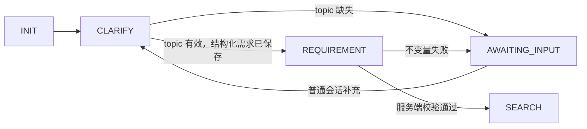

# PPT 会话交互、需求采集、进度与 MVC 收敛规格

> 上级文档：[PPT 生成能力重构需求文档](../ppt-generation-refactor-requirements.md)
>
> 状态：Implemented
>
> 日期：2026-08-19
> 需求范围：R44–R57

## 1. 背景与问题

PPT 生成的核心状态机、任务持久化、取消、修改、图片生成和 Python 渲染已经存在，但用户交互和代码
组织仍有两套相互干扰的模型：

- 用户既能在会话输入框发消息，也要在 PPT 卡片内使用澄清和修改输入框；
- `create` 端点同时承担创建、关键词意图识别和部分修改/恢复分发，但澄清与取消另走 taskId 端点；
- 未命中关键词的消息默认被识别成 CREATE，等待澄清时从主输入框回复会错误创建新任务；
- 需求澄清依赖自然语言标记判断，并要求用户同时提供主题、页数、风格和受众；
- 用户回答一次后直接跳过澄清，结构化主题尚未得到确认也可能继续执行；
- 前端只有百分比进度条，后端已有 checkpoint 事件却没有形成用户可读的进度时间线；
- IMAGE 阶段只有整阶段 checkpoint，无法展示“图片生成完成 3/6”；
- Controller 内包含任务视图装配、状态权限推导、异步调度和会话记录等应用逻辑；
- PPT 包根目录存在大量仅承载一个 record 或一次转发的浅模块，增加查找成本。

本规格不重写已经验证过的状态机、任务表和渲染链路。目标是通过一个深的应用模块隐藏消息路由、任务
状态判断、调度和视图装配，让 Controller、前端和测试都只学习一个主要接口。

## 2. 产品目标

1. 用户始终通过会话输入框发送 PPT 相关消息。
2. 后端结合“当前任务状态 + 明确关键词”识别 CREATE、ANSWER、MODIFY、RESUME、CANCEL。
3. 主题是开始生成的唯一强制业务信息；其他字段由会话内容提取、推断或使用稳定默认值。
4. 未获得有效主题时必须停在 `AWAITING_INPUT`，不得进入 SEARCH 及后续生成阶段。
5. 进度以可折叠时间线展示真实持久化事件，不展示模型私有推理过程。
6. 图片阶段展示总数、当前序号、成功数和失败数，刷新后可恢复。
7. Spring Boot 层次收敛为 Controller、Application、Domain、Infrastructure 四种职责；Controller 不再
   编排业务。
8. 删除已无调用的类；将只共同描述一个 payload 的浅 record 合并到所属深模块。

## 3. 非目标

- 不要求用户填写表单或显式填写所有需求字段；
- 不引入通用工作流引擎；
- 不引入 WebSocket；轮询仍是任务状态的可靠读取方式；
- 不向前端输出 chain-of-thought；“思考过程”仅指可审计的业务阶段事件；
- 不在本次迁移中重命名数据库表；
- 不在本期建设浏览器内 PPT 预览；成功后先提供鉴权下载，PDF/缩略图预览作为独立产物能力设计；
- 不因 MVC 收敛而机械地为每个 record 创建 service/repository/controller；
- 不一次性移动所有稳定领域类型的包路径，避免无价值的大规模 import churn。

## 4. 核心领域规则

### R44：主题是唯一硬门禁

新建 PPT 在进入 SEARCH 前必须存在经过服务端校验的 `PptRequirement.topic`。

有效主题必须满足：

- 非 null、非空白；
- 不是“PPT”“做一个 PPT”“生成吧”“这个”“刚才那个”等无法独立表达内容的执行词或指代词；
- 若来自“把刚才的分析做成 PPT”这类指代，必须能从会话摘要中解析出具体主题；
- 长度和字符内容满足服务端约束，不能仅由标点或控制字符组成。

Controller、前端或模型输出均无权绕过此规则。状态机在 REQUIREMENT 提交点执行最终校验。

### R45：其他需求字段自动补齐

`title`、`audience`、`slideCount`、`tone` 不是开工门禁：

| 字段 | 优先级 |
| --- | --- |
| title | 用户明确表达 → 会话推断 → 使用 topic |
| audience | 用户明确表达 → 会话推断 → “通用受众” |
| slideCount | 用户明确表达 → 会话推断 → 配置默认值（默认 10） |
| tone | 用户明确表达 → 根据主题/受众推断 → “专业简洁” |

默认页数必须限制在配置范围内。模型输出越界时由服务端归一化或拒绝，不把校验责任交给提示词。

### R46：累积式需求采集

结构化采集器每次读取：

1. 当前用户消息；
2. 当前会话摘要；
3. 任务中已经采集的原始需求与结构化草稿；
4. 上一次追问；
5. 本次补充回答。

已经采集的受众、页数和风格不得因后续只补充主题而丢失。模型不得凭空创造主题；无法确定时返回
`topic = null` 和一条只询问主题的 `clarifyingQuestion`。

### R47：允许多轮但只追问必要信息

- 主题明确时不追问页数、受众和风格，立即生成；
- 主题缺失或仍然含糊时保持 `AWAITING_INPUT`；
- 用户下一条普通会话消息重新执行结构化采集，不直接跳过校验；
- 可进行多轮澄清，直到主题有效或用户取消；
- 每次只提出一个聚焦主题的问题，不展示字段表单。

## 5. 统一消息接口

### R48：外部接口

新增：

```http
POST /agent/v1/ppt/message
Content-Type: application/json

{
  "conversationId": "...",
  "message": "把第二页改成流程图",
  "idempotencyKey": "..."
}
```

返回统一 `PptGenerationResponse`/`PptTaskView`。旧的 create、clarify、modify、resume、cancel 端点在兼容期
保留，但全部委托同一个应用模块，不再各自复制状态判断和调度逻辑。

### R49：状态优先的消息路由

路由顺序固定如下：

1. 消息明确表达取消，且存在可取消活跃任务 → CANCEL；
2. 最新任务为 `AWAITING_INPUT` → ANSWER；
3. 消息明确表达继续，且存在可恢复任务 → RESUME；
4. 最新成功任务存在，消息明确表达修改 → MODIFY；
5. 其他情况 → CREATE。

状态判断优先于模糊关键词。ANSWER 不要求用户说“回答”；等待输入期间的普通消息默认属于当前任务。
取消必须使用明确词组，不能因为正文出现“取消率”等业务名词而误取消。

### R50：支持的意图

```text
CREATE  新建 PPT
ANSWER  补充当前等待中的需求
MODIFY  基于最近成功版本创建修改任务
RESUME  从失败或中断 checkpoint 继续
CANCEL  协作式取消当前活跃任务
```

第一层只使用任务状态和明确关键词，保持低成本、确定性和可测试性。仅当最新成功任务下 CREATE 与
MODIFY 无法区分时，才允许增加可替换的语义分类器；本期不把 LLM 作为所有消息的必经步骤。

## 6. 状态机规则

### R51：需求采集流



兼容现有 checkpoint，保留 `CLARIFY` 和 `REQUIREMENT` 状态名：

- CLARIFY 负责结构化采集并保存草稿；
- REQUIREMENT 负责生成/归一化最终 `PptRequirement` 并执行主题硬校验；
- `answerClarification` 必须回到 CLARIFY，而不是直接跳到 REQUIREMENT；
- SEARCH 入口再次断言 requirement 和 topic 有效。

后续可以在数据库迁移窗口将两阶段合并为 REQUIREMENT_COLLECTION，本期不为重命名增加风险。

### R52：修改任务

MODIFY 复用基线任务已经通过校验的结构化需求，不重新要求主题。修改指令只影响 Schema、图片和渲染
链路；若用户明确要求改主题，则更新结构化需求后重新执行受影响的阶段。

正在运行的任务不允许原地覆盖 Context：worker 可能正在使用旧 revision，原地修改会与 checkpoint 条件
提交竞争。V1 收到生成中修改时，先对旧任务写协作式取消请求，再创建带 `supersedesTaskId` 关系的新任务；
旧任务及其事件仍保留。已成功任务继续使用 `baseTaskId/baseArtifactId` 创建 MODIFY 版本。若取消尚未完成，
新任务可以先持久化为 QUEUED，但不得与被替代任务同时进入耗资源的生成阶段。

## 7. 进度事件

### R53：用户可读事件模型

进度的第一层是完整流水线阶段，而不是图片数量。用户应始终能看到当前位于需求采集、资料检索、视觉
规划、模板、大纲、页面 Schema、素材、渲染、校验或完成中的哪一阶段，以及此前哪些阶段已经完成。

固定阶段顺序为：

```text
需求采集 → 结构化需求 → 资料检索 → 视觉规划 → 模板准备
→ 大纲生成 → 页面编排 → 素材生成 → PPT 渲染 → 产物校验 → 完成
```

`PptTaskView` 增加 `progressEvents`，每项至少包含：

```json
{
  "sequence": 12,
  "stage": "IMAGE",
  "level": "DETAIL",
  "status": "COMPLETED",
  "message": "图片生成完成（3/6）",
  "current": 3,
  "total": 6,
  "occurredAtMillis": 1780000000000
}
```

`level = STAGE` 表示整体阶段事件，`level = DETAIL` 表示阶段内部的细节事件。允许的 status：
`STARTED`、`COMPLETED`、`WARNING`、`FAILED`、`CANCELLED`。事件消息是稳定业务文案，
不得包含模型推理、原始 prompt、堆栈、密钥、MinIO 内部路径或用户不可见的系统信息。

### R54：阶段事件映射

现有 `PptCheckpointEvent` 是阶段进度的权威来源：

- STARTED → “正在{阶段动作}…”；
- SUCCEEDED → “{阶段结果}完成”；
- FAILED/CANCELLED → 安全失败或取消说明；
- 相同 revision/attempt 的重复事件在视图层去重；
- 顺序按持久化时间和 sequence，不按前端到达时间。

任务视图同时返回 `currentStage`、`completedStages` 和 `progressEvents`：前两者让前端稳定绘制整体阶段，
事件列表负责解释每个阶段正在做什么。图片数量不能替代整体阶段，也不能改变阶段完成判定。

### R55：图片细粒度进度

IMAGE 策略在扫描 Schema 后先写总数子事件，再为每张图片追加完成或 warning 子事件。事件必须持久化，页面
刷新后仍能恢复 `3/6`，不能只保存在 JVM 回调或前端内存中。

单张图片失败不阻断整个 PPT：记录 WARNING、增加失败数、保留模板占位图并继续下一张。用户取消则
停止后续图片并产生 CANCELLED 事件。

## 8. 前端交互

### R56：唯一会话输入

- 删除 `PptTaskCard.vue` 内的澄清 textarea 和修改 textarea；
- PPT 模式下所有输入统一调用 `pptApi.message`；
- 用户消息以正常 user bubble 展示，不能只藏在任务卡片标题中；
- 等待补充时，卡片展示助手问题，但回答仍从页面底部会话输入框发送；
- 修改、继续、取消文本消息走同一入口；
- 下载按钮保留在任务卡片；取消按钮可在兼容期保留为 taskId 精确快捷操作；
- 发送消息后立即释放输入框，任务通过轮询继续更新；
- 当前会话存在 `AWAITING_INPUT` 任务时，输入框 placeholder 提示“回复 PPT 主题或发送取消”。

### R57：可折叠业务进度时间线

- 用一个可折叠“生成过程”区域替代单独的百分比条作为主要反馈；
- 顶层始终展示完整流水线阶段，明确当前阶段和已经完成的阶段；
- 展开当前阶段后再展示该阶段的细节事件，图片 `3/6` 属于素材阶段的细节；
- 当前事件显示加载状态，完成事件显示勾选，warning 使用非阻断提示；
- 默认只展开最近若干条，详细 Schema/大纲不直接铺满会话；
- 图片展示 `当前/总数`；
- 成功后显示下载和继续修改提示；
- 历史恢复与直播使用相同组件和 `progressEvents` 数据，不维护两份展示协议；
- 百分比可作为辅助信息保留，但不得假装成比 checkpoint 更精确的实时进度。

## 9. Spring Boot MVC 职责收敛

### 9.1 目标结构

```text
web/controller/
  PptGenerationController       HTTP、鉴权、参数校验、响应码
web/dto/
  PptMessageRequest             输入 DTO
  PptGenerationResponse         兼容响应 DTO
  PptTaskView                   只读视图 DTO

web/service/
  PptApplicationService         统一消息、旧操作兼容、调度和会话记录
  PptTaskViewAssembler          领域任务 → Web 视图

capability/ppt/application/
  PptMessageRouter              状态优先意图决策（应用模块内部）

capability/ppt/domain/          状态、任务、需求、Schema、事件和校验规则
capability/ppt/strategy/        每个 pipeline stage 的实现
capability/ppt/infrastructure/  JDBC、MinIO、Python、外部图片模型 adapter
```

本期优先完成职责收敛；包移动按可验证的小批次执行。稳定领域 record 不为“看起来像 MVC”而机械移动。

### 9.2 Controller 允许与禁止

Controller 允许：

- 读取登录用户；
- Bean Validation；
- 调用一个应用接口；
- HTTP 文件响应和异常到状态码转换。

Controller 禁止：

- 判断 CREATE/MODIFY/ANSWER/RESUME/CANCEL；
- 查事件后计算进度；
- 推导 capability flags；
- 直接调用任务 Store；
- 复制异步提交和完成后会话记录逻辑。

### 9.3 深模块接口

首要外部 seam：

```java
PptGenerationResponse handleMessage(String userId, PptMessageCommand command);
```

该接口内部完成路由、幂等准备、协作式取消/澄清、异步调度和任务视图装配。旧端点通过明确的兼容方法
进入同一实现。Controller 和前端不学习状态机转换细节。

## 10. 文件清理与合并规则

### 10.1 立即删除

- 已无生产与测试引用的类；
- 已被 Schema 图片 URL 闭环替代的资产任务模型；
- 只为已删除路径存在的 planner/status/source/provenance；
- 迁移后前端卡片内澄清、修改表单状态和处理函数。

### 10.2 优先合并

- 仅共同描述 Python render JSON 的多个四到十行 record，合并为 `PptRenderPayload` 的嵌套类型；
- Controller 内的 `buildTaskView` 与 capability 推导，迁入 `PptTaskViewAssembler`；
- 分散的关键词意图 enum/recognizer，收进状态感知的 `PptMessageRouter`；
- 旧 create/clarify/modify/resume/cancel 的重复调度逻辑，收进 `PptApplicationService`。

### 10.3 必须保留

- `PptTaskStore` seam 及 JDBC/内存两个 adapter；
- 图片生成、对象存储和渲染 seam，因为均有生产 adapter 和测试替身；
- 任务 checkpoint、乐观锁、租约、取消 token 和恢复机制；
- Schema、Requirement、Task、Failure 等具有独立不变量的领域类型；
- 旧 checkpoint JSON 的读取兼容，直到有明确数据迁移窗口。

删除必须通过 deletion test：删除后若复杂度只是散落到多个调用者，则保留并深化；删除后复杂度消失或由
所属深模块自然吸收，才执行删除。

## 11. 兼容与迁移

1. 先新增 `/ppt/message` 并让前端切换；
2. 旧端点保留至少一个版本，内部委托应用模块；
3. 旧 `PptGenerationResponse` 顶层字段继续返回，`taskView` 为权威；
4. 新增 DTO 字段必须向后兼容旧历史 JSON；
5. 旧 `AWAITING_INPUT` 任务收到回答后回到 CLARIFY，重新验证主题；
6. 旧 checkpoint 中已经存在有效 `requirement.topic` 时不得重复追问；
7. 包移动与业务行为改动分开提交，便于回滚和审查；
8. 前端在后端尚未提供 progressEvents 时继续显示当前阶段，避免灰度期间空白。

## 12. 测试与验收

### 12.1 结构化诊断日志

后端在以下业务节点输出结构化日志，字段名保持稳定，便于按任务串联排查和后续性能优化：

- 收到消息：`userIdHash`、`conversationId`、消息长度，不打印完整消息；
- 路由完成：`taskId`、`operation`、`routeReason`、`pipelineState`、`runStatus`；
- 任务入队/拒绝/开始/结束：`taskId`、队列结果、`durationMs`；
- 阶段开始/完成/失败/取消：`taskId`、`pipelineState`、`revision`、`attempt`、`durationMs`；
- 需求采集：`topicPresent`、采用默认值的字段名、是否进入等待输入；
- checkpoint 条件提交：expected/actual state 与 revision，冲突时使用 WARN；
- 图片：`pageId`、`fieldName`、`current`、`total`、生成/下载/上传各段耗时及结果；
- 渲染与校验：模板标识、页数、文件大小、渲染/校验耗时；
- 统一响应：`taskId`、`pipelineState`、`runStatus`、`progressEventCount`。

日志等级：正常阶段边界使用 INFO，单图降级和 checkpoint 冲突使用 WARN，任务失败使用 ERROR，可能高频
的轮询查询只使用 DEBUG。日志不得包含完整 Prompt、模型原始输出、密钥、Authorization、临时图片 URL、
MinIO 签名 URL、用户完整消息或模型私有推理。`conversationId` 可记录以支持任务串联，userId 只记录稳定
哈希或脱敏值。

### 12.2 后端行为测试

- 无任务 + “生成 AI Agent PPT” → CREATE；
- 无任务 + “帮我做个 PPT” → AWAITING_INPUT，且不执行 SEARCH；
- 等待输入 + “AI Agent 技术原理” → ANSWER，重新采集后开始；
- 等待输入 + “随便” → 仍为 AWAITING_INPUT；
- 等待输入 + “取消” → CANCEL，不作为 ANSWER；
- 成功任务 + “第二页换成流程图” → MODIFY；
- 失败任务 + “继续” → RESUME；
- 主题存在但其他字段缺失 → 自动默认并开始；
- REQUIREMENT topic 为空 → 状态机门禁拒绝进入 SEARCH；
- 所有操作校验 userId 归属和幂等键。

### 12.3 进度测试

- checkpoint STARTED/SUCCEEDED 映射为有序进度事件；
- 六张图片产生总数、1/6…6/6 事件；
- 单图失败产生 warning 并继续；
- 取消停止后续图片；
- 刷新查询得到与运行中相同的事件；
- 重复轮询和重复 checkpoint 不产生重复 UI 项。

### 12.4 前端测试

- PPT 卡片不再渲染澄清/修改 textarea；
- 等待输入时底部输入发送 `pptApi.message`；
- 普通修改、继续、取消消息使用同一接口；
- user bubble 和任务卡片顺序正确；
- 时间线展示阶段与图片计数；
- revision 较小的响应不能覆盖新状态；
- 刷新恢复后继续轮询并恢复时间线；
- 下载和 taskId 精确取消快捷按钮仍可用。

### 12.5 完成定义

- 后端 PPT 全量测试通过；
- 前端单元测试和构建通过；
- Python rich renderer 编译与真实模板集成测试通过；
- `/ppt/message` 覆盖五类意图；
- 无主题任务无法观察到 SEARCH 开始事件；
- 卡片内不存在独立追问和修改输入框；
- 图片进度刷新可恢复；
- Controller 不再包含任务视图装配和消息路由；
- 关键路由、阶段、图片、渲染和 checkpoint 日志均能按 taskId 串联；
- 清理清单中的无用文件已删除，合并后无旧类型引用；
- `git diff --check` 通过，未改动无关用户文件。

## 13. 实施顺序

1. 测试锁定主题门禁和状态优先路由；
2. 新增统一应用模块和 `/ppt/message`；
3. 让澄清回答回到采集阶段并增加 Requirement 校验；
4. 前端切换单一输入，删除两个独立输入框；
5. 暴露 checkpoint 进度时间线；
6. 持久化图片细粒度事件；
7. 提取 Controller 视图装配，合并 render payload 浅类型；
8. 全量回归后再删除兼容期内已无调用的文件。
