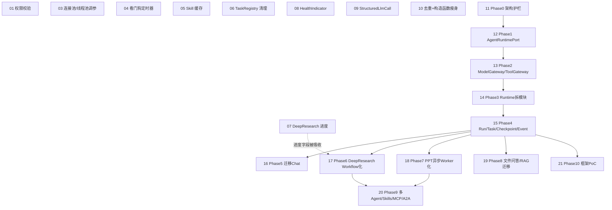

# AgentTrail 重构缺陷修复 — 需求 Spec

> **状态：规划中**（2026-08-11 立项）。派生自 [`docs/refactor-blueprint.md`](../../refactor-blueprint.md)——
> 那份文档是"发现了什么问题、目标架构长什么样"，这份 Spec 是"拆成能实际开工的票"。
> 每张票的详细设计见 `refactor-remediation-ticket-NN.md`，格式沿用 `../phase3-governance/backend-phase3-governance-ticket-09.md`
> 的深度：范围边界 + 代码级实现指引 + 先验证提示 + 测试方案 + Out of Scope。
> 完成一张票后回来把下表状态改成 ✅，不要另开"完成报告"文档——状态就活在这张表里。

## Problem Statement

`docs/refactor-blueprint.md` 用四层（核心层/业务层/监控层/观测审计层）系统梳理了当前代码库的
结构性问题、效率问题、安全问题和目标架构。这份 Spec 要解决的是"知道问题在哪"和"能不能直接开工
改"之间的落差——原文档的 §1.8/§2.8/§6 给的是 Phase 0-10 的阶段目标和验收标准，但一个 Phase 往往
横跨好几个类、好几周工作量，不是一个 PR 能吃下的粒度；同时还有一批和 Phase 计划无关、能立刻独立
修的小问题（权限校验、连接池调参、内存泄漏），如果混在大重构计划里容易被无限期推后。

## Solution：两组票，独立推进

**第一组（Ticket 01、03-10）：低成本快速修复**，和 Runtime 大重构互不阻塞，随时可以插队做，建议
最先排期——尤其是 01（安全）。

**第二组（Ticket 11-21）：Runtime/Capability 分层重构**，对应 `refactor-blueprint.md` 的
Phase 0-10，票之间有严格的先后依赖（后一张票的接口假设建立在前一张票已经落地的基础上），
不能跳着做。

## Ticket 一览

| # | 标题 | 层 | 依赖 | 状态 |
|---|---|---|---|---|
| [01](refactor-remediation-ticket-01.md) | Golden Case / 审计接口权限校验补齐 | 观测审计层 | 无 | 待开始 |
| [02](refactor-remediation-ticket-02.md) | ~~CI 接入 Testcontainers 类集成测试~~ | 观测审计层 | 无 | ❌ 不做（2026-08-11 讨论后决定：CI 不接入，本地跳过门槛也不需要，票内容保留仅供参考） |
| [03](refactor-remediation-ticket-03.md) | HikariCP 连接池 + 后台线程池调参 | 核心层 | 无 | 待开始 |
| [04](refactor-remediation-ticket-04.md) | AgentLoopExecutor 看门狗定时器泄漏修复 | 核心层 | 无 | 待开始 |
| [05](refactor-remediation-ticket-05.md) | Skill 工具改为会话级缓存 | 核心层 | 无 | 待开始（2026-08-11 已定案：只做单一方案，按 `RunContext`/每次 `stream()` 调用缓存，不做 revision 失效钩子——理由和调研见票内 §1.2） |
| [06](refactor-remediation-ticket-06.md) | DeepResearchTaskRegistry 终态任务清理 | 业务层 | 无 | 待开始 |
| [07](refactor-remediation-ticket-07.md) | DeepResearch 进度可见性（currentStep） | 业务层 | 无（Phase 6 落地后会被 Workflow 事件流吸收，见 Ticket 17） | 待开始 |
| [08](refactor-remediation-ticket-08.md) | Redis/PgVector/MinIO/DashScope HealthIndicator | 监控层 | 无 | 待开始 |
| [09](refactor-remediation-ticket-09.md) | StructuredLlmCall 抽取，消除 5 处重复解析逻辑 | 业务层 | 无 | 待开始 |
| [10](refactor-remediation-ticket-10.md) | GoldenCaseService 去重 + ToolCallExecutor 构造函数瘦身 | 业务层/核心层 | 无 | 待开始 |
| [11](refactor-remediation-ticket-11.md) | Phase 0：架构护栏与基线（ArchUnit + Runtime Profile 摘要 + HTTP 契约快照） | 核心层 | 无 | 待开始 |
| [12](refactor-remediation-ticket-12.md) | Phase 1：冻结 `AgentRuntimePort` 契约 | 核心层 | Blocked by 11 | 待开始 |
| [13](refactor-remediation-ticket-13.md) | Phase 2：`ModelGateway`/`ToolGateway` 切断 Spring AI 泄漏 | 核心层 | Blocked by 12 | 待开始 |
| [14](refactor-remediation-ticket-14.md) | Phase 3：Runtime 拆 6 模块 + 删 telescoping constructor + Hook/StageOutputProvider 去留 | 核心层 | Blocked by 13 | 待开始（2026-08-11 已定案：Hook/StageOutputProvider 两套 SPI 都保留不删，理由和 ASJ/SAA 的对照见票内 §3.1） |
| [15](refactor-remediation-ticket-15.md) | Phase 4：统一 Run/Task/Checkpoint/Event | 核心层 | Blocked by 14 | 待开始 |
| [16](refactor-remediation-ticket-16.md) | Phase 5：迁移普通 Chat 到 `ChatApplicationService` | 业务层 | Blocked by 15 | 待开始 |
| [17](refactor-remediation-ticket-17.md) | Phase 6：DeepResearch 改造为 Workflow+Task | 业务层 | Blocked by 15（16 可并行） | 待开始（2026-08-11 已定案：取消机制直接复用 `AgentTaskManager`（和主对话同一套、已验证的 Reactor `Disposable` + 跨实例广播），不用现在 `DeepResearchTaskRegistry` 的 `Future.cancel(true)`——后者已证实对卡在网络调用中的任务不可靠，见票内 §7.1/§7.2） |
| [18](refactor-remediation-ticket-18.md) | Phase 7：PPT 改造为异步 Worker+Artifact | 业务层 | Blocked by 15（16/17 可并行） | 待开始 |
| [19](refactor-remediation-ticket-19.md) | Phase 8：文件问答/RAG 迁移 | 业务层 | Blocked by 15 | 待开始 |
| [20](refactor-remediation-ticket-20.md) | Phase 9：多 Agent / Skills / MCP / A2A | 业务层 | Blocked by 17, 18 | 待开始 |
| [21](refactor-remediation-ticket-21.md) | Phase 10：框架 PoC 评估（调研票，非实现票） | 核心层 | Blocked by 15 | 待开始 |

## 依赖图

第一组（01-10）不在这张依赖图的主链上，可以在第二组进行的任何阶段并行插入。

## 关于"哪些票该先做"

按 `refactor-blueprint.md` §9 的判断：01（安全）优先级最高，建议立刻排期，不等其它任何票。
03-10 都是独立、低风险、单 PR 可完成的改动，谁先做不影响后续，可以按团队空闲时间见缝插针。
11-21 是一条严格顺序链，一旦开工不建议中途插队做别的 Phase——每个 Phase 的验收标准都假设前
一个 Phase 已经落地。

**02 已废弃**：2026-08-11 讨论后决定不做——`SharedMySql` 相关的 IT 本来就有意不接入 CI（连本机
常驻 MySQL，不适合无状态 runner），真正能零成本接 CI 的只剩 4 个 Redis Testcontainers 类，但
讨论后判断这点回归保护不值得引入 Docker Hub 拉取镜像这个新的 CI 失败面，维持现状（这些 IT 只
在开发者本地手动跑）。票的内容保留在 `refactor-remediation-ticket-02.md` 里，如果以后重新考虑
可以直接复用里面已经核实过的 4 个类清单，不需要重新调研。

## Out of Scope（这份 Spec 不覆盖的）

- `refactor-blueprint.md` §4.10/§4.5 里提到但本次未单独立票的：CORS 配置、`docker-compose.yml`
  的 langfuse 明文密钥、数据库迁移工具化（Flyway/Liquibase）、多租户改造——这几项影响面牵涉
  部署和数据库层面的决策，需要先和运维/DBA 对齐，不适合在这批代码重构票里顺带做，后续单独立项。
- Golden 评测轮询组件的 `onUnmounted` 清理缺失（`refactor-blueprint.md` §1.4 提到的类似问题
  在 §4.4 的前端轮询里也有一处）——纯前端 bugfix，工作量在"半小时改一行"级别，不需要正式 Spec，
  发现的人直接改就行，不必等这批票排期。
